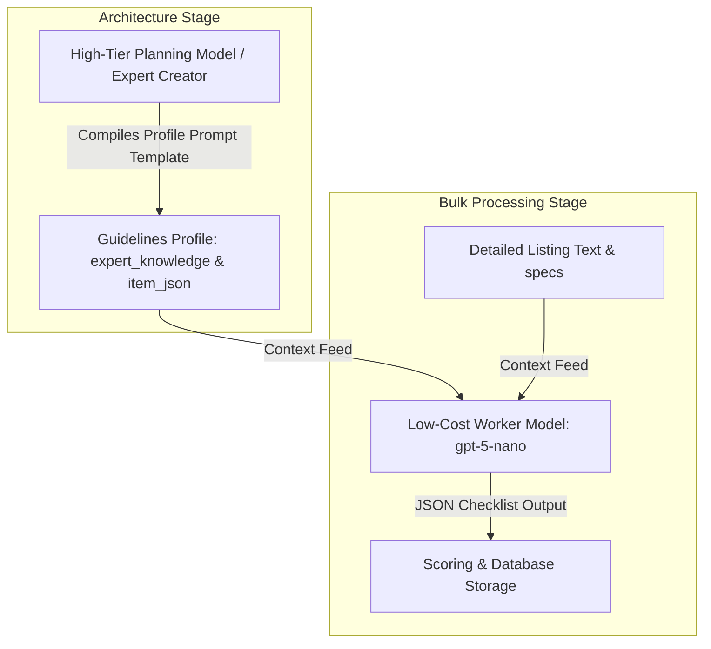
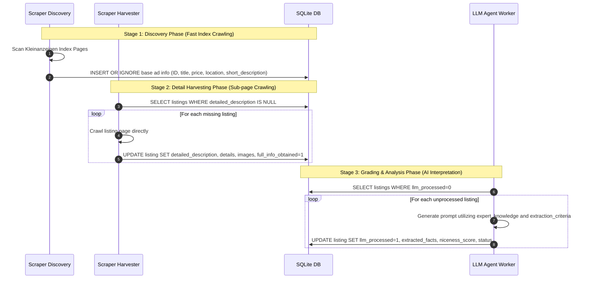

# Kleinanzeigen Scraper and AI Agent Architecture

This document maps the repository layout, data schemas, sequence workflow, and API interfaces for the Kleinanzeigen deal-matching and automated outreach workspace.

---

## Repository Layout

```
├── ARCHITECTURE.md          # System map & architectural reference
├── data/
│   ├── scraper.db           # SQLite production database
│   ├── scraper.log          # Rotated operational log
│   ├── logs/                # Isolated per-listing detailed prompt/response logs
│   │   └── <listing_id>/
│   │       ├── analysis.log
│   │       ├── conversation_analysis.log
│   │       └── outreach_draft.log
│   └── session_status.json  # Persisted login session data (email & timestamp)
├── prompts/                 # Version-controlled AI prompt templates
│   ├── external_prompt.md   # Guidelines guidelines planning prompt template
│   └── internal_prompt.md   # Internal evaluator prompt with skeleton placeholder
├── backend/                 # Node.js/Express SQLite API Server
│   ├── package.json
│   ├── db_setup.js          # SQLite table creation schema and triggers
│   ├── server.js            # Express server handling listing APIs & scheduler
│   └── public/              # Legacy frontend fallback dashboard
├── scraper/                 # Python 3 Scraper Daemon & AI worker
│   ├── main.py              # CLI controller orchestrating crawling and interpretation stages
│   ├── scraper.py           # Playwright scraper (index discovery & detailed specs/images harvesting)
│   ├── agent_worker.py      # OpenAI GPT evaluator calculating scores and matching status
│   ├── prompts.py           # Evaluation criteria & outreach message prompts templates
│   ├── config.py            # Scraping and LLM settings, dynamic .env loader
│   └── requirements.txt     # Python backend dependencies
├── frontend/                # Vite + React Client App
│   ├── src/
│   │   ├── App.tsx          # Single-Page state-driven dashboard (Landing, Dashboard, Edit view)
│   │   ├── types.ts         # TypeScript schema and state definitions
│   │   ├── main.tsx
│   │   └── index.css        # Tailwind/Vite premium styling sheet
│   └── package.json
└── scripts/                 # Maintenance scripts
    └── reset_listings.py    # Database utility to purge listings while preserving credentials
```

---

## Two-Agent Architecture

The system uses two distinct LLM agents with different roles:

```
YOU (buyer description)
        │
        ▼
┌────────────────────────┐
│  EXTERNAL PLANNING     │
│  AGENT (any capable    │
│  LLM, e.g. ChatGPT)   │
│                        │
│  Prompt: external_     │
│  prompt.md             │
│                        │
│  Outputs:              │
│  1. item_json (JSON)   │
│     extraction_criteria│
│     scoring_model      │
│  2. expert_knowledge   │
│     (German checklist) │
└───────────┬────────────┘
            │  paste into UI once per campaign
            ▼
┌────────────────────────┐
│  KNOWLEDGE SET (DB)    │
│  knowledge_sets table  │
│  - item_json           │
│  - expert_knowledge    │
└───────────┬────────────┘
            │
            ▼
┌────────────────────────┐
│  LISTING (scraped ad)  │
│  - title               │
│  - description         │
│  - details             │
└───────────┬────────────┘
            │
            ▼
┌────────────────────────┐
│  INTERNAL WORKER       │
│  (gpt-5-nano, cheap)   │
│                        │
│  Prompted with:        │
│  - internal_prompt.md  │
│  - expert_knowledge    │
│  - extraction_criteria │
│  - listing text        │
│                        │
│  Outputs:              │
│  - criteria (value,    │
│    evidence, conf.)    │
│  - highlights          │
│  - draft_message (DE)  │
│  - score (computed)    │
└────────────────────────┘
```

**External planning agent** = campaign designer (runs once per knowledge set setup, any LLM).
**Knowledge set** = reusable evaluation scheme stored in the DB.
**Internal worker** = listing evaluator (runs automatically for every scraped listing).

The planning prompt template lives at [`prompts/external_prompt.md`](prompts/external_prompt.md), and the worker prompt lives at [`prompts/internal_prompt.md`](prompts/internal_prompt.md).

---

## Database Schema

### 1. `campaigns`
Top-level campaign entity representing a broad market segment (e.g. "Sport Bikes").
*   `id` (INTEGER, PK)
*   `name` (TEXT, UNIQUE)

### 2. `knowledge_sets`
Contains expert instructions, checklists, and real-time evaluation weights.
*   `id` (INTEGER, PK)
*   `name` (TEXT)
*   `expert_knowledge` (TEXT) - General domain description instructions
*   `item_json` (TEXT) - JSON payload representing:
    *   `extraction_criteria`: List of `{ id, description, type }` evaluated by Worker AI.
    *   `scoring_model`: A normalized, importance-based scoring engine:
        ```json
        {
          "weights": {
            "camelCaseFieldId": {
              "satisfied_if": true,
              "importance": 25
            }
          }
        }
        ```

### 3. `searches`
Configured Kleinanzeigen tracking queries linked to a single guidelines profile.
*   `id` (INTEGER, PK)
*   `campaign_id` (INTEGER, FK -> campaigns.id)
*   `name` (TEXT)
*   `url` (TEXT) - Kleinanzeigen search endpoint URL
*   `enabled` (INTEGER, BOOLEAN)
*   `knowledge_set_id` (INTEGER, FK -> knowledge_sets.id)

### 4. `listings`
Scraped ads, harvested sub-page metrics, and calculated AI evaluations.
*   `id` (TEXT, PK) - Scraped Kleinanzeigen ad ID
*   `title` (TEXT)
*   `price` (TEXT)
*   `location` (TEXT)
*   `url` (TEXT)
*   `short_description` (TEXT) - Parsed from search card list
*   `detailed_description` (TEXT) - Harvested from full ad detail page
*   `llm_processed` (INTEGER, BOOLEAN)
*   `llm_processed_time` (TEXT, ISO timestamp)
*   `full_info_obtained` (INTEGER, BOOLEAN) - 1 if all criteria evaluated cleanly
*   `extracted_facts` (TEXT, JSON string) - KV mapping matching criterion IDs to values
*   `niceness_score` (INTEGER) - Normalized weight-based rating from 0 to 100
*   `status` (TEXT) - `'New' | 'Evaluating' | 'Matched'`
*   `search_id` (INTEGER, FK -> searches.id)
*   `details` (TEXT, JSON string) - Generic KV specifications parsed from `.addetailslist--detail`
*   `images` (TEXT, JSON string) - List of harvested carousel image slide URLs

---

## Hierarchical Intelligent Agent Pipeline (The Dual-Model Engine)

The deal-matching workspace relies on a decoupled, hierarchical dual-model agent pipeline to balance high-level structural intelligence with low-cost execution.



### 1. Ingestion Profile Architect (Planning Agent)
*   **Role**: An advanced, reasoning-capable model (or human domain expert) outlines the campaign guidelines parameters.
*   **Operation**: The architect creates the specific ingestion configuration. It designs the core domain logic (`expert_knowledge`), maps checklist targets (`extraction_criteria`), and assigns the scoring importance weights (`scoring_model.weights`).
*   **Logical Focus**: Decouples search design and expert criteria formulation (requiring high logical reasoning) from continuous, manual item review.

### 2. Execution Processor (Low-Cost Worker Agent)
*   **Role**: A high-efficiency, lower-cost model (`gpt-5-nano`) executes high-throughput evaluation tasks.
*   **Context Fed to the Worker**:
    *   **Scraped Listing Text**: The specific Kleinanzeigen ad's detailed description, title, and key specifications.
    *   **Domain & Expert Knowledge Rules**: General instructions, specific warnings (e.g. what indicates track use or valve wear), and product constraints.
    *   **Extraction Criteria List**: Strict target fields to evaluate and parse from the text.
*   **Operation**: The low-cost model processes each listing independently. It maps the listing's text against the guidelines checklists and generates a clean, structured JSON output (`extracted_facts`). It has no knowledge of scoring weights, serving strictly as an objective, unbiased fact extractor.
*   **Dynamic Scoring**: The backend server and agent worker post-calculate the score using the structured output from the cheap model and the importance weights defined by the architect.
*   **Robust Schema Resiliency (Soft Extraction)**: 
    *   **Dynamic JSON Skeleton Injection**: The worker injects a pre-built target JSON skeleton populated with default values (`"unknown"`) immediately following the `START_JSON` trigger at the end of the prompt to enforce clean generation.
    *   **Fuzzy Sanitization Layer**: The model is asked to extract arbitrary highlights. The Python logic ([agent_worker.py](file:///home/schneider/repos_private/KleinanzeigenScraper/scraper/agent_worker.py)) intercepts the response and sanitizes the output by fuzzy-mapping raw `kind` strings to standard types (`maintenance`, `warning`, `feature`), automatically deriving sentiments (`positive`, `negative`, `neutral`), and strictly truncating tag labels to 32 characters in post-processing.
    *   **Catastrophic-Only Validation & Bounded One-Shot Retry**: Validation checks focus exclusively on catastrophic schema issues (e.g. missing required criteria fields). In the event of failure, the engine initiates a single targeted retry with a dynamic validation failure report, falling back to a best-effort parse if the retry fails.

---

## Normalized Scoring Engine

The matching system calculates item deal suitability using a normalized weight-based percentage (0% to 100%).

1. **Decentralized Guidelines Profiles**: Expert evaluation checklists and weights are stored in the database per campaign search target via `knowledge_sets`.
2. **Normalized Weights**: Instead of a starting baseline score and absolute adjustments, each satisfied criterion adds its specific `importance` weight.
3. **Score Range**: Calculated as `sum(satisfied_criteria.importance)`. The frontend and backend cap the score within `[0, 100]`.
4. **Color Badges**: Badges are rendered dynamically based on the score threshold:
   * **Green (Excellent)**: Score >= 70
   * **Amber (Good/Neutral)**: Score >= 40 and < 70
   * **Grey (Low)**: Score < 40

---

## Execution & Lifecycle Pipeline



### Key Execution Highlights

1. **Per-Listing Independent AI Evaluation**:
   Users can click "AI-Eval" on any listing in the dashboard to trigger an independent, real-time background evaluation request (`POST /api/process` with listing ID). The frontend monitors execution state at the listing card level, keeping other UI components interactive.
2. **Dynamic Prompt Template**:
   The AI Guidelines prompt is externalized in `prompts/external_prompt.md`. The frontend retrieves it via `GET /api/external-prompt` to allow copying the reference template.
3. **Resilient Environment Key Loader**:
   `scraper/config.py` contains a dynamic environment file loader that parses the parent `.env` file for `OPENAI_API_KEY` on startup. This fallback ensures standalone Python tasks (e.g. cron-like scheduler tasks) inherit the correct API key regardless of terminal environment variables.

---

## API Documentation (backend/server.js)

### Campaigns
*   `GET /api/campaigns` - Retrieves campaigns including active listings metrics.
*   `POST /api/campaigns` - Creates a new campaign.
*   `DELETE /api/campaigns/:id` - Deletes a campaign and cascades associated search queries.

### Search Targets
*   `GET /api/search-urls` - Retrieves active search queries and their linked `knowledge_set_id`.
*   `POST /api/search-urls` - Persists search target lists and binds expert profiles.
*   `DELETE /api/search-urls/:id` - Deletes a tracking search target.

### Guidelines & Schema Prompts
*   `GET /api/knowledge-sets` - Returns all guidelines profiles.
*   `POST /api/knowledge-sets` - Saves or updates a dynamic guidelines profile.
*   `GET /api/external-prompt` - Retrieves the active guidelines planning prompt markdown template.

### Session Authentication Management
*   `GET /api/session-status` - Returns cookie-based session email and last updated timestamp.
*   `POST /api/login-session` - Spawns Playwright browser worker in dynamic interactive login mode.

### Listings & Operations
*   `GET /api/listings` - Returns detailed lists of scraped items.
*   `POST /api/process` - Triggers match grading and scoring evaluations. Accepts optional `listing_id` parameter to run per-card evaluations.
*   `POST /api/listings/draft` - Returns or dynamically generates a personalized outreach message draft.
*   `POST /api/scrape` - Asynchronously triggers Python scraper daemon commands.
*   `GET /api/scrape/progress` - Server-Sent Events (SSE) stream returning real-time progress card details.

---

## Log Rotation & Isolated Analysis Logging Architecture

### Log Rotation
To guarantee disk scalability and avoid uncontrolled log growth, the system implements a strict global rotation strategy:
* **Log Location**: [scraper.log](file:///home/schneider/repos_private/KleinanzeigenScraper/data/scraper.log)
* **Log Settings**: Handled via standard `RotatingFileHandler` with `maxBytes=5*1024*1024` (5 MB) and `backupCount=3 backups`.
* **Detail Cleanliness**: Huge raw LLM prompt and response payloads are kept entirely out of the central [scraper.log](file:///home/schneider/repos_private/KleinanzeigenScraper/data/scraper.log) file to preserve readability and disk health.

### Listing-Level Isolated Analysis Logs
To capture verbose LLM execution details without cluttering global systems, every evaluated listing automatically instantiates a dedicated sandboxed logging directory at `data/logs/<listing_id>/`:
1. `analysis.log`: Records the exact dynamic initial evaluation prompt (carrying domain expert checklists, criteria, and the pre-filled JSON skeleton), the raw OpenAI completions, structural validation failures, and the complete bounded one-shot retry sequences.
2. `conversation_analysis.log`: Records prompt history and output blocks for the chat-negotiation interpretation agent.
3. `outreach_draft.log`: Records missing-criteria prompts and the generated outreach seller draft messages.
