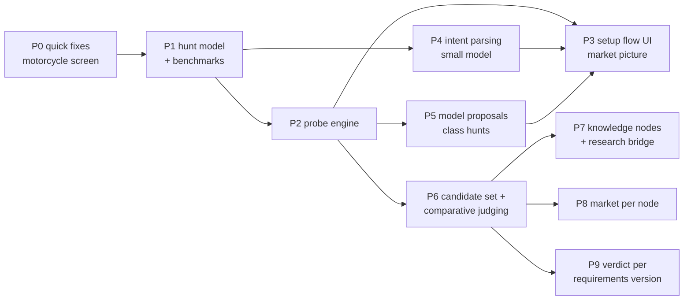

# Plan: the hunt engine

From "one term + a form" to: hunt type → probed search terms → market picture →
candidate set → one comparative judgement. Implements `product-core.md` §2–§4, §9.

Living plan. Bullets. Superseded steps stay ~~struck~~ with the reason.
Written 2026-09-24.

---

## 0. Goal and non-goals

**Goal:** for any hunt, in any category, the buyer sees **before saving** how the
market looks for what they want, and **after crawling** a ranked, justified short
list. The measure is the benchmark hunts (§1), not RAM alone.

**Non-goals (this plan):**
- own research agent with web search (research bridge stays copy/paste, P7)
- multi-user knowledge sharing
- vision / photo collage (separate plan; hooks left in P6)
- route/corridor changes (probing runs per circle later, see §13)

---

## 1. Benchmark hunts — the acceptance suite

Every package is measured on all of these, not on the one it was built for.

| # | hunt | hunt type | profile | what "good" means |
|---|---|---|---|---|
| B1 | Corsair 2×16 GB DDR4-3200 CL16, ≤ 150 € | exact | spec | no regression: ≥ 7 fit found, reasons name missing fields |
| B2 | Yamaha R1 or Honda CBR1000RR, ≤ 9000 € | shortlist | vehicle | one rung per model, counts per model, model weaknesses as checks |
| B3 | any 1000cc supersport, ≤ 7000 € | class | vehicle | models proposed, each probed, buyer ticks → B2-like hunt |
| B4 | laptop 32 GB, OLED, > FHD, ≤ 800 € | features | performance tech | ladder + snowball finds model names; market picture per budget; ranked top 30 |
| B5 | mattress 140×200, ≤ 150 € | fit | hygiene | size in term (sellers write it); hygiene checks |
| B6 | wardrobe ≤ 120 cm wide, ≤ 100 € | fit | large furniture | size NOT in term; width read from text/photo or asked |
| B7 | vintage armchair, ≤ 200 € | taste | taste | no musts; photo grid; no model judging |
| B8 | anything under market in tools, ≤ 100 € | opportunity | wear device | category only; deviation from market |

- Location for all: Landsberg am Lech area, no radius limit unless the hunt needs one.
- Stored as `scripts/benchmarks/hunts.json`; runner `scripts/benchmarks/run.py`
  prints one table (rungs, requests, seconds, candidates, fit, top-3 titles).
- **Recorded fixtures** (saved result pages) for tests; **live runs** only for measuring,
  ≤ 1 req/s, never more than one benchmark run at a time.

---

## 2. Packages at a glance



| pkg | ships | depends | parallel with |
|---|---|---|---|
| P0 | motorcycle screen sane | — | everything |
| P1 | `hunt_type` stored, benchmarks runnable | — | P0 |
| P2 | ✓ probe engine (scraper + API), no UI | P1 | P4 |
| P3 | new setup flow with market picture | P2, P4 | P5 |
| P4 | free text → intent chips | P1 | P2 |
| P5 | class → model proposals, probed | P2, P4 | P3 |
| P6 | candidate set + one comparative call | P2 | P3–P5 |
| P7 | knowledge nodes, research bridge | P6 | P8 |
| P8 | market per node | P6 | P7 |
| P9 | verdict survives search edits | — | anytime |

Each package ships on its own and leaves the app usable.

---

## 3. P0 — quick fixes (motorcycle case)


- Requirements sheet:
  - hide `description` (English extractor instructions); show label + unit only.
  - playbook fields become **suggestions** (collapsed "more criteria"), not the default form.
- Filterable fields go to the URL, not requirements:
  - map playbook field → taxonomy filter where one exists
    (motorcycles: `km_i`, `ez_i`, `hubraum_i`, `leistung_i`, `tuevy_i`; laptops: `ram_s`, `screen_size_s`, …).
  - shown in the setup form as range/enum inputs next to price.
  - ⚠ seller-set attributes are often **unset** → filtering on them can drop good listings.
    P0 shows them; P2 measures coverage before they are applied (§4.4).
- First-open bug: the requirements sheet loads nothing until requirements were edited once.
  Reproduce on a copy DB, fix, test.
- Tests: sheet renders no description; field→filter mapping per category (table-driven).

---

## 4. P1 — hunt model

### 4.1 Data

- `campaigns.hunt_type` TEXT: `exact | shortlist | class | features | fit | taste | opportunity`, nullable (old hunts).
- `campaigns.profile_key` TEXT nullable: override of the category proposal.
- `campaigns.intent_json` TEXT: `{text, musts[], prefs[], filters{}, use[], models[], sizes{}, budget{min,max}}`.
  - `musts`/`prefs`: `{id, label, type: number|enum|boolean|text, want: {min|max|oneOf|match|present}}`.
  - fields may be **ad-hoc** (buyer-defined, no playbook) — extraction must handle them (P6).
- Migration: additive columns only; `VACUUM INTO` backup before running on live.
- Backfill: existing hunts with a family + one memory playbook → `exact`; else null (asked on next edit).

### 4.2 Benchmarks

- `scripts/benchmarks/hunts.json`, `run.py` (§1). Runs against a **copy** DB via `PRISMDEALS_DB`.
- Fixture recorder: `run.py --record` saves every fetched page under
  `scraper/fixtures/probe/<sha1(url)>.html` for offline tests.

---

## 5. P2 — probe engine

New module `scraper/probe.py`; CLI mode `--mode probe` (JSON on stdout, like `family-preview`).

### 5.1 Input

```
{ category_code, filters{}, location_id, radius_km|null, price{min,max},
  hunt_type, musts[], prefs[], seed_terms[], models[], budget_steps[] }
```

### 5.2 Ladder per hunt type

| type | rungs (in order) |
|---|---|
| exact | seed name → name minus revision/latency/speed (existing broadening rule) → line + capacity |
| shortlist | one per model + spelling variants (`cbr 1000 rr`, `cbr1000rr`, `fireblade`) |
| class | net term for the class (e.g. `supersportler`) + one per proposed model (P5) |
| features | category, no term → one rung per must with a strong keyword (`oled`) → pairs of strong musts → snowball models |
| fit | item type → item type + size (only if the size is a title token, see 5.5) |
| taste | style words, each alone |
| opportunity | category, no term |

- Attribute filters (`ram_s`, `km_i`) are **rungs too**: "category + filter" vs "category + term".
- Max 8 rungs per probe; max 2 pages per rung → **≤ 16 requests, ≤ 20 s**.

### 5.3 Per rung

- Fetch page 1 (+ page 2 if total > page size and the rung is still promising).
- `result_list.total_results` = site total; `result_list.parse` = cards (id, title, snippet, price, location).
- Pre-sieve each card on title + snippet with `text_facts` (known playbooks) or keyword match
  for ad-hoc musts → `likely | unclear | no`.
- Record: `total, sampled, likely, unclear, no, new_ids (not seen in earlier rungs), prices[]`.

### 5.4 Keep / drop / stop

- `gain = new likely / sampled`. Drop a rung with gain < 0.10 **and** overlap > 0.8 *(guesses, tune on benchmarks)*.
- Stop when two consecutive rungs have gain < 0.05, or budget of requests used.
- A rung with total > 2000 and likely share < 2 % is "too wide": kept only as the net for
  opportunity/taste, else replaced by its narrower child.

### 5.5 Snowball and title tokens

- Model names: n-grams from `likely` titles that repeat ≥ 3× and are not generic
  (stop list per profile: "laptop", "notebook", "gb", "neu", "top zustand").
- For features hunts: known model patterns from `identity.py` (laptops, phones) first,
  n-grams second. Each new model = new rung (counts toward the 8).
- Title-token test for sizes/specs: share of `likely` titles that contain the token.
  < 30 % → the token must not become a search term (wardrobe width), ≥ 60 % → it may (mattress 140x200).

### 5.6 Market picture (output)

```
{ rungs: [...],
  chosen_terms: [...],
  estimate: { union_likely, union_unclear, median_price },
  per_budget: [{max: 500, likely: 2}, {max: 800, likely: 11}, ...],
  relax: [{must: "ram>=32", likely_without: 23}, ...],
  models_seen: [{name, count, median}],
  requests, seconds }
```

- `per_budget` / `relax` are computed on the **sample** and scaled by rung totals;
  labelled "estimate" in the UI. No extra requests.
- Relax only musts whose absence changes the count by ≥ 2×.

### 5.7 Rate limit and caching

- One **global** limiter across processes (file lock in `/run/lock` or SQLite row):
  crawl, harvest and probe share 1 req/s. Today delays are per loop.
- `probe_cache(url PK, fetched_at, status, html_gz)`; reuse ≤ 6 h. Editing a hunt and
  re-probing costs nothing if URLs repeat.
- 403/429 → stop the probe, return what exists with `partial: true`.

### 5.8 Memory

- `node_terms(node_key, term, category_code, total, likely_share, probed_at)`.
  Written after every probe; read as extra seed terms next time for the same node
  (node = profile key until P7 gives real nodes).

### 5.9 API

- `POST /api/probe` → spawns `--mode probe`, streams progress lines (`__PROBE_RUNG__:{json}`)
  as server-sent events; final JSON = market picture.
- Abort on client disconnect (same pattern as route preview).

### 5.10 Tests

- Ladder builder per hunt type (pure).
- Gain/overlap/stop on synthetic rung data.
- Snowball on recorded laptop titles (fixture) → finds ≥ 3 real model names, no stop words.
- Title-token test: mattress fixture → size allowed; wardrobe fixture → not.
- Rate limiter: two processes, 10 requests → ≥ 9 s.
- Mutation-check each.

---

## 6. P3 — setup flow UI

Replaces the edit screen for **new** hunts; edit screen stays for existing ones, with a "probe again" button.

```
1  What are you looking for?        [free text________________]
2  How do you hunt?                 (chips, one preselected by P4)
   exact · these models · a kind of · these features · must fit · I'll know it · anything cheap
3  Type-specific                    shortlist: model chips (+ add)
                                    class:     proposed models with counts (P5), tick
                                    features:  must chips / nice-to-have chips
                                    fit:       sizes
                                    taste:     style words
4  Where, how far, up to what       location · radius (default none) · price · URL filters
5  Market picture (live)            rung rows fill in as they arrive
                                      oled laptop        60 · 45 likely
                                      oled 32gb          18 · 12 new
                                      zenbook 14 oled    9 · 4 new
                                    ≤ 500 € 2 · ≤ 800 € 11 · ≤ 1000 € 19
                                    without "32 GB": 23 at ≤ 500 €   [relax]
6  [Save and search]
```

- Numbers are the hero of step 5; text ≤ 1 line per row.
- Relax / budget taps re-run only the aggregation (no new requests) unless a term changes.
- Save → family with `chosen_terms`, filters, hunt type, intent; crawl starts (existing path).
- Screens measured at 390 and 1440; no horizontal scroll; ≤ 6 buttons visible per step.
- Translations de + en.

---

## 7. P4 — intent parsing (small model)

- One call: free text (+ category if known) → `{hunt_type, confidence, musts, prefs, filters, use, models, sizes, budget, class}`.
- Frame: hard rules + output format at the end (product-core §8). Model: current
  `LLM_MODEL` via OpenRouter, reasoning off, `:nitro`.
- Code post-processing:
  - filters mapped to taxonomy keys; unknown → musts.
  - models checked against identity patterns; unknown kept as text.
  - never invent a budget.
- UI shows everything as editable chips; nothing applies silently.
- Fallback without model: category default hunt type table + keyword musts.
- Tests: 20 recorded utterances across benchmark categories → expected JSON (fixture replay, no live calls in CI).

---

## 8. P5 — model proposals for class hunts

- Input: class text, budget, category, use.
- Small model proposes 5–12 models **with years plausible under budget**.
- Each proposal = one probe rung → `count, median, likely`. Models with 0 hits are shown struck ("none on the market").
- Cached per class node (`node_terms` + `class_models(node_key, model, proposed_at)`), 30 days.
- Buyer ticks → hunt becomes `shortlist` (hunt type switch stored, with the class kept in intent).
- Guard: a model name the probe never finds in titles is dropped after 2 probes (hallucination filter).

---

## 9. P6 — candidate set and comparative judging

### 9.1 Funnel

1. Crawl (existing) → listings of the hunt.
2. Free sieve (existing `text_facts` / `fit.judge_search`) → out on stated must violation.
3. Detail pages for the rest (existing harvest) — only if not fresher than 7 days.
4. Ad-hoc fact extraction for musts without regex patterns: one small call per **batch of 10**
   listings, facts only, quote required (`fact_sheets` shape).
5. Candidate set = remaining, sorted by score, cap 30. >30 → tournament (§9.4).

### 9.2 The call

- Input, compact:
  - intent (musts, prefs, use),
  - node knowledge (claims, when P7 exists; before: profile checklist),
  - market numbers (median, quartiles, count),
  - per listing: `id · price · location · stated facts table · condition · first 600 chars of description`.
- Output per listing ID (JSON lines, end of prompt): `node, facts{field: {value, quote}}, musts{id: met|violated|unstated|retrofittable}, checks[], seller_questions[], rank, reason (≤ 20 words), same_as[]`.
- Code validates: every quote must occur in the listing text; facts without a matching quote are dropped.

### 9.3 Stability

- 3 runs, shuffled order, same input. Final rank = mean rank; spread > 5 places → "uncertain".
- Measure Kendall tau between runs on benchmarks; target ≥ 0.7 *(guess)*. If lower: smaller sets.
- Cost logged per run (tokens, €, seconds).

### 9.4 More than 30

- Tournament: groups of ≤ 30 (shuffled), top 10 of each into a final group.
- Prefer tightening first: the UI suggests the must or budget that halves the set.

### 9.5 New listings later

- New candidate + current top 10 as anchors → one small call → insert position.
- Full rerun nightly if ≥ 5 new candidates or knowledge changed.

### 9.6 Storage

- `judge_runs(id, campaign_id, requirements_hash, knowledge_hash, created_at, model, tokens, cost_eur)`.
- `listing_ranks(run_id, listing_id, rank, reason, musts_json, facts_json, questions_json)`.
- Score (`score.js`) reads the `musts` states from the latest run when fresher than text facts.

### 9.7 UI

- Row: percent as today; `#3 / 28` small beside it when a run exists.
- Sheet: rank + reason line, "same as #12" link, seller questions with copy button.
- Weak market banner when the best candidate is above the node median or misses a must.

### 9.8 Tests

- Quote validator drops invented facts.
- Rank merge of 3 runs (pure).
- Tournament grouping (pure).
- Replay of one recorded B4 call → parsed, stored, rendered.

---

## 10. P7 — knowledge nodes and research bridge

- Claims table as in product-core §6 (split today's one-row dossier into claims).
- Node assignment comes from the P6 call (`node`), with "higher when unsure".
- Inheritance: read claims along the path.
- Research bridge: three prompts, copy/paste UI, URL check, approval (product-core §8).
- Trigger: research value (product-core §5) above threshold **and** node without fresh claims.
- Benchmarks for features hunts = claims of kind `benchmark` (model → value → source).

## 11. P8 — market per node

- Listing → node from P6/P7; median per node, excluding defect/parts/accessory.
- Value drivers (year, km, age) regression once ≥ 30 listings per node.
- `score.js` value axis switches from per-search median to per-node median.

## 12. P9 — verdict per requirements version

- `listing_fit` keyed by (listing, requirements_hash) instead of (listing, search).
- Editing search terms no longer drops verdicts; editing musts re-judges.

---

## 13. Cross-cutting

- **Rate:** 1 req/s global (P2 limiter), probes + crawl + harvest share it.
- **Routes:** probing on a route runs per circle only for the chosen terms, not the ladder (later).
- **Cost ceiling** per hunt setup: ≤ 20 requests, ≤ 2 small-model calls, ≤ 0.05 € *(guess)*.
- **Safety:** never write `data/scraper.db` except migrations after `VACUUM INTO`; tests on copies.
- **Language:** code, docs, commits English; UI strings via translations de + en.
- **Heavy runs** through `buildlock` (pytest).
- **Deploy:** backend first, then frontend; migrations before backend restart.

## 14. Definition of done per package

- Tests green; every new test mutation-checked once.
- Benchmark table before/after in the PR description.
- Screenshots 390 + 1440 for UI packages, viewed.
- `product-core.md` updated: state table, struck ideas with reason.

## 15. Risks

| risk | mitigation |
|---|---|
| block by Kleinanzeigen through extra probe requests | global limiter, cache, ≤ 20 req per setup, stop on 403/429 |
| small model invents models or facts | probe verifies models; quote check for facts |
| position bias in comparative call | shuffled runs, stability metric, tournament |
| setup flow too heavy for exact hunts | exact hunt skips steps 3 and most of 5 (one rung list) |
| estimates on samples mislead | label "estimate", show sample size |
| seller-set attribute filters drop unset listings | measured as a rung before applying |

## 16. Open decisions

- Default hunt type when the model is unsure: ask, or pick by category?
- Show rank and percent both, or only one for taste/opportunity hunts?
- Tournament vs forcing narrower musts above 30 — which first?
- Where the probe runs for route hunts (circle count × rungs explodes).
