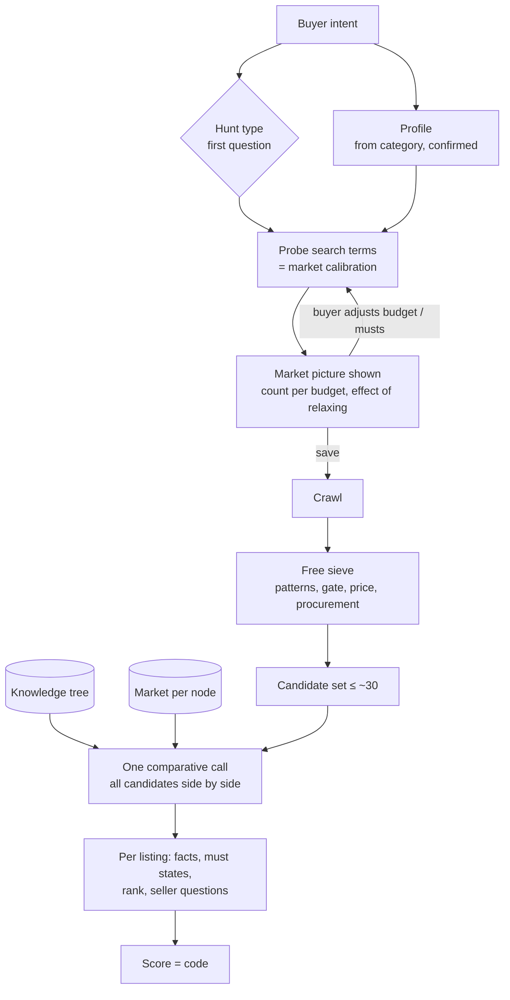

# Product core: matching a buyer's intent to listings

Living document, iterated by people and AIs. Bullets, not prose.
Replaces `produktkern.md` (German, 2026-09-23). Rewritten 2026-09-24.

**Question it answers:** how does "I want to buy X" become a justified judgement
of every listing, whether X is a motorcycle, RAM, a laptop or a wardrobe?

**Conventions**
- Superseded ideas stay: ~~struck through~~ + *dropped: reason*. Never delete.
- Numbers are measured on the live DB unless marked as a guess.
- Examples must span several categories. One category never proves a rule.

---

## 1. Flow

Kept apart because they age differently and belong to different people:

| | belongs to | changes in | source |
|---|---|---|---|
| Intent | one buyer | per hunt | interview |
| Knowledge | everyone | years | research, once per node |
| Market | everyone | weeks | own observation |

---

## 2. Two independent dimensions: hunt type × profile

- **Hunt type** = how the buyer hunts → decides *search and comparison*.
- **Profile** = what kind of thing it is → decides *risk, value, procurement weights*.
- Category suggests both; buyer confirms. Same category, different hunt types:
  motorcycle can be *shortlist* ("R1 or CBR") or *class* ("1000cc supersport").

| hunt | hunt type | profile |
|---|---|---|
| Corsair 2×16 GB DDR4-3200 | exact | spec |
| Yamaha R1 or Honda CBR1000RR | shortlist | vehicle |
| any 1000cc supersport ≤ 7000 € | class | vehicle |
| laptop 32 GB, OLED, > FHD | features | performance tech |
| mattress 140×200 | fit | hygiene |
| wardrobe ≤ 120 cm wide | fit | large furniture |
| vintage armchair | taste | taste |
| Lego 75192 complete | exact | collectible |
| tool bundles under market | opportunity | wear device |

### Hunt types

| type | buyer says | examples | search | judge | knowledge |
|---|---|---|---|---|---|
| **exact** | "this spec" | RAM kit, tyres 205/55 R16, Lego set no., printer cartridge, Sony FE 85/1.8 | name, broadened + category filters | gate + price | part-number schema |
| **shortlist** | "one of these models" | R1/CBR, iPhone 13/14, Bugaboo Fox/Cybex Priam, Golf 7/Octavia 3 | one term per model + spelling variants | condition, model weaknesses, year/km curve | deep, per model |
| **class** | "a kind of thing" | 1000cc supersport, estate car with towbar, trekking e-bike, bean-to-cup machine, 4-berth camper | class → candidate models → probe each → buyer ticks → becomes shortlist; plus one net term for the class | like shortlist | class + per model |
| **features** | "these properties, brand irrelevant" | laptop, 27" 4K monitor, 55" TV, 18 V brushless drill, 8 kg washer | feature ladder + model snowball (§4) | normalised facts side by side, performance per euro | benchmarks per model/series |
| **fit** | "must fit" | wardrobe, mattress, bike frame 56, kids' bike 20", shoes 44 | item type broad; size in the term only if sellers put it in titles (mattress yes, wardrobe no) | measures from text/attributes/photo; open → seller question; procurement heavy | none or generic |
| **taste** | "I'll know it when I see it" | lamp, armchair, decor, art, vintage clothes | style words, broad | the buyer; learn from keep/dismiss; photo grid | none |
| **opportunity** | "anything cheap in X" | tool bundles, giveaways, resale | category, no term | deviation from node market, fraud signals | market only |

- **Modifiers** come from the profile, across hunt types: authenticity, completeness,
  hygiene, registration, safety expiry (child seats).
- **Hunt types change** after probing:
  - class → shortlist once models are ticked.
  - features → shortlist if the snowball finds a few dominant models.
  - exact → features if the exact market is empty (relax one spec).
- **The first interview question is the hunt type**, not category fields.

### Profiles

Axis weights 0–3 per profile. Full category mapping (161 categories, all assigned):
`scraper/profiles.py`, exported to `backend/db/profiles.json`.

| profile | identity | risk | value | procurement | fit | research |
|---|---|---|---|---|---|---|
| vehicle | mid | **high, per model** | curve (year, km) | viewing mandatory | mid | deep |
| performance tech | mid | mid | **performance per €** | shipping ok | low | benchmarks, series weaknesses |
| wear device | mid | **wear parts** | new price, age | mid | low | shallow |
| spec | **high** | low | close to new | shipping | none | schema only |
| large furniture | low | low, visible | low | **high** | **high** | none |
| hygiene & safety | mid | **high, generic** | new price | mid | mid | once per category |
| fashion | size, **authenticity** | low | new price, brand | shipping | **high** | authenticity marks |
| collectible | **authenticity, completeness** | mid | collector market | shipping, insurance | mid | deep |
| taste | low | low | low | mid | **all** | none |
| open | small model picks one per hunt | | | | | |

- Category is only a proposal: mattress sits in "bedroom" (→ furniture) but is hygiene;
  Lego sits in "toys" but is collectible; e-bike sits in "bicycles" but judges like a vehicle.
  Small model checks the proposal **once per hunt**, buyer sees and can change it.
- Category comes from the **listing** URL first (`/s-anzeige/…/<id>-225-…` → c225), then
  the search URL. Measured: search URL alone leaves 378 of 1498 listings without profile,
  listing URL 11.

---

## 3. Buyer intent

Four kinds of needs; the kind decides where a need flows:

| kind | example | goes to |
|---|---|---|
| filter | ≤ 9000 €, automatic, colour, km, ccm, first registration | search URL **if Kleinanzeigen has the filter**, else treat as must. Seller-set attributes (laptop `ram_s`, motorcycle `km_i`) are often unset → probe them as a rung before applying |
| must | has towbar, no accident, 32 GB | gate; stated violation → out; unstated → seller question |
| preference | rather black, ideally with cases | ranking, never exclusion |
| use | two-up on country roads, tows 1.5 t, video editing | research **and** judging |

- Wishes and musts **in the buyer's own words** ("ABS", "Koffer", "mindestens 150 PS") are
  first-class: read from title and description as words (negation: "ohne ABS" = no) or numbers
  with units. A wish lifts the score (met 1, unmentioned ½, denied 0) and never changes the
  verdict; a must decides like a playbook must. Entered in setup ("Wäre schön") or later in the
  requirements sheet. Code: `scraper/wishes.py`, `fit._own_words`.
- In a model list the **model is a must** (named in the title, word-aware), a **generation code**
  ("RN19") is a must on build years (asked once per code, cached, ±1 year), and a **request**
  ("Suche …") is not an offer. Code: `scraper/hunt_identity.py`, `scraper/generation.py`.
- Search terms never carry a generation code ("yamaha r1 rn19" finds 0, "yamaha r1" 115).
- **Asking vs judging is separated:** a change to terms, place, radius, price or filters crawls,
  then judges and compares (server-side); a change to requirements only judges and compares; a
  rename does nothing.
- Rule: **the buyer decides which questions are asked; the answers belong to the tree.**
  No model call depends on a single buyer, except the interview and the judging.
- A must can trigger research: "must have towbar" → is it retrofittable, at what cost?
- ~~Interview questions are chosen by profile (≤ 5 per profile)~~
  *dropped: the hunt type decides search and comparison, so it must be asked first; profile questions follow.*
- ~~Requirements screen = every playbook field of the category as a form~~
  *dropped: produced the motorcycle case (§11). Filterable fields belong in the URL; generic
  fields not tied to the model are noise; musts come from the buyer and the model node.*

---

## 4. Search wide, judge narrow · market calibration

- **Rule:** the search term finds, the requirements judge. Neither does the other's job.
  - A surplus hit costs one row in the free sieve. A missed hit is invisible forever.
  - Sellers rarely put specs in titles; the facts are in descriptions.
- ~~The job's name becomes the search term~~ *dropped: Corsair case (§11).*
- ~~Broadening = a fixed rule per profile decides the terms~~
  *dropped: a guess. Stays only as the first rung of the ladder; measurement decides.*
- ~~Terms measured only after saving ("50 hits, 7 fit")~~
  *dropped: too late — the buyer committed before seeing the market. Measurement moves before save.*

### Probing (before saving)

1. Build a ladder from wide to narrow (per hunt type):

   | hunt type | ladder |
   |---|---|
   | exact | line name → name + capacity → name + spec |
   | shortlist | one rung per model + spelling variants |
   | class | class word → candidate models (from knowledge) |
   | features | category only → feature word ("oled laptop") → feature pair ("oled 32gb") → snowballed model names |
   | fit | item type → item type + size, only if sellers write it |
   | taste | style words |
   | opportunity | category, no term |

2. Per rung: total count shown by Kleinanzeigen + pages 1–2 (titles, snippets) →
   pre-sieve for likely fit.
3. Overlap between rungs (share of IDs already seen) → drop rungs that add < ~10 % new
   likely candidates *(threshold is a guess)*.
4. **Snowball:** model names found in hits become new rungs ("Zenbook 14 OLED").
5. Stop when the next rung adds almost nothing. ≤ 1 request/s → 5 rungs ≈ 10 s.
6. **Market picture** shown to the buyer:
   - count meeting all musts per budget step (≤ 500 / 800 / 1000 €),
   - effect of relaxing each must ("16 GB instead of 32 → 23 instead of 2"),
   - median.
   Buyer adjusts budget or musts, then saves.
7. Stored per knowledge node: term, hits, likely-fit share, date → next hunt starts smarter.
8. Re-probe weekly or when yield drops.

### Saving

- Save crawls immediately, then runs the free sieve. Screen shows "searching", not an empty list.
- Old finds stay visible until the new search ran once.
- Verdict belongs to (listing, requirements version), not (listing, search).
  *Implemented in P9: keyed by `(listing_id, requirements_hash)` with fallback to `search_id`.*
- ~~Default radius 30 km~~ *dropped: default is no limit; the buyer narrows.*

---

## 5. When research pays off

**research value ≈ price level × hiddenness × model dependence**

| | price | hidden | per model | result |
|---|---|---|---|---|
| Yamaha R1 | 8000 € | high | high | deep: model + generation |
| bean-to-cup machine | 300 € | mid | mid | shallow: series wear parts |
| mattress | 200 € | high | **no** | once per category |
| RAM | 100 € | low | no | part-number schema |
| wardrobe | 50 € | low | no | none |

- High risk ≠ deep research: a generic risk needs one node for the whole category.
- Always, without model or research: price vs market, procurement, seller signals
  (private/commercial, age, VB, photo count), fraud signals.
- The small model may answer "research not worth it" → no brief, hunt costs nothing.

---

## 6. Knowledge tree

- Worth storing = reuse × how long it stays true.
  Category level always; depth only where hunts go. Nodes are created **only when a hunt needs them**.
- Path keys exist: `dossiers.identity_key` (`bmw/3er/e90/320d/n47`). Missing: inheritance.
- Knowledge inherits downward (RN19 gets R1, supersport, motorcycle).
- Each claim hangs at the highest node where it is true.
- Where a node splits is decided by research ("do generations differ in weaknesses? how to tell from a listing?").
- When unsure, classify a listing **higher** (R1, not RN19).
- A claim: node · kind (weakness, check, recognition mark, maintenance, value driver,
  warning sign, seller question, retrofit, **good search terms**) · axis · check path
  (text, photo, ask, on site) · weight · ≥ 1 reachable source URL · date + expiry · approved.
- Free learning: every listing feeds node markets; every judgement shows which checks
  sellers answer unasked; every probe records which terms work.

---

## 7. Market

- **Prices are never researched.** Own listings are current, German, regional, free.
- Market per **node**, not per search ("motorcycle ≤ 4000 €" mixes 125cc and 1000cc).
- Exclude defects, parts donors, accessories from the median.
- Adjust by value drivers once data allows (year, km, age).
- New price may come from research (ages slowly, verifiable).
- Market picture for prompts: 10 listings spread over price deciles + count, median, quartiles, count under budget.

---

## 8. Research bridge

- No own research agent yet. Buyer copies one brief into their web-search AI, pastes the answer back.
- Three prompts, each: **hard frame (code) · soft middle (data/small model) · format at the end**.
  1. Write brief (small model): intent (use + research-relevant musts), profile, market picture,
     what the tree already knows. Output: `DECISION` · `WHAT TO KNOW` (≤ 6 lines) · `BRIEF`.
  2. Research (buyer's AI): sources required, no used prices, fixed headings per profile
     (vehicle: classification, known weaknesses, maintenance, warning signs, value drivers,
     fitness for use, seller questions, sources; spec: part-number structure; collectible:
     authenticity marks; furniture/taste: no brief).
  3. Classify answer (small model): split into claims, keep links, mark unsourced; code checks URLs
     (`dossiers.validate_claim`); buyer approves.
- Fixed headings, not JSON: every AI keeps headings, each breaks JSON differently.

---

## 9. Judging

- **Free sieve first**, no model: title/description patterns, filters, stated must violations,
  procurement, price vs market. RAM: patterns decide 34 of 50 without a model.
- ~~Batches of 8–12 mixed listings per call~~
  *dropped: splitting prevents side-by-side comparison; ~30 compact listings (~30–40k tokens,
  guess) fit one call.*

### Candidate set

- Funnel to ≤ ~30: stated must violations out, open musts stay (flagged). Detail pages ≈ 1 s each.
- One call: inherited knowledge + node market numbers + intent + compact fact table +
  short description per listing. No raw HTML.
- Output per listing ID: node · facts with quote · state per must (met / violated / unstated /
  retrofittable) · check items · seller questions · rank + one-line reason.
- 2–3 runs, shuffled order, average ranks; disagreement shown as uncertainty.
- Cross-references are the gain: "same laptop as #12, 80 € cheaper".
- New listing later: compare against current top ~10 as anchors, insert; no full rerun.
- More than ~30: tighten via probing/musts, or tournament (groups of 30, winners in a final).
- Photos as second source when text leaves a must open: all images as **one collage**,
  one vision call, asking only for open fields.
- Hunt type decides how much this matters: essential for shortlist/class/features;
  optional for exact (gate + price mostly suffice); taste → buyer, not model.

---

## 10. Score

`score = gate × Σ(weight_axis × grade_axis) / Σ weight_axis` — code: `backend/db/score.js`.

- Gate from musts: stated violation → 0; each unstated must caps × 0.75.
- Grades 0–1: identity (share of preferences met) · value (price vs node median: median 0.5,
  −30 % ≈ 0.86, +30 % ≈ 0.14) · condition/risk (detail-page condition, share of stated fields,
  photos) · procurement (detour minutes) · fit (only where measurable).
- An axis without basis drops out of numerator and denominator.
- Weights from the profile.
- **AI supplies facts, code computes the grade.**
- The comparative **rank is its own statement** ("#3 of 28"), not folded into the percent.
  It ranks the **quality of the offer without price** (certainty, condition, completeness, trust):
  measured, the model ordered by price worse than code does.
  Weak market: "best found, market weak".
- ~~Niceness score from the model's impression~~
  *dropped: shifted with whichever reference description the model had seen; not reproducible.*

---

## 11. Cases

- **RAM works** (Corsair 2×16 GB DDR4-3200 CL16): exact hunt; identity fully specifiable;
  facts are in text; homogeneous market; gate + price suffice.
- **Corsair, job name as term:** saving turned the name into
  "corsair-vengeance-32gb-2x16-ddr4-3200-cl16". "corsair vengeance 32gb" found 50 hits, 7 fitting;
  the long term would have found almost nothing, silently.
- **Motorcycle, 2026-09-24 — failed badly:**
  - hunt "Motorrad", ≤ 7000 €, one term "motorrad" → 6 hits, 0 fit.
  - Requirements screen = fixed motorcycle field list:
    - filterable fields (first registration, km, kW, ccm) offered as requirements,
    - generic AI-written fields (storage, crash damage) tied to no model,
    - English extractor instructions shown to the buyer.
  - First open loaded nothing; only after editing requirements.
  - Root cause: a shortlist/class hunt treated as an exact hunt with a spec form;
    no hunt-type question, no probing, no model knowledge.
- **Printer:** 13 terms, nothing found; the buyer could not see whether terms, radius or
  price caused it → probing shows it before saving.
- ~~Chat idea 2026-09-24: four routes by product group (model known / class / performance
  per € / interview), build "class" next~~
  *dropped: organised by product group, not by how the buyer hunts; no market calibration.*

---

## 12. UI per profile

- Result row identical everywhere: photo, title, location, price as hero, score below.
- Right column / detail sheet vary:
  - vehicle: checklist of weaknesses, seller questions to copy.
  - performance tech: price vs performance curve, listing as a point.
  - spec: musts "x of y", decoded part number.
  - large furniture: total cost = price + detour + transport.
  - hygiene: warning signs present.
  - taste, fashion: photo grid instead of list.
- Order: cheapest · nearest · best rated. Server-side over the whole hunt, not the loaded page.
  - Nearest = detour on a corridor, km from the hunt's town otherwise.
- Map closes the list: every find of the tab, the search circle or the corridor.
  - ~~Map as a toggle, corridor hunts only~~ — plain hunts had no map at all.
- Position from the card, no geocoding service:
  - `listings.postal_code` (own column, updated from every card) → centroid.
  - else "State - Town" → gazetteer; a bare name only near the search.
  - ~~PLZ packed into the place text, upgraded by a regex rule~~ — the code needs its own field.
- Map: one number = one popup with exactly those offers; listings sharing a postal code never split by zoom.
  - No search circles; fit to the shape once, never on re-render.
- One request per page: listings, all pins of the tab (page 1) and the corridor shape.
- Edit screen shows how the hunt is stored: per model, for all models, what is searched.
- Change with AI: one sentence ("CBR nur SC59, unter 5000 km") -> the hunt document changed.
  - Changes listed by code (diff), not by the model; "Übernehmen" fills the form, "Speichern" stores.
  - A generation joins the model name; the search term stays without it (no new crawl).
  - Requirements for one model carry `applies_to` (term ids): judge, score and hash respect it.
  - Own-word reading includes the detail page's attributes (Kilometerstand from details).
- Buttons are one line (CSS `button { white-space: nowrap }`); the CI shot run fails on a wrapped
  button or a page wider than the window, at 360, 480 and 1440 px.
- Research answers: footnotes ("[1][5]" + list) become URLs before classifying; the brief asks for
  sources, not for a form. ~~"Nenne zu jeder Aussage die vollständige URL"~~ — produced debris.
- Corridor after the fact: the hunt keeps terms, requirements, verdicts.
  - Every term runs in every circle; town searches rest (links inactive, finds stay).
  - Removing the corridor brings the town searches back.

---

## 13. State in code

| | exists | missing |
|---|---|---|
| taxonomy | `data/kleinanzeigen_taxonomy.json`, 161 categories with filters | — |
| category → profile | `scraper/profiles.py` (listing + search URL) | small-model check per hunt |
| hunt type | `campaigns.hunt_type` stored, validated, backfilled (P1); 7 types validated in `scraper/intent.py` (P4) | UI setup flow (P3) |
| probing / market picture | ✓ probe engine, ladder, snowball, node memory (`scraper/probe.py`, P2); B1-B8 runner (P1) | UI setup flow (P3) |
| playbooks | 5 in `scraper/playbooks.py`, mapped to filters (P0) | tie to profile + hunt type |
| path keys | `dossiers.identity_key` | inheritance |
| claims | table `dossiers`, `validate_claim` | axis, check path, weight; today one row = whole dossier |
| listing → node | `identity.py` (cars, motorcycles, laptops, phones), `market_node.js` / `market_node.py` (table `listing_nodes`, P8) | — |
| market | median per node (`market_node.js`), clean from defects/accessories, fallback chain, value drivers (P8) | — |
| intent | requirements per campaign, filter mapping to URL (P0), `campaigns.intent_json` (P1), `scraper/intent.py` + `POST /api/intent/parse` (P4) | interview UI (P3) |
| model proposals | `scraper/model_proposals.py`, table `class_models`, `POST /api/intent/models` (P5) | probe integration |
| verdict | per (listing, requirements version) via `requirements_hash` in `listing_fit` + `knowledge_sets` (P9) | — |
| score | `backend/db/score.js`, breakdown in sheet | rank as separate statement |
| research bridge | three prompts in `scraper/research_bridge.py`, copy/paste UI (`KnowledgeSheet.tsx`), URL check, buyer approval (P7) | — |
| comparative judging | fact sheets with quotes (`fact_sheets`) | candidate set, one call, shuffled runs |

### Order of work

Detailed plan: [`plan-hunt-engine.md`](plan-hunt-engine.md) (packages P0–P9, benchmark hunts B1–B8).

1. ✓ taxonomy lookup · ✓ score.
2. ✓ P0 quick fixes (motorcycle screen) · ✓ P1 hunt model + benchmarks.
3. ✓ P2 probe engine · ✓ P4 intent parsing → ✓ P3 setup flow with market picture · ✓ P5 model proposals.
4. ✓ P6 candidate set, one comparative call.
5. ✓ P7 knowledge nodes + research bridge · ✓ P8 market per node · ✓ P9 verdict per requirements version.
- ~~Order: probing → hunt-type question → candidate set → research → market~~
  *dropped: superseded by the package plan; hunt type and probing are built together because the ladder depends on the type.*
- ~~Interview comes last (old step 7)~~ *dropped: the hunt type decides the search, so it comes first.*
- Later: own research agent; knowledge shared between buyers (pasted research is foreign text, check before sharing).

---

## 14. Open questions

- Rank vs percent: show both, or derive one from the other?
- Probing cost and block risk at 1 req/s with many hunts.
- Candidate-set size limit: measure where order starts to colour the ranking.
- Claim weight at several nodes ("track use is bad" — all motorcycles, supersport more).
- Who approves shared knowledge once there are several buyers?
- Who sets the hunt type when the buyer does not know — small model proposal + one question?
