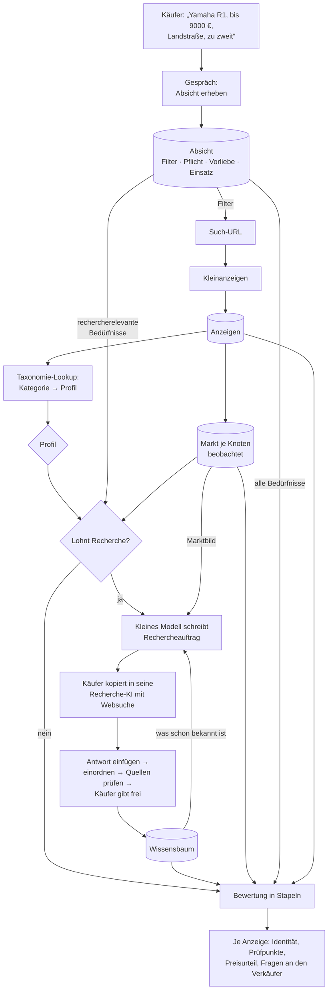
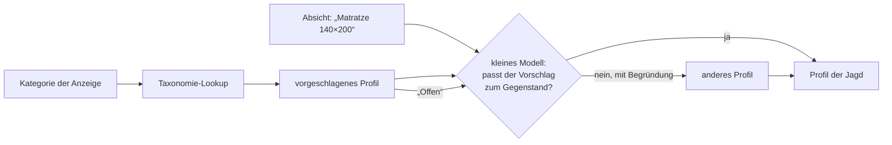
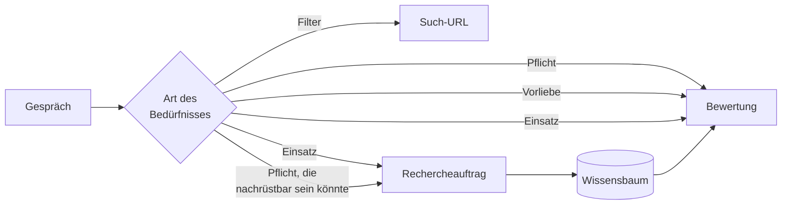
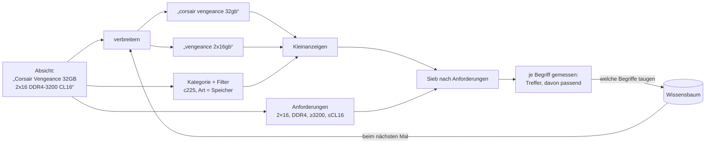
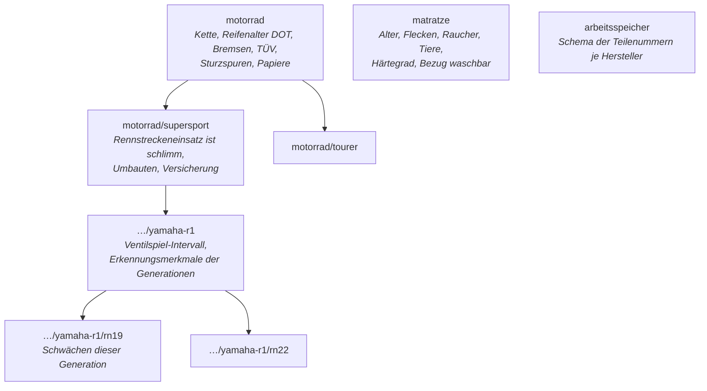
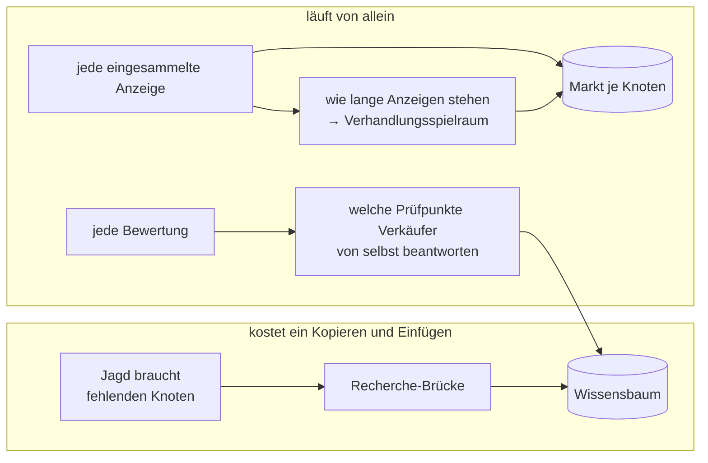
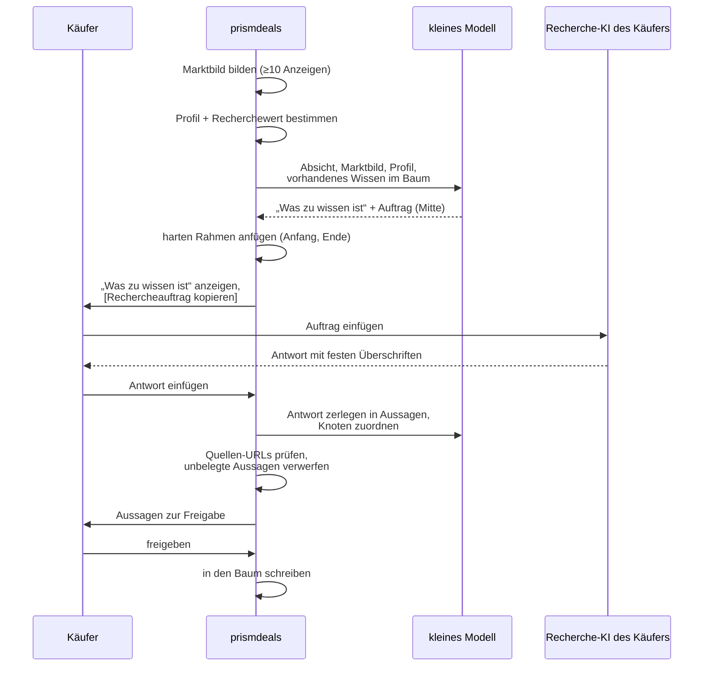
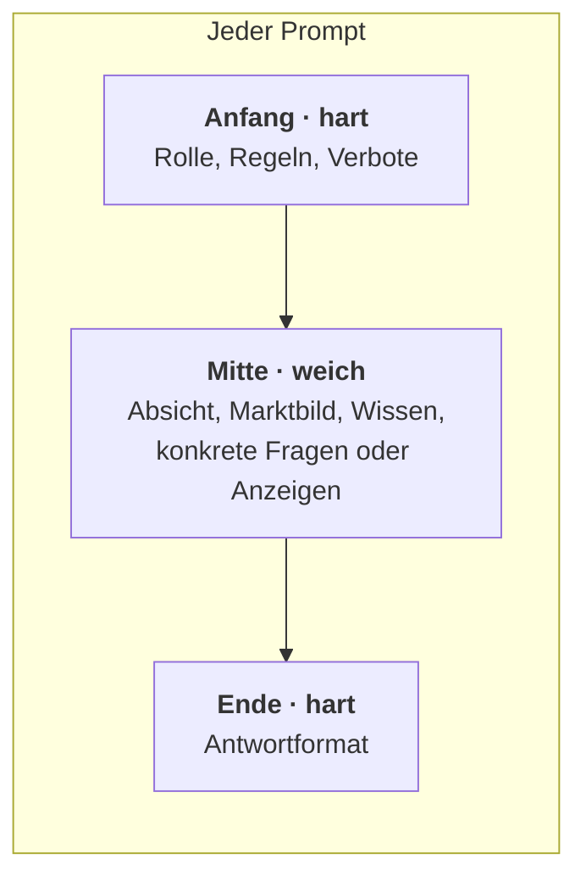
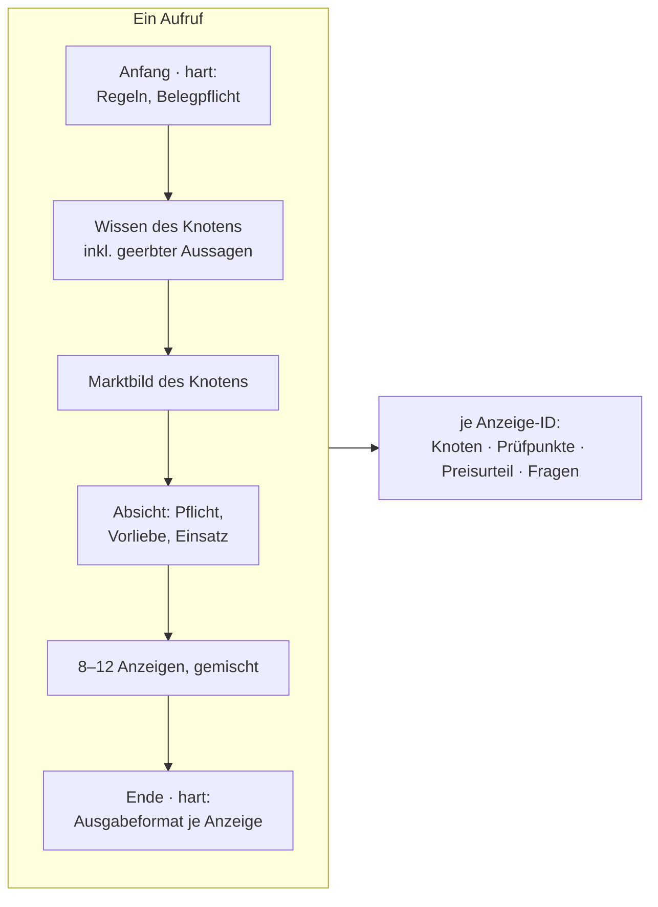

# Der Produktkern: wie prismdeals urteilt

*Master-Dokument, Stand 2026-09-23. Ersetzt `plan-generische-suche.md` und
`plan-wissen.md`. Den Ist-Zustand, auf dem es aufbaut, beschreibt
[`backend-bestand.md`](backend-bestand.md).*

Dieses Dokument beantwortet eine Frage: **Wie wird aus „ich will X kaufen" ein
begründetes Urteil über jede einzelne Anzeige, egal ob X ein Motorrad, ein
Arbeitsspeicher oder ein Schrank ist?**

---

## Inhalt

1. [Das Problem](#1-das-problem)
2. [Fünf Achsen](#2-fünf-achsen)
3. [Profile: 161 Kategorien auf zehn Arten zu urteilen](#3-profile)
4. [Wann Recherche sich lohnt](#4-wann-recherche-sich-lohnt)
5. [Was der Käufer will: Absicht und Bedürfnisse](#5-was-der-käufer-will)
6. [Breit suchen, eng urteilen: wer die Suchbegriffe bestimmt](#6-breit-suchen-eng-urteilen)
7. [Der Wissensbaum](#7-der-wissensbaum)
8. [Der Markt wird beobachtet, nie recherchiert](#8-der-markt)
9. [Die Recherche-Brücke](#9-die-recherche-brücke)
10. [Wie die Prompts gebaut sind](#10-wie-die-prompts-gebaut-sind)
11. [Bewertung in Stapeln](#11-bewertung-in-stapeln)
12. [Der Score: ein Tor, fünf Achsen](#12-der-score)
13. [Was die Oberfläche je Profil zeigt](#13-was-die-oberfläche-zeigt)
14. [Stand im Code und Reihenfolge](#14-stand-im-code-und-reihenfolge)
15. [Offene Fragen](#15-offene-fragen)

---

## Der ganze Fluss auf einen Blick



Drei Dinge fließen zusammen und werden **getrennt gehalten**, weil sie
verschieden schnell altern und verschiedenen Leuten gehören:

| | gehört | ändert sich | Quelle |
|---|---|---|---|
| **Absicht** | dem einen Käufer | pro Jagd | Gespräch |
| **Wissen** | allen | in Jahren | Recherche, einmal pro Knoten |
| **Markt** | allen | in Wochen | eigene Beobachtung, laufend |

---

## 1. Das Problem

Heute kennt prismdeals eine einzige Art zu urteilen: **Stimmen die Angaben mit
meinen Anforderungen überein?** Für Arbeitsspeicher ist das richtig, reguläre
Ausdrücke entscheiden dort 34 von 50 Fällen ohne einen Modellaufruf. Für fast
alles andere ist es die falsche Frage:

- **Beim Motorrad** passen die Angaben fast immer. Entscheidend ist, ob
  *dieses* Exemplar die bekannten Schwächen *seines* Modells hat, ob es auf der
  Rennstrecke war, ob das Ventilspiel gemacht ist. Das steht in keiner Anzeige,
  man weiß es über das Modell.
- **Beim Laptop** gibt es keine richtige Antwort, nur eine bessere. Die Marke
  ist egal, es zählt Leistung pro Euro.
- **Bei der Matratze** ist das Risiko hoch (Hygiene, Alter), aber es ist für
  alle Matratzen dasselbe.
- **Beim Schrank** hat eine KI nichts zu sagen. Die wahren Kosten stecken im
  Abbau und Transport, und ob er gefällt, weiß nur der Käufer.

Unterschiedliche Dinge **urteilt man unterschiedlich**. Das Produkt muss wissen,
wie.

---

## 2. Fünf Achsen

Jeder Kauf wird auf denselben fünf Achsen beurteilt. Was sich je Gegenstand
ändert, ist **wie schwer jede Achse wiegt** und **woher das Wissen dafür kommt**.

| Achse | Frage | enthält |
|---|---|---|
| **Identität** | Ist es das Gesuchte? | Spezifikation, Echtheit, Vollständigkeit, Kompatibilität |
| **Zustand und Risiko** | Was ist verborgen kaputt oder verschlissen? | Schwächen, Verschleiß, Unfall, Hygiene, Missbrauch |
| **Wert** | Was ist ein fairer Preis? | Markt, Neupreis, Wertfaktoren |
| **Beschaffung** | Was kostet es, das Ding heimzubringen? | Umweg, Versand, Sperrigkeit, Abbau, Anmeldung, Besichtigung |
| **Passung** | Passt es zu mir? | Geschmack, Maße, Größe, Sitzposition |

### Dieselben fünf Achsen, vier Gegenstände

| | Yamaha R1 | Arbeitsspeicher | Matratze | Kleiderschrank |
|---|---|---|---|---|
| **Identität** | Modell, Generation, Baujahr. Leicht | *alles*: Takt, Latenz, Riegel. Schwer, aber rein technisch | Größe, Härtegrad | Maße mit Sockel |
| **Zustand und Risiko** | *alles*: verborgen, modellspezifisch, teuer | läuft oder läuft nicht, billig ersetzt | Hygiene, Alter: verborgen, aber **für alle Matratzen gleich** | sichtbar; übersteht er den Abbau? |
| **Wert** | Baujahr × km × Zustand × Wartung | Ware ohne Unterschiede, nah am Neupreis | Neupreis minus starker Wertverlust | fast nichts, oft verschenkt |
| **Beschaffung** | Besichtigung und Probefahrt Pflicht, Anmeldung | Versand, Umweg egal | Auto nötig | Abbau, Transporter, Helfer: **kann mehr kosten als der Schrank** |
| **Passung** | Sitzposition, Einsatz | egal | Härte ist persönlich | Stil, Raum, nur der Käufer weiß es |

### Woher das Wissen je Achse kommt

| Achse | Wissen | Nachweis in der Anzeige | KI nötig? |
|---|---|---|---|
| Identität | Schema, Teilenummern, Erkennungsmerkmale: **Wissensbaum** | Text, Merkmale der Detailseite, Foto | nur wo Muster versagen |
| Zustand und Risiko | allgemein je Kategorie + modellspezifisch: **Wissensbaum** | Text, Foto, **Frage an den Verkäufer**, **vor Ort** | ja, wenn Wissen da ist |
| Wert | **eigene Marktbeobachtung** + Neupreis + Wertfaktoren aus dem Baum | Preis, Baujahr, km, Zustand | nein |
| Beschaffung | **eigene Daten**: Ort, Umweg, Versand, Größenklasse des Profils | Ort, Versand | nein |
| Passung | nur der Käufer | Fotos, Maße | nein, höchstens Maße lesen |

---

## 3. Profile

Ein Profil legt fest, wie die fünf Achsen für eine Art von Gegenstand gewichtet
sind und welche Stufen laufen. 161 Kleinanzeigen-Kategorien fallen auf zehn
Profile.

| Profil | Identität | Risiko | Wert | Beschaffung | Passung | Recherche |
|---|---|---|---|---|---|---|
| **Fahrzeug** | mittel | **hoch, modellabhängig** | Kurve (Jahr, km) | Besichtigung Pflicht | mittel | tief |
| **Leistungstechnik** | mittel | mittel, teils modellabhängig | **Leistung pro Euro** | Versand möglich | niedrig | Leistungswerte, Baureihenschwächen |
| **Gerät mit Verschleiß** | mittel | **Verschleißteile** | Neupreis, Alter | mittel | niedrig | flach |
| **Spezifikation** | **hoch** | niedrig | eng am Neupreis | Versand | keine | nur Schema |
| **Großmöbel** | niedrig | niedrig, sichtbar | niedrig | **hoch** | **hoch** | keine |
| **Hygiene und Sicherheit** | mittel | **hoch, allgemein** | Neupreis | mittel | mittel | einmal je Kategorie |
| **Mode** | Größe, **Echtheit** bei Marken | niedrig | Neupreis, Marke | Versand | **hoch** | Echtheitsmerkmale bei Marken |
| **Sammeln und Wert** | **Echtheit, Vollständigkeit** | mittel | Sammlermarkt | Versand, Versicherung | mittel | tief |
| **Geschmack** | niedrig | niedrig | niedrig | mittel | **alles** | keine |
| **Offen** | *das kleine Modell wählt eines der obigen je Jagd* | | | | | |

### Die Zuordnung aller Kategorien

Erzeugt aus `data/kleinanzeigen_taxonomy.json` (161 Kategorien, alle zugeordnet)
und im Code nachgeschlagen über `scraper/profiles.py`.

| Profil | Kategorien |
|---|---|
| **Fahrzeug** | Autos (c216), Motorräder & Motorroller (c305), Wohnwagen & -mobile (c220), Boote & Bootszubehör (c211), Nutzfahrzeuge & Anhänger (c276) |
| **Leistungstechnik** | Laptops & Notebooks (c278), PCs (c228), Handy & Telefon (c173), Tablets & Reader (c285), Konsolen (c279), Foto (c245), Wearables (c405), TV & Video (c175) |
| **Gerät mit Verschleiß** | Haushaltsgeräte (c176), Audio & Hifi (c172), Heimwerken (c84), Fahrräder & Zubehör (c217), Musikinstrumente (c74), Faxgeräte (c407), Kommunikation & Funk (c408) |
| **Spezifikation** | PC-Zubehör & Software (c225), Autoteile & Reifen (c223), Motorradteile & Zubehör (c306), Wearables Zubehör (c406), Videospiele (c227), Bücher & Zeitschriften (c76), Fachbücher, Schule & Studium (c77), Musik & CDs (c78), Film & DVD (c79) |
| **Großmöbel** | Schlafzimmer (c81), Wohnzimmer (c88), Küche & Esszimmer (c86), Büro (c93), Kinderzimmermöbel (c20), Badezimmer (c91) |
| **Hygiene und Sicherheit** | Babyschalen & Kindersitze (c21), Kinderwagen & Buggys (c25), Baby-Ausstattung (c258), Heimtextilien (c90) |
| **Mode** | Damenbekleidung (c154), Herrenschuhe (c158), Damenschuhe (c159), Herrenbekleidung (c160), Baby- & Kinderschuhe (c19), Baby- & Kinderkleidung (c22), Taschen & Accessoires (c156), Beauty & Gesundheit (c224) |
| **Sammeln und Wert** | Uhren & Schmuck (c157), Kunst & Antiquitäten (c240), Sammeln (c234), Modellbau (c249), Comics (c284) |
| **Geschmack** | Lampen & Licht (c82), Dekoration (c246), Gartenzubehör & Pflanzen (c89), Büro & Schreibwaren (c281), Esoterik & Spirituelles (c232), Handarbeit, Basteln & Kunsthandwerk (c282), Zubehör (c313), Spielzeug (c23) |
| **Offen** | die neun gemischten Oberkategorien (z. B. ganz „Elektronik“ c161, „Haus & Garten“ c80), Weitere Elektronik (c168), Weiteres Familie, Kind & Baby (c18), Weitere Musik, Filme & Bücher (c75), Weiteres Haus & Garten (c87), Weiteres Mode & Beauty (c155), Sport & Camping (c230), Weiteres Auto, Rad & Boot (c241), Weiteres Freizeit, Hobby & Nachbarschaft (c242), Trödel (c250), Essen & Trinken (c248), Verschenken (c192), Tauschen (c273) |
| **Außerhalb** | ganze Zweige: Jobs (c102), Immobilien (c195), Unterricht & Kurse (c235), Eintrittskarten (c231), Dienstleistungen (c297). Einzeln: Nachbarschaftshilfe (c400, c401), Dienstleistungen Elektronik (c226), Dienstleistungen Haus & Garten (c239), Reparaturen & Dienstleistungen (c280), Tierbetreuung & Training (c133), Babysitter/-in (c237), Altenpflege (c236), Freizeitaktivitäten (c187), Verloren & Gefunden (c189), Künstler/-in & Musiker/-in (c191), Reise & Eventservices (c233), Umzug & Transport (c238), Verleihen (c274), lebende Tiere (c132, c134, c135, c136, c138, c139, c243), Vermisste Tiere (c283) |

### Die Kategorie ist nur ein Vorschlag

Die **Matratze** liegt bei Kleinanzeigen in „Schlafzimmer", zusammen mit
Kleiderschränken, gehört aber zu „Hygiene und Sicherheit". **Lego** liegt in
„Spielzeug", gehört aber zu „Sammeln und Wert". Das E-Bike liegt in
„Fahrräder", urteilt sich aber wie ein Fahrzeug (Akku, Motor, bekannte
Schwächen).

Deshalb gilt:



Das kleine Modell prüft den Vorschlag **einmal pro Jagd**, nicht pro Anzeige,
und schreibt seine Begründung dazu. Der Käufer sieht sie und kann sie ändern.
Die Wahl der Jagd wird gespeichert; eine Jagd auf „Matratze 140×200" ist dann
für immer „Hygiene und Sicherheit", auch wenn Kleinanzeigen sie „Schlafzimmer"
nennt.

### Woher die Kategorie einer Anzeige kommt

Heute nur aus der **Such**-URL (`c225`). Familien- und Routensuchen suchen über
alle Kategorien (`k0`), deshalb haben 30 von 32 Suchen kein Playbook. Die
**Anzeigen**-URL trägt die Kategorie aber auch:
`/s-anzeige/…/3517306856-225-8308` → `c225`. Der Lookup liest beide, die
Anzeige zuerst.

Gemessen an der Live-Datenbank (`python scraper/profiles.py --db data/scraper.db`):
Aus der Such-URL allein bleiben **378 von 1498** Anzeigen ohne Profil, aus der
Anzeige nur **11**. Und die 219 Matratzen der Matratzen-Jagd tragen fast alle
c81 „Schlafzimmer": Der Vorschlag wäre „Großmöbel", richtig ist „Hygiene und
Sicherheit". Genau dafür prüft das kleine Modell den Vorschlag je Jagd.

---

## 4. Wann Recherche sich lohnt

Keine Meinung, sondern eine Abschätzung aus drei Größen:

> **Recherchewert ≈ Preisniveau × Verborgenheit × Modellabhängigkeit**

- **Preisniveau**: der Median des beobachteten Markts. Wie viel steht auf dem Spiel?
- **Verborgenheit**: Welcher Anteil der Mängel ist in Anzeige und Fotos
  unsichtbar? (vom Profil vorgegeben)
- **Modellabhängigkeit**: Sind die Mängel für *dieses Modell* anders als für
  die Kategorie? (vom Profil vorgegeben, vom kleinen Modell je Jagd bestätigt)

| | Preisniveau | verborgen | modellabhängig | Ergebnis |
|---|---|---|---|---|
| Yamaha R1 | 8000 € | hoch | hoch | **tief: Modell und Generation** |
| Jura-Vollautomat | 300 € | mittel | mittel | flach: Verschleißteile der Baureihe |
| Matratze | 200 € | hoch | **nein** | **einmal je Kategorie**, dann nie wieder |
| Arbeitsspeicher | 100 € | niedrig | nein | nur das Schema der Teilenummern |
| Kleiderschrank | 50 € | niedrig | nein | keine |

Die Matratze ist der lehrreiche Fall: **hohes Risiko heißt nicht tiefe
Recherche**. Wenn das Risiko allgemein ist, reicht ein Knoten für alle
Matratzen, einmal recherchiert.

**Ein Bedürfnis des Käufers kann Recherche auslösen**, die sonst nicht nötig
wäre. „Auto, muss Anhängerkupplung haben" macht einen Kombi, der keine hat,
nicht automatisch unbrauchbar, wenn sie sich für 600 € nachrüsten lässt. Ob
und wie teuer, ist Wissen über das Modell. Siehe [Abschnitt 5](#5-was-der-käufer-will).

### Was immer läuft, was nur manchmal

**Immer, für jede Jagd, ohne Recherche und ohne Modell:**
Preis gegen den eigenen Markt · Beschaffung (Umweg, Versand, sperrig) ·
Verkäufersignale (privat oder gewerblich, Alter der Anzeige, VB, Anzahl Fotos) ·
Betrugssignale (weit unter Markt, nur Versand, kopierter Text).

**Nur manchmal:**

| Baustein | wann |
|---|---|
| Modellrecherche | Risiko teuer **und** modellabhängig |
| Schema-Entschlüsselung | Identität kompliziert (Teilenummern, Referenznummern) |
| Leistung pro Euro | Wert folgt aus Spezifikationen |
| Echtheitsprüfung | Marken, die gefälscht werden |
| Foto im Mittelpunkt | Passung zählt |
| Gesamtkosten des Holens | sperrig, Abbau, Anmeldung |

---

## 5. Was der Käufer will

### Das Gespräch am Anfang

Bevor gesucht wird, fragt das Produkt. Nicht ein Formular mit zwanzig Feldern,
sondern **höchstens fünf Fragen**, und welche das sind, hängt vom Profil ab.
Auch dieser Fragenkatalog ist Wissen und liegt im Baum: „Was fragt man einen
Motorradkäufer?" wird einmal gelernt.

| Profil | gefragt wird nach |
|---|---|
| Fahrzeug | Einsatz, Budget samt Nebenkosten, was unbedingt dabei sein muss, wie weit man zur Besichtigung fährt |
| Leistungstechnik | wofür (Büro, Spiele, Schnitt), mobil oder fest, Mindestausstattung |
| Großmöbel | Maße des Platzes, Transportmittel, Abbau selbst oder nicht |
| Mode | Größe, Marke, Farbe |
| Hygiene und Sicherheit | Größe, wie alt höchstens, Raucher/Tiere ausgeschlossen |

### Vier Arten von Bedürfnissen

Jede Antwort wird in eine von vier Arten einsortiert. Die Art entscheidet, **wo
das Bedürfnis hinfließt**.

| Art | Beispiel | wirkt auf |
|---|---|---|
| **Filter** | „schwarz", „bis 9000 €", „Automatik" | die Such-URL, **wenn Kleinanzeigen dafür einen Filter hat** (Farbe hat einen: `global.farbe`). Sonst wie Pflicht |
| **Pflicht** | „muss Anhängerkupplung haben", „kein Unfall" | die Bewertung: fehlt es ausdrücklich, fällt die Anzeige raus; wird es nicht erwähnt, wird es zur **Frage an den Verkäufer** |
| **Vorliebe** | „lieber schwarz", „gern mit Koffern" | die Rangfolge, nie der Ausschluss |
| **Einsatz** | „Landstraße, zu zweit", „zieht 1,5 t Anhänger", „für Videoschnitt" | **die Recherche** (welche Schwächen zählen) **und** die Bewertung |



Das „schwarz" aus der Armbanduhr ist ein Filter und eine Vorliebe, aber **kein
Rechercheanlass**: Über die Farbe muss niemand recherchieren. „Zieht einen
1,5-t-Anhänger" dagegen verändert, was man über ein Auto wissen muss
(zulässige Anhängelast, Kupplung, Getriebe unter Last).

### Die Regel, die das Wissen sauber hält

> **Der Käufer bestimmt, welche Fragen gestellt werden. Die Antworten gehören
> dem Baum.**

Der Rechercheauftrag enthält den Einsatz des Käufers, weil er die Recherche
lenkt. Aber was zurückkommt, wird **ohne den Käufer** gespeichert: „Die
Anhängerkupplung ist beim Modell X ab Werk Option und für ~600 € nachrüstbar"
stimmt für jeden. Erst die Bewertung bringt Wissen und Käufer wieder zusammen.

Das hält die Konstruktionsregel aus der [ROADMAP](ROADMAP.md) ein: **Kein
Modellaufruf darf von einem einzelnen Käufer abhängen**. Ausgenommen sind das
Gespräch, in dem seine Absicht entsteht, und die Bewertung, die sie anwendet.

---

## 6. Breit suchen, eng urteilen

### Der Vorfall, an dem das sichtbar wurde

Die Corsair-Jagd hieß „Corsair Vengeance 32GB (2x16) DDR4-3200 CL16". Gesucht
wurde bei Kleinanzeigen nach „corsair vengeance 32gb": **50 Treffer, 7 passend.**
Als beim Speichern der Name selbst zum Suchbegriff wurde, suchte die Jagd nach
„corsair-vengeance-32gb-2x16-ddr4-3200-cl16". Die meisten Verkäufer schreiben
weder Takt noch Latenz in den Titel, also hätte diese Suche fast nichts
gefunden. Und was sie nicht findet, sieht niemand je wieder.

### Zwei Dinge, die entgegengesetzt funktionieren

| | Was ich will | Wonach gesucht wird |
|---|---|---|
| Zweck | urteilen | finden |
| soll sein | **eng**: 2×16 GB, DDR4, 3200 MHz, CL16 | **breit**: alles, was es sein *könnte* |
| ein Fehler kostet | einen falschen Treffer, den das kostenlose Sieb verwirft | eine gute Anzeige, **die wir nie sehen** |
| gehört zu | den Anforderungen, unserem Urteil | den Suchbegriffen bei Kleinanzeigen |

Ein überflüssiger Treffer kostet eine Zeile im Sieb. Ein fehlender Treffer ist
unsichtbar und nicht zurückzuholen. Daraus folgt die Regel:

> **Breit suchen, eng urteilen.** Der Suchbegriff sucht, die Anforderungen
> urteilen. Keins von beiden darf die Arbeit des anderen tun.

### Wer bestimmt die Suchbegriffe

**Das Produkt schlägt vor, der Käufer sieht und ändert.** Nie mehr stillschweigend
der Name der Jagd.



1. **Verbreitern ist eine Regel je Profil.** Es bleibt, was Verkäufer
   zuverlässig schreiben. Es fällt weg, was sie oft weglassen.

   | Profil | bleibt | fällt weg |
   |---|---|---|
   | Spezifikation (RAM) | Marke, Produktlinie, Kapazität | Takt, Latenz, Modulaufteilung, Revision |
   | Fahrzeug | Marke, Modell | Baujahr, Leistung, Farbe |
   | Leistungstechnik | Baureihe oder Prozessorklasse | exakte Konfiguration |
   | Großmöbel | das Möbelstück, eventuell das System (PAX) | Maße, Farbe |

   Für den Anfang reicht eine Regel, die Klammerinhalte, Takt, Latenz und
   Aufteilungen streicht. Später schreibt das kleine Modell die Vorschläge, mit
   dem Wissen des Knotens: „Wie heißt dieses Ding in Kleinanzeigen?" ist genau
   die Art Wissen, die sich lohnt zu behalten.

2. **Kategorie und Filter verengen strukturell.** Kategorie c225 und
   „Art = Speicher" setzt der Verkäufer durch Anklicken, also verlässlich.
   Damit muss der Suchbegriff das Ding nicht mehr von allem anderen
   unterscheiden, sondern nur noch finden.

3. **Die Anforderungen urteilen**, im kostenlosen Sieb und, wo nötig, im Stapel
   (Abschnitt 11). Was im Titel fehlt, steht oft in der Beschreibung, und was
   dort fehlt, wird zur Frage an den Verkäufer.

4. **Jeder Begriff wird gemessen.** Treffer und davon passend, am Begriff
   angezeigt: „corsair vengeance 32gb: 50 Treffer, 7 passend". Ein Begriff mit
   vielen Treffern und null passenden ist zu breit, einer mit zwei Treffern und
   zwei passenden vermutlich zu eng. Die Messung wandert in den Wissensbaum
   („gute Suchbegriffe für diesen Knoten"). Auch so wird das Produkt klüger,
   ohne dass jemand recherchiert.

### Was Speichern bedeutet

Eine geänderte Suche ist eine neue Frage an Kleinanzeigen, aber keine neue Jagd.

- **Speichern ruft sofort ab und bewertet danach mit dem kostenlosen Sieb.**
  Der Bildschirm zeigt, dass gesucht wird, nicht eine leere Liste.
- **Nichts verschwindet vor dem ersten Abruf.** Die Funde der alten Suche
  bleiben sichtbar, bis die neue einmal gelaufen ist.
- **Ein Urteil hängt an den Anforderungen, nicht an der Suche.** Heute wird es
  pro (Anzeige, Suche) gespeichert; jede Änderung an der Suche lässt es
  scheinbar verschwinden. Richtig ist pro (Anzeige, Stand der Anforderungen):
  Findet die neue Suche dieselbe Anzeige wieder und die Anforderungen sind
  gleich, gilt das alte Urteil sofort. Bis das umgebaut ist, sorgt die
  automatische Bewertung nach dem Abruf dafür, dass die Urteile zurückkommen.

---

## 7. Der Wissensbaum

### Lohnt sich eine Wissensdatenbank?

Gespeichertes Wissen ist so viel wert, wie oft es **wiederverwendet** wird, mal
wie lange es **stimmt**.

| Ebene | Beispiel | Wiederverwendung | hält |
|---|---|---|---|
| Kategorie | Motorrad | jede Motorradjagd | Jahre |
| Klasse | Supersportler | viele | Jahre |
| Modell | Yamaha R1 | jede R1-Jagd | Jahre |
| Generation | R1 RN19 (2007–08) | seltener | Jahre |
| Exemplar | die Anzeige in Waldshut | nie | Tage |

- Die **Kategorieebene** lohnt sich immer.
- Die **Tiefe** lohnt sich genau dort, wo gejagt wird. Ein RN19-Knoten, der nur
  einmal gebraucht wird, hat sich trotzdem gelohnt; ohne ihn wäre diese Jagd
  blind gewesen.
- **„In der Tiefe liegt unendlich viel"** stimmt nur für Knoten, die ohne
  Anlass angelegt werden. Knoten entstehen deshalb **nur, wenn eine Jagd sie
  braucht**.

### Aufbau



- **Wissen erbt nach unten.** Wer eine RN19 bewertet, bekommt alles auf dem Weg
  nach oben: RN19, R1, Supersport, Motorrad.
- **Jede Aussage hängt am höchsten Knoten, für den sie stimmt.** „Rennstrecke
  ist schlimm" gilt für alle Motorräder, am schwersten für Supersportler, also
  an beiden mit unterschiedlichem Gewicht. Die Kette gehört zu `motorrad`, nicht
  zu jeder Generation.
- **Wo sich ein Knoten teilt, sagt die Recherche.** Der Auftrag fragt: *„Unterscheiden
  sich Generationen oder Baujahre in ihren Schwächen wesentlich? Wo verläuft die
  Grenze, woran erkennt man sie in einer Anzeige?"* Die Antwort legt die Kinder
  an, oder eben nicht.
- **Woran man einen Knoten erkennt, ist selbst Wissen.** Verkäufer schreiben „R1
  2008", nicht „RN19". Die Erkennungsmerkmale kommen aus der Recherche. Im
  Zweifel wird eine Anzeige **höher** eingeordnet (R1 statt RN19): Lieber zu
  grob als ein falsches Modell mit fremden Schwächen.

Die Pfadschlüssel gibt es schon: `dossiers.identity_key` baut
`bmw/3er/e90/320d/n47`. Es fehlt nur das Erben.

### Eine Aussage

| Feld | Beispiel |
|---|---|
| Knoten | `motorrad/supersport/yamaha-r1` |
| Art | Schwäche · Prüfweg · Erkennungsmerkmal · Wartung · Werttreiber · Warnzeichen · Käuferfrage · Nachrüstung |
| Aussage | was stimmt |
| Achse | Identität · Risiko · Wert · Beschaffung |
| Prüfweg | aus dem Text · aus dem Foto · nur durch Nachfrage · nur vor Ort |
| Gewicht | Kleinigkeit · teuer · Ausschlussgrund |
| Quellen | mindestens eine erreichbare URL, sonst verworfen |
| Datum, Verfall | je Art (Konstruktionsschwäche 2 Jahre, Marktnotiz 30 Tage) |
| freigegeben | ein Mensch hat sie gesehen |

### Wie der Baum klüger wird



---

## 8. Der Markt

**Preise werden nie recherchiert.** Eine Recherche-KI kennt vor allem US-Foren
und Neupreise; ihre Zahlen sind in einer Woche falsch. Unsere eigenen Anzeigen
sind aktuell, deutsch, regional und kosten nichts.

- **Markt je Knoten**, nicht je Suche: Eine Suche „Motorrad bis 4000 €" mischt
  sonst 125er und 1000er. Jede Anzeige, die einem Knoten zugeordnet wird, zählt
  zu seinem Markt und zu dem aller Knoten darüber.
- **Nur Vergleichbares zählt**: Defekte, Teilespender und Zubehör kommen nicht
  in den Median (heute ziehen sie ihn nach unten).
- **Bereinigt nach Wertfaktoren**, sobald genug Anzeigen da sind: Baujahr und
  km beim Fahrzeug, Alter beim Gerät. Welche Faktoren zählen, sagt der Baum
  (Aussagen der Art „Werttreiber").
- **Neupreis als Anker**, wo der Gebrauchtmarkt dünn ist. Der Neupreis darf aus
  der Recherche kommen, denn er altert langsam und ist belegbar.

### Das Marktbild

Für Recherche und Bewertung wird der Markt zu einem Marktbild verdichtet:

- **Zehn Anzeigen, über den Preis gestreut** (je eine aus jedem Zehntel), mit
  Titel, Preis, Ort, Merkmalen und den ersten 400 Zeichen der Beschreibung.
  Nicht zufällig: Billige Unfallmaschinen und teure Sammlerstücke sollen beide
  darin vorkommen.
- **Die Zahlen**: Anzahl, Median, Quartile, wie viele unter dem Budget des
  Käufers liegen.

---

## 9. Die Recherche-Brücke

Vorerst betreiben wir **keinen eigenen Recherche-Agenten**. Der Käufer hat eine
Recherche-KI mit Websuche (ChatGPT, Gemini, Perplexity, Claude). Wir sorgen
dafür, dass er genau **einmal kopiert und einmal einfügt**.



### Was der Käufer sieht

> Für diese Jagd fehlt uns Wissen über die Yamaha R1.
> Was wir herausfinden wollen: …
> **[Rechercheauftrag kopieren]**
> Füge ihn in eine KI mit Websuche ein und die Antwort hier ein:
> [ Antwort einfügen … ]

Kein Konto, keine Schnittstelle, kein Schlüssel. Der Auftrag darf sehr lang
sein, denn der Käufer liest ihn nicht, er kopiert ihn nur.

### „Was zu wissen ist": Beispiele

Das kleine Modell schreibt Fragen, keine Antworten; die Antworten liefert die
Recherche.

**Yamaha R1, bis 9000 €, Landstraße, zu zweit (Fahrzeug, tief)**
> Im Markt: 23 Angebote von 2004 bis 2019; unter 9000 € fast nur 2007–2012.
> - Unterscheiden sich die Generationen dieser Jahre in ihren Schwächen, und woran
>   erkennt man sie ohne Typenbezeichnung?
> - Welche Schwächen haben diese Generationen, und welche sieht man auf Fotos?
> - Woran erkennt man Rennstreckeneinsatz und Sturzschäden?
> - Wann ist das Ventilspiel fällig, was kostet es, woran erkennt man, dass es
>   gemacht wurde?
> - Taugt sie zu zweit auf der Landstraße (Soziussitz, Hitze, Sitzposition)?

**Laptop bis 600 €, für Videoschnitt (Leistungstechnik)**
> Im Markt: 140 Angebote, 38 verschiedene Prozessoren, 11 Grafikkarten.
> - Wie schneiden diese Prozessoren und Grafikkarten beim Videoschnitt ab (eine
>   Zahl je Modell, mit Quelle)?
> - Welche Baureihen haben bekannte Schwächen (Scharniere, Akkus, Displays, Hitze)?

**Kombi bis 15 000 €, muss Anhängerkupplung haben, zieht 1,5 t (Fahrzeug)**
> Im Markt: 60 Angebote, 14 Modelle; 22 erwähnen eine Anhängerkupplung.
> - Welche dieser Modelle dürfen 1,5 t ziehen, und mit welchem Motor?
> - Wo ist die Kupplung nachrüstbar, was kostet es samt Elektrik und Eintragung?
> - Welche Getriebe gelten bei Anhängerbetrieb als anfällig?

**Matratze 140×200 (Hygiene und Sicherheit)**
> Für Matratzen gibt es schon Wissen im Baum. Neu zu recherchieren ist nichts.

**Kleiderschrank, höchstens 120 cm (Großmöbel)**
> Hier lohnt keine Recherche. Worauf es ankommt (Maße mit Sockel, Abbau,
> Transport), prüfen wir in der Anzeige.

Die letzten zwei sind Absicht: **Das kleine Modell darf sagen, dass Recherche
sich nicht lohnt.** Dann entsteht kein Auftrag, und die Jagd kostet nichts.

---

## 10. Wie die Prompts gebaut sind

Es gibt drei Prompts. Alle drei haben denselben Aufbau: **ein harter Rahmen,
eine weiche Mitte**. Der Rahmen ist Code und ändert sich nie zufällig. Die
Mitte schreibt das kleine Modell oder setzt der Code aus Daten zusammen.



**Das Antwortformat steht am Ende**, nicht am Anfang: Modelle befolgen die
letzte Anweisung am treuesten, gerade nach viel Kontext. Am Anfang steht nur
ein Satz, der ankündigt, dass am Ende ein festes Format folgt.

### Prompt 1: Auftrag schreiben (für das kleine Modell)

| Teil | Inhalt | Herkunft |
|---|---|---|
| Anfang, hart | „Du bereitest eine Recherche für einen Gebrauchtkäufer in Deutschland vor. Du schreibst Fragen, keine Antworten. Du darfst entscheiden, dass keine Recherche nötig ist." | Code |
| Mitte | Absicht (nur Einsatz und rechercherelevante Pflichten), Profil mit Achsengewichten, Recherchewert, Marktbild, **was im Baum schon steht** (damit nichts doppelt gefragt wird) | Daten |
| Ende, hart | Format: `ENTSCHEIDUNG: recherchieren / nicht nötig` · `WAS ZU WISSEN IST:` (höchstens 6 Zeilen) · `AUFTRAG:` (die Fragen je Achse) | Code |

### Prompt 2: Die Recherche (für die Recherche-KI des Käufers)

Das kleine Modell schreibt nur die Mitte. Anfang und Ende setzt der Code
darum, und welche Überschriften das Ende verlangt, bestimmt das Profil.

```
── Anfang (hart) ──────────────────────────────────────────────────────
Du recherchierst für einen Privatkäufer in Deutschland. Nutze die Websuche.
Belege jede Aussage mit einem Link. Bevorzuge Fachpresse, Werkstatthand-
bücher, Rückrufdatenbanken (KBA, NHTSA) und große Fachforen. Aussagen ohne
Quelle lass weg. Nenne keine Gebrauchtpreise; die kennen wir aus dem Markt.
Am Ende steht das Format, in dem du antwortest.

── Mitte (vom kleinen Modell) ─────────────────────────────────────────
Er will eine Yamaha R1 kaufen, bis 9000 €, für die Landstraße, oft zu zweit.
So sieht sein Markt aus (10 von 23 Angeboten, über den Preis gestreut):
  1. R1 2008, 34 000 km, 7200 €, "Scheckheft, neue Reifen" …
  2. R1 2004, 61 000 km, 4300 €, "Kette neu, kleiner Umfaller" …
  …
Was wir schon wissen und nicht brauchen: allgemeine Motorrad-Prüfpunkte
(Kette, Reifenalter, Bremsen, TÜV, Sturzspuren).
Was wir brauchen:
  1. Welche Generationen kommen in diesem Markt vor, und unterscheiden sie
     sich in ihren Schwächen wesentlich? …
  2. …

── Ende (hart, Überschriften je Profil) ───────────────────────────────
Antworte genau mit diesen Überschriften, in dieser Reihenfolge:
## Einordnung            (Varianten; Grenze; Erkennungsmerkmale)
## Bekannte Schwächen     (je: was, welche Varianten, Prüfweg, Kosten, Quelle)
## Wartung und Verschleiß
## Warnzeichen in Anzeigen
## Werttreiber            (keine Preise, nur Richtungen)
## Eignung für den Einsatz
## Fragen an den Verkäufer
## Quellen
```

Welche Überschriften je Profil verlangt werden:

| Profil | Überschriften |
|---|---|
| Fahrzeug | alle |
| Leistungstechnik | Einordnung, **Leistungswerte** (Tabelle Modell → Wert → Quelle), Bekannte Schwächen, Eignung, Quellen |
| Gerät mit Verschleiß | Einordnung, Wartung und Verschleiß, Warnzeichen, Fragen, Quellen |
| Spezifikation | **Aufbau der Teilenummer**, Revisionen, Quellen |
| Hygiene und Sicherheit | Warnzeichen, **Ablauf und Normen** (Kindersitze), Fragen, Quellen |
| Mode, Sammeln | Einordnung, **Echtheitsmerkmale**, Vollständigkeit, Werttreiber, Quellen |
| Großmöbel, Geschmack | kein Auftrag |

**Feste Überschriften statt JSON**: Jede Recherche-KI schreibt anders, aber
alle halten Überschriften ein. An JSON-Schemata scheitern sie verschieden.
Die Überschriften machen das Zerlegen zuverlässig, ohne den Text zu verbiegen.

### Prompt 3: Antwort einordnen (für das kleine Modell)

| Teil | Inhalt |
|---|---|
| Anfang, hart | „Zerlege die Recherche in einzelne Aussagen. Erfinde nichts. Jede Aussage behält ihren Quellenlink; Aussagen ohne Link markierst du als unbelegt." |
| Mitte | die eingefügte Antwort, der Knotenpfad, die vorhandenen Aussagen des Knotens (um Doppeltes und Widersprüche zu markieren) |
| Ende, hart | je Aussage: Knoten, Art, Achse, Prüfweg, Gewicht, Aussage, Quellen. Dazu neu anzulegende Kinderknoten mit Erkennungsmerkmalen |

Danach prüft **Code**, nicht das Modell, jede URL auf Erreichbarkeit
(`dossiers.validate_claim` tut das schon).

---

## 11. Bewertung in Stapeln

Bewertet wird nicht Anzeige für Anzeige, sondern **acht bis zwölf je Aufruf**.



**Warum Stapel:**

- Wissen und Marktbild sind der teure Teil. Im Stapel zahlt man sie einmal
  statt zwölfmal.
- Das Modell sieht Vergleiche: „diese hat 12 000 km weniger zum selben Preis".
  Das Einzelurteil sieht das nie.
- Das Modell ordnet im selben Aufruf jede Anzeige ihrem Knoten zu. Das füttert
  den Markt je Knoten.

**Was dagegen spricht, und wie wir es abfangen:**

| Gefahr | Gegenmittel |
|---|---|
| Die Reihenfolge färbt das Urteil | Stapel zufällig mischen; eine Stichprobe in anderem Stapel wiederholen und die Abweichung messen |
| Fakten wandern zwischen Anzeigen | feste Ausgabe je Anzeige-ID; Belegzitat je Fakt (wie `fact_sheets` es verlangt) |
| Nur relativ, kein absoluter Maßstab | Marktzahlen des Knotens in jedem Stapel |
| Ein Stapel aus lauter schlechten Anzeigen macht die mittelmäßige zum Star | Preisurteil gegen den Markt des Knotens, nicht gegen den Stapel |

**Was vorher ohne Modell läuft**, damit der Stapel nur noch die schweren Fälle
bekommt: Titel- und Beschreibungssieb mit Mustern (wie heute), Filter,
ausdrücklich verletzte Pflichten, Beschaffung, Preis gegen Markt.

**Ausgabe je Anzeige:**

| Feld | Beispiel |
|---|---|
| Knoten | `…/yamaha-r1` (im Zweifel höher) |
| Identität | passt / passt nicht / unklar, mit Zitat |
| je Prüfpunkt | belegt behoben · nicht erwähnt · Warnzeichen, mit Zitat |
| je Pflicht des Käufers | erfüllt · nicht erfüllt · nicht erwähnt · nachrüstbar |
| Preis | gegen den Markt des Knotens, bereinigt nach Wertfaktoren |
| Fragen an den Verkäufer | die nicht erwähnten Prüfpunkte und Pflichten, als Nachricht zum Kopieren |

---

## 12. Der Score

Eine Zahl je Anzeige, dieselbe Formel für jedes Profil. Sie ersetzt den alten
„niceness score", den ein Modell aus dem Gefühl vergab („vague, claim-heavy")
und der je nach Referenzbeschreibung schwankte.

### Die Formel

```
Score = Tor × Σ ( Gewicht_Achse × Teilnote_Achse ) / Σ Gewicht_Achse
```

- **Das Tor** kommt aus den Muss-Anforderungen.
- **Die Teilnoten** kommen aus den fünf Achsen (Abschnitt 2), jede zwischen
  0 und 1.
- **Die Gewichte** kommen aus dem Profil (`scraper/profiles.py`, 0–3 je
  Achse). Beim Fahrzeug zählt Zustand am meisten, beim Arbeitsspeicher
  Identität und Wert, beim Schrank Beschaffung und Passung.

### Das Tor: was erfüllt sein muss

| Zustand je Muss-Anforderung | Wirkung |
|---|---|
| ausdrücklich verletzt | Score **0**, Urteil „abgelehnt" |
| ausdrücklich erfüllt | nichts |
| nicht angegeben | Deckel: **× 0,75** je offener Muss-Anforderung |

Ein Angebot, bei dem der Takt fehlt, kann sehr gut sein, ist es aber nicht
bestätigt. Es landet bei höchstens 75 %, zwei offene bei 56 %. So steht ein
bestätigtes Angebot immer über einem ebenso billigen unbestätigten, und die
Fragen an den Verkäufer (Abschnitt 11) sagen, was den Deckel hebt.

### Die fünf Teilnoten

| Achse | Teilnote | Quelle |
|---|---|---|
| **Identität** | Anteil erfüllter Soll-Anforderungen (Vorlieben) | Fakten aus Text, Merkmalen, später Fotos |
| **Wert** | Preis gegen den Median vergleichbarer Angebote: Median = 0,5; 30 % darunter ≈ 0,85; 30 % darüber ≈ 0,15 | eigener Markt (Abschnitt 8), ohne Abgelehnte |
| **Zustand und Risiko** | Zustand der Detailseite (Neu 1, Sehr gut 0,85, Gut 0,7, In Ordnung 0,5, Defekt 0), Anteil der Profilfelder, die die Anzeige selbst nennt, Anzahl Fotos; später die Prüfpunkte aus dem Wissensbaum | Detailseite, Fakten, Wissensbaum |
| **Beschaffung** | Umweg in Minuten, Versand möglich hebt auf 1 | Route, Detailseite |
| **Passung** | nur wo messbar (Maße, Größe), sonst neutral 0,5 | Anforderungen |

Fehlt die Grundlage für eine Achse (kein Markt, kein Weg), fällt sie aus
Zähler und Nenner, statt mit einer erfundenen Note mitzuzählen.

### Was die KI darf

Die KI liefert **Fakten**: Felder aus dem Text, die Teilenummer vom Foto, die
Prüfpunkte eines Modells. Die **Note** rechnet Code. Damit ist der Score
nachvollziehbar, wiederholbar und nicht davon abhängig, welche
Referenzbeschreibung das Modell gerade gesehen hat.

### Was man sieht

- In der Liste: eine Zahl in Prozent, farbig (ab 90 grün, ab 70 hell,
  darunter messing).
- Im Blatt: die Aufschlüsselung. Welche Muss-Anforderungen erfüllt, verletzt
  oder offen sind, und die Teilnoten mit einem Satz je Achse. So beantwortet
  das Blatt die Frage „warum 87 %".

### Fotos als zweite Quelle

Wenn der Text eine Muss-Anforderung offen lässt, prüft eine zweite Stufe die
Fotos: alle Bilder einer Anzeige zu **einer** Collage zusammengesetzt, ein
Aufruf eines Bildmodells, gefragt wird nur nach den offenen Feldern (bei RAM
etwa der Aufkleber mit Teilenummer, Takt und Latenz). Eine Collage statt vier
Aufrufen hält die Kosten bei einem Aufruf je Anzeige.

---

## 13. Was die Oberfläche zeigt

Die Fundliste aus Musterbogen C bleibt für jedes Profil gleich: Foto, Titel,
Ort, Preis als Held. **Die rechte Spalte wechselt mit dem Profil**, weil sie
zeigt, worauf es bei dieser Art Ding ankommt.

| Profil | rechte Spalte | im Detailblatt |
|---|---|---|
| Fahrzeug | Prüfliste der Schwächen: wie viele Anzeigen belegen was | Prüfpunkte dieser Anzeige, Fragen an den Verkäufer zum Kopieren |
| Leistungstechnik | Kurve Preis gegen Leistung, der Fund als Punkt | Leistungswert, Abstand zur Kurve |
| Spezifikation | Anforderungen „x von y" (wie heute in C) | Merkmale, Teilenummer entschlüsselt |
| Großmöbel | Gesamtkosten: Preis + Umweg + Transport | Maße, Abbauhinweise |
| Hygiene und Sicherheit | Warnzeichen-Liste | welche Warnzeichen diese Anzeige hat |
| Geschmack, Mode | Fotoraster statt Liste (Entwurf B hatte hier recht) | große Fotos |

---

## 14. Stand im Code und Reihenfolge

| | gibt es | fehlt |
|---|---|---|
| Taxonomie | `data/kleinanzeigen_taxonomy.json`, 161 Kategorien mit Filtern | — |
| Kategorie → Profil | `scraper/profiles.py` (Lookup aus Such- **und** Anzeigen-URL) | Prüfung durch das kleine Modell je Jagd |
| Playbooks (Felder je Kategorie) | 5 in `scraper/playbooks.py` | Verknüpfung mit dem Profil |
| Pfadschlüssel | `dossiers.identity_key` | Erben entlang des Pfads |
| Aussagen mit Quelle, Verfall, Freigabe | Tabelle `dossiers`, `validate_claim` | Achse, Prüfweg, Gewicht; heute ist eine Zeile ein ganzes Dossier |
| Anzeige → Knoten | `identity.py` für Autos, Motorräder, Laptops, Handys | Erkennungsmerkmale aus der Recherche; Zuordnung im Stapel |
| Markt | Median je Suche (`reference_price.js`) | Markt je Knoten, ohne Defekte, bereinigt |
| Absicht | Anforderungen je Kampagne (`requirements_api.js`) | Gespräch, vier Arten von Bedürfnissen |
| Suchbegriffe | Begriffe je Familie (`search_family_terms`) | Vorschlag durch Verbreitern, Messung je Begriff, Name der Jagd nicht mehr als Begriff |
| Urteil | pro (Anzeige, Suche) in `listing_fit` | pro (Anzeige, Stand der Anforderungen), damit Urteile eine geänderte Suche überleben |
| Recherche-Brücke | Rechercheprompt in `dossiers.py` (für einen eigenen Agenten gedacht) | alle drei Prompts, Kopieren/Einfügen, Freigabe |
| Stapelbewertung | Faktenblätter mit Belegzitat (`fact_sheets`) | Stapel, Prüfpunkte, Fragen an den Verkäufer |
| Modellaufrufe erreichbar | `pipeline.py`, `extraction.py` | kein Knopf ruft sie auf; Zeitplan steht auf 0 |

### Reihenfolge

| | Paket | liefert sofort |
|---|---|---|
| 1 | **Taxonomie-Lookup** (Kategorie aus Anzeige, Profil je Kategorie) | jede Anzeige hat ein Profil; 30 Suchen sind nicht mehr blind |
| 2 | Detailseite ganz lesen: Verkäufer, Versand, Einstelldatum, Zustand | billig, jedes Profil profitiert |
| 3 | Marktbild + Prompt 1 + Prompt 2 zum Kopieren | Käufer kann recherchieren lassen, auch bevor wir die Antwort verarbeiten |
| 4 | Antwort einfügen, Prompt 3, Quellenprüfung, Freigabe, Baum mit Erben | der Baum wächst |
| 5 | Stapelbewertung mit Wissen, Markt und Absicht | Urteile mit Prüfpunkten und Fragen an den Verkäufer |
| 6 | Markt je Knoten, bereinigt | Kalibrierung ohne Recherche |
| 7 | Gespräch am Anfang, vier Arten von Bedürfnissen | Absicht statt Formular |
| später | eigener Recherche-Agent mit Websuche; Wissen zwischen Käufern teilen | erst, wenn Freigabe und Quellenprüfung sich bewährt haben. Eingefügte Recherche ist fremder Text und wird vor dem Teilen geprüft |

Jedes Paket wird ausgeliefert und ist ohne die folgenden benutzbar.

---

## 15. Offene Fragen

- **Gewicht einer Aussage an mehreren Knoten.** „Rennstrecke ist schlimm" gilt
  für alle Motorräder, für Supersportler mehr. Eine Aussage mit Gewicht je
  Knoten, oder zwei Aussagen?
- **Wer gibt frei, wenn es mehrere Käufer gibt?** Solange es einen gibt, er.
  Danach braucht geteiltes Wissen eine Prüfung, bevor es für andere urteilt.
- **Größe der Stapel.** Acht bis zwölf ist eine Annahme. Die wiederholte
  Stichprobe (Abschnitt 11) misst, ab wann die Reihenfolge das Urteil färbt.
- **Wann verfällt ein Knoten ganz?** Modelle, die niemand mehr jagt, kosten
  nichts, solange sie liegen. Sie müssen nur beim nächsten Gebrauch als alt
  erkannt werden (Verfall je Aussage).
