# Die Strecke durch prismdeals

Bestandsaufnahme, keine Bewertung. Jeder Bildschirm, den ein Mensch auf dem Weg
durch diese Anwendung sieht, in der Reihenfolge, in der er ihn sieht, in zwei
Breiten fotografiert und ausgezählt.

Aufgenommen am 2026-09-16 mit `scripts/ui_shots.py` gegen eine **Kopie** von
`data/scraper.db`. Die Oberfläche stand auf Englisch (Voreinstellung); alle
Zitate sind deshalb englisch und wörtlich.

## Wie die Zahlen zustande kommen

Alles gemessen im Browser über `getBoundingClientRect`, nichts geschätzt.

| Größe | Definition |
|---|---|
| **Knöpfe** | sichtbare `<button>`-Elemente. Links (`<a>`) zählen getrennt, sonst würde eine Trefferliste allein durch ihre 107 anklickbaren Zeilen 107 „Knöpfe" melden. |
| **Kästen** | Card-Bauteile, erkannt an der Klassensignatur, die `ui/Card.tsx` immer ausgibt (`backdrop-blur-xl` + `rounded-2xl`). |
| **Zeilen** | `[data-testid=listing-row]`, getrennt von den Kästen ausgewiesen. |
| **Wörter Fließtext** | sichtbarer Text ohne den Text in `<button>`, `<input>`, `<textarea>`, `<select>`. Alles andere, was ein Leser sieht, ist gezählt — auch die Prompt-Texte im KI-Assistenten, die dort als Text auf dem Bildschirm stehen. |
| **Inhalt beginnt bei y** | Oberkante des ersten Elements, das weder Rahmen noch Erklärung ist, in Dokumentkoordinaten — also dieselbe Skala wie das ganzseitige Bildschirmfoto. Bei einer Trefferliste die erste Anzeige. |
| **Seitenhöhe** | die tatsächliche Dokumenthöhe. Bilder über 6000 px sind oben beschnitten; wo das zutrifft, steht es dabei. |

Zwei Breiten: **390 px** (Telefon) und **1440 px** (Rechner). Jede Breite lief
gegen eine eigene Kopie der Datenbank und einen eigenen Wegwerf-Server, damit
die Zahlen vergleichbar bleiben.

---

## 01 — Anmeldung

**Wie man hierher kommt:** Anwendung öffnen, ohne angemeldet zu sein. Es gibt keinen anderen Einstieg; jeder Bildschirm liegt hinter dieser Maske.

**Telefon:** 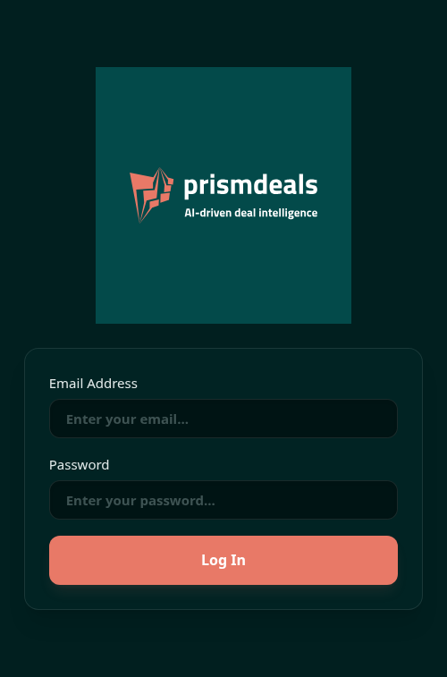
**Rechner:** 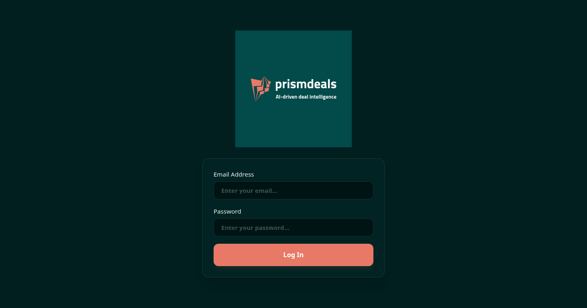

**Was dasteht**, von oben nach unten, wörtlich: das prismdeals-Logo als Bild, darunter „Email Address" (Feld mit dem Platzhalter „Enter your email..."), „Password" (Feld mit „Enter your password..."), „Log In".

**Was anklickbar ist und was dann passiert:** genau ein Knopf, „Log In". Er schickt das Formular ab. Keine Registrierung, kein „Passwort vergessen", keine Sprachumschaltung — die Kopfleiste mit Sprache, Einstellungen und Abmelden existiert auf diesem Bildschirm noch nicht.

**Zählungen:** 1 Knopf · 1 Kasten · 2 Felder · 3 Wörter Fließtext · Inhalt beginnt bei y=417 · Seitenhöhe 757 px (beide Breiten identisch). Bei 390 px ist die Seite **500 px breit**, also 110 px breiter als das Fenster.

---

## 02 — Anmeldung, falsches Passwort

**Wie man hierher kommt:** Anmeldemaske → E-Mail und ein falsches Passwort eintragen → „Log In".

**Telefon:** 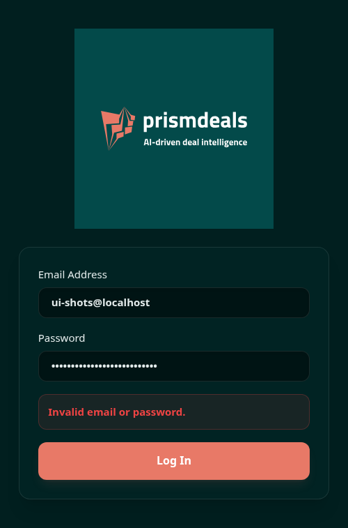
**Rechner:** 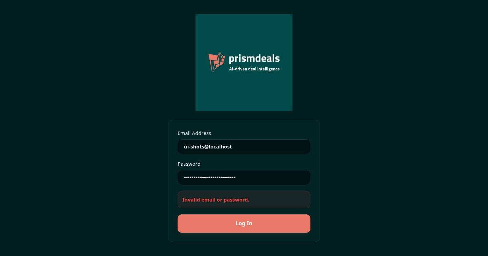

**Was dasteht:** „Email Address", „Password", dann in Rot „Invalid email or password.", darunter „Log In".

**Was anklickbar ist und was dann passiert:** weiterhin nur „Log In". Die Fehlermeldung nennt nicht, welches der beiden Felder falsch war. Die eingetragenen Werte bleiben stehen.

**Zählungen:** 1 Knopf · 1 Kasten · 2 Felder · 7 Wörter Fließtext · Inhalt beginnt bei y=382 · Seitenhöhe 757 px (beide Breiten identisch). Die Fehlermeldung schiebt das Formular um 35 px nach oben, statt darunter Platz zu nehmen.

---

## 03 — Übersicht aller Suchen

**Wie man hierher kommt:** nach erfolgreicher Anmeldung. Auch über das Logo in der Kopfleiste von jedem Bildschirm aus.

**Telefon:** 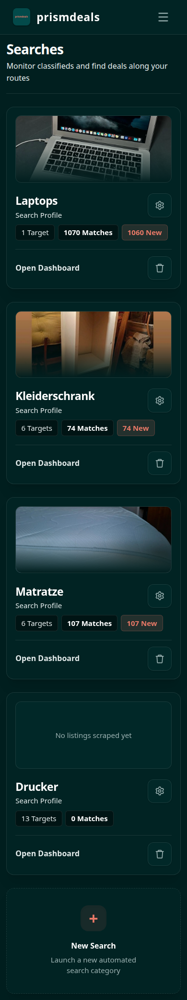
**Rechner:** 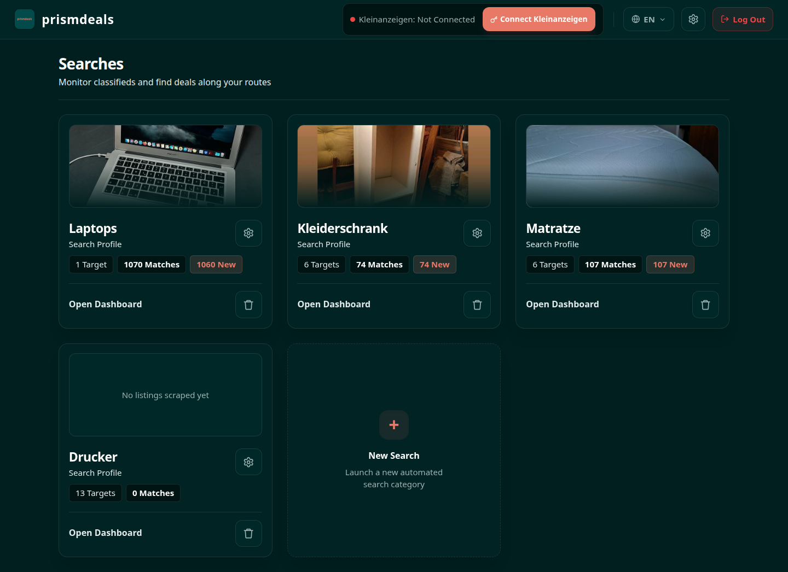

**Was dasteht:** Kopfleiste mit „prismdeals", „Kleinanzeigen: Not Connected", „Connect Kleinanzeigen", „EN", Zahnrad, „Log Out". Dann „Searches" und darunter „Monitor classifieds and find deals along your routes". Danach das Kartenraster, je Suche: Vorschaubild oder „No listings scraped yet", der Name („Laptops", „Kleiderschrank", „Matratze", „Drucker"), darunter immer derselbe Untertitel „Search Profile", dann Plaketten wie „1 Target", „1070 Matches", „1060 New" bzw. „6 Targets", „107 Matches", „107 New", und am Fuß jeder Karte „Open Dashboard". Als letzte Kachel „+", „New Search", „Launch a new automated search category".

**Was anklickbar ist und was dann passiert:** die ganze Karte öffnet die Suche — hat sie Suchziele, landet man auf den Ergebnissen, hat sie keine, direkt in den Einstellungen. Das Zahnrad auf der Karte („Configure Searches & Guidelines") geht immer in die Einstellungen. Der Papierkorb („Delete search") öffnet einen **Bestätigungsdialog des Browsers**, kein Element der Anwendung. Die „+"-Kachel führt zum Anlegen. In der Kopfleiste: „Connect Kleinanzeigen", die Sprachumschaltung, das Zahnrad für die globalen Einstellungen, „Log Out".

**Zählungen:**
- Rechner: 12 Knöpfe · 5 Kästen · 68 Wörter Fließtext · Inhalt beginnt bei y=209 · Seitenhöhe 1046 px
- Telefon: 9 Knöpfe · 5 Kästen · 65 Wörter Fließtext · Inhalt beginnt bei y=222 · Seitenhöhe **2080 px**

Die drei Knöpfe Unterschied sind die Kopfleiste, die auf dem Telefon hinter dem Hamburger verschwindet. Der Text „Open Dashboard" steht auf jeder Karte einmal, der Untertitel „Search Profile" ebenfalls.

---

## 04 — Neue Suche anlegen, leeres Formular

**Wie man hierher kommt:** Übersicht → die „+"-Kachel anklicken.

**Telefon:** 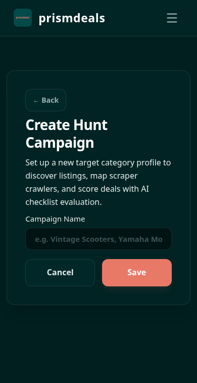
**Rechner:** 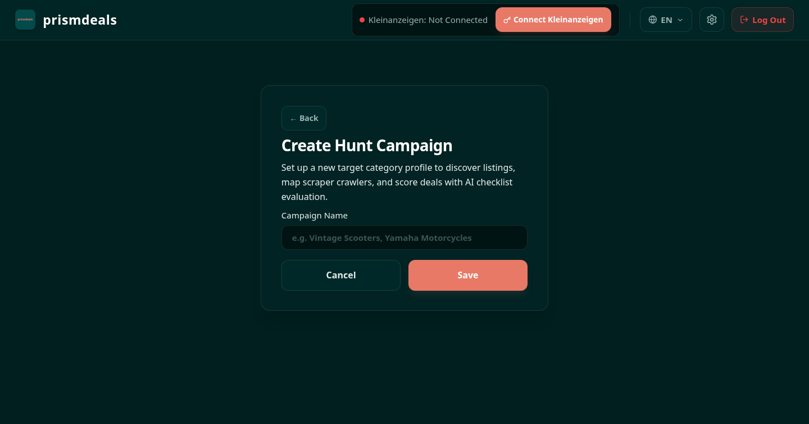

**Was dasteht:** „← Back", „Create Hunt Campaign", „Set up a new target category profile to discover listings, map scraper crawlers, and score deals with AI checklist evaluation.", „Campaign Name" mit einem Feld (Platzhalter „e.g. Vintage Scooters, Yamaha Motorcycle"), darunter „Cancel" und „Save".

**Was anklickbar ist und was dann passiert:** „← Back" und „Cancel" führen beide zurück zur Übersicht. „Save" ist auch bei leerem Feld anklickbar, tut dann aber nichts — der Aufruf bricht ohne Rückmeldung ab, wenn der Name leer ist. Die Eingabetaste im Feld löst dasselbe aus wie „Save".

**Zählungen:**
- Rechner: 7 Knöpfe · 1 Kasten · 1 Feld · 29 Wörter Fließtext · Inhalt beginnt bei y=373 · Seitenhöhe 757 px
- Telefon: 4 Knöpfe · 1 Kasten · 1 Feld · 26 Wörter Fließtext · Inhalt beginnt bei y=421 · Seitenhöhe 757 px

Ein Feld, drei Wege zurück (Back, Cancel, Logo).

---

## 05 — Neue Suche anlegen, teilweise ausgefüllt

**Wie man hierher kommt:** wie 04, dann einen Namen eintippen.

**Telefon:** 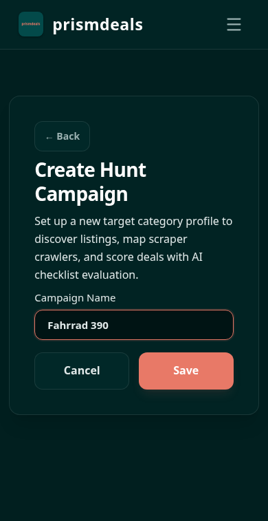
**Rechner:** 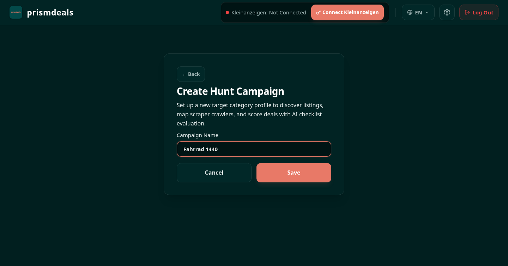

**Was dasteht:** wortgleich zu 04. Der einzige Unterschied ist der Feldinhalt.

**Was anklickbar ist und was dann passiert:** unverändert. „Save" verhält sich jetzt anders als bei 04 — es legt die Suche an und springt in deren Einstellungen —, sieht aber gleich aus: der Knopf ist in beiden Zuständen gleich dargestellt und in beiden anklickbar.

**Zählungen:** identisch zu 04 — Rechner 7 Knöpfe · 1 Kasten · 29 Wörter · y=373; Telefon 4 Knöpfe · 1 Kasten · 26 Wörter · y=421. Zwischen leerem und ausgefülltem Formular ändert sich keine einzige gemessene Größe.

---

## 06 — Die neue Suche, noch ohne Ziele

**Wie man hierher kommt:** Formular 05 → „Save". Man landet unmittelbar in den Einstellungen der neuen Suche, Reiter 1.

**Telefon:** 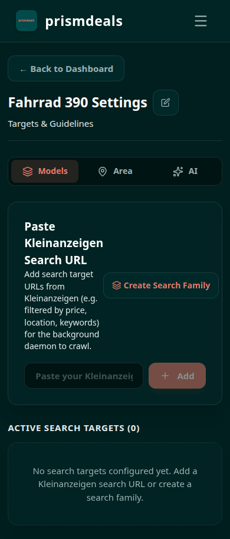
**Rechner:** 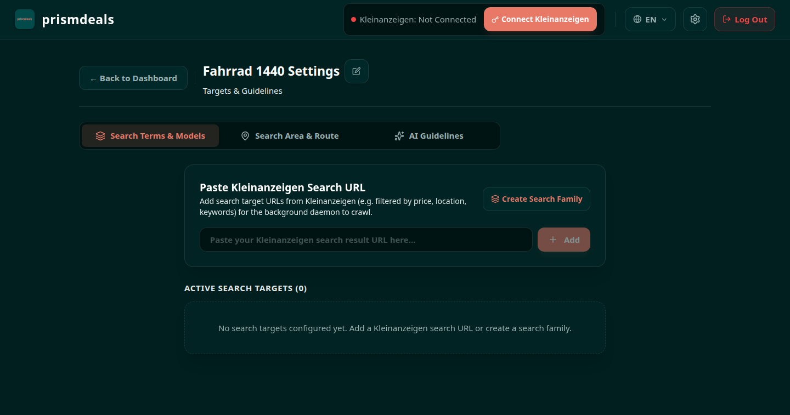

**Was dasteht:** „<Name> Settings" mit einem Stift-Knopf daneben, „← Back to Dashboard", „Targets & Guidelines". Dann die Reiterleiste „Search Terms & Models" · „Search Area & Route" · „AI Guidelines" (auf dem Telefon verkürzt zu „Models" · „Area" · „AI"). Darunter „Paste Kleinanzeigen Search URL", „Create Search Family", „Add search target URLs from Kleinanzeigen (e.g. filtered by price, location, keywords) for the background daemon to crawl.", ein Feld mit „Paste your Kleinanzeigen search result URL here...", der Knopf „Add", dann „Active Search Targets (0)" und der Leerzustand „No search targets configured yet. Add a Kleinanzeigen search URL or create a search family."

**Was anklickbar ist und was dann passiert:** „Add" ist ausgegraut, solange das Feld leer oder ungültig ist. „Create Search Family" schaltet denselben Reiter auf den Familien-Editor um. Die drei Reiter wechseln den Inhalt. „← Back to Dashboard" geht zu den Ergebnissen dieser Suche — die es noch nicht gibt.

**Zählungen:**
- Rechner: 11 Knöpfe · 2 Kästen · 1 Feld · 53 Wörter Fließtext · Inhalt beginnt bei y=328 · Seitenhöhe 757 px
- Telefon: 8 Knöpfe · 2 Kästen · 1 Feld · 50 Wörter Fließtext · Inhalt beginnt bei y=370 · Seitenhöhe 914 px

---

## 07 — Ungültige Eingabe

**Wie man hierher kommt:** Bildschirm 06 → etwas in das URL-Feld tippen, das keine Kleinanzeigen-Adresse ist (hier: `ebay.de/nicht-kleinanzeigen`).

**Telefon:** 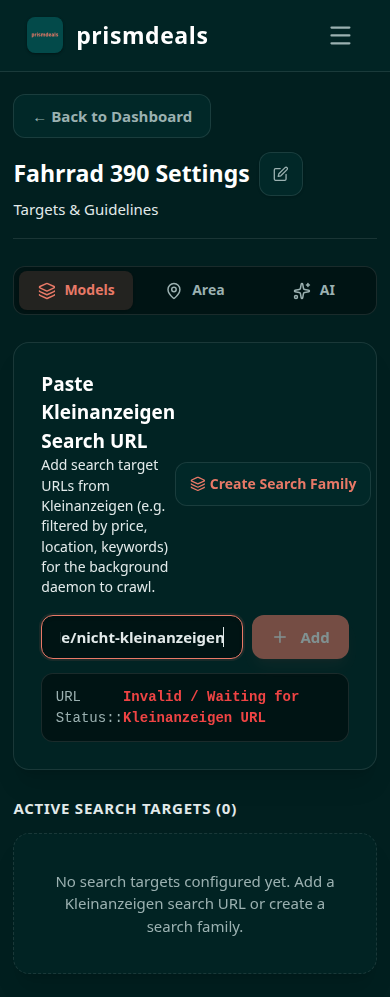
**Rechner:** 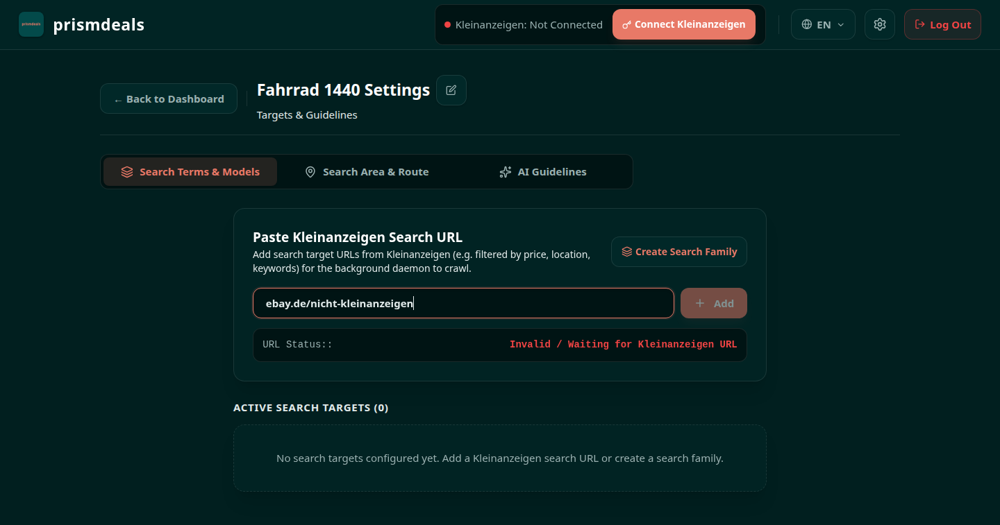

**Was dasteht:** wie 06, und zusätzlich unter dem Feld ein Kasten in Schreibmaschinenschrift: „URL Status::" und rechts daneben in Rot „Invalid / Waiting for Kleinanzeigen URL".

**Was anklickbar ist und was dann passiert:** „Add" bleibt ausgegraut. Es gibt keinen Weg, die Eingabe trotzdem abzuschicken, und keinen Hinweis darauf, wie eine gültige Adresse aussehen müsste — außer dem Platzhalter im Feld.

**Zählungen:**
- Rechner: 11 Knöpfe · 2 Kästen · 1 Feld · 62 Wörter Fließtext · Inhalt beginnt bei y=328 · Seitenhöhe 757 px
- Telefon: 8 Knöpfe · 2 Kästen · 1 Feld · 59 Wörter Fließtext · Inhalt beginnt bei y=370 · Seitenhöhe 997 px

Die Fehlermeldung kostet 9 Wörter und auf dem Telefon 83 px Seitenhöhe.

---

## 08 — Gültige Eingabe

**Wie man hierher kommt:** dasselbe Feld, eine gültige Kleinanzeigen-Adresse. **Dieser Zustand hält 600 ms.** Danach handelt die Anwendung von selbst: sie legt ein Richtlinien-Set an, legt das Suchziel an, leert das Feld und startet einen Abruf — ohne dass „Add" gedrückt wurde. Das Bild ist deshalb innerhalb dieser 600 ms aufgenommen.

**Telefon:** 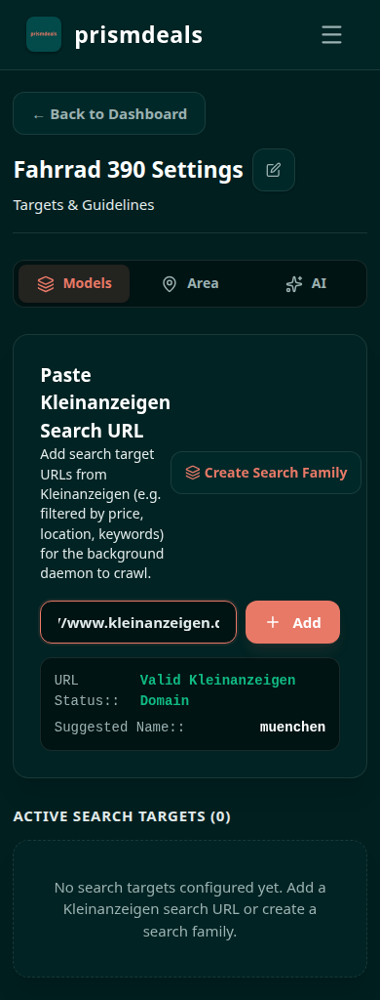
**Rechner:** 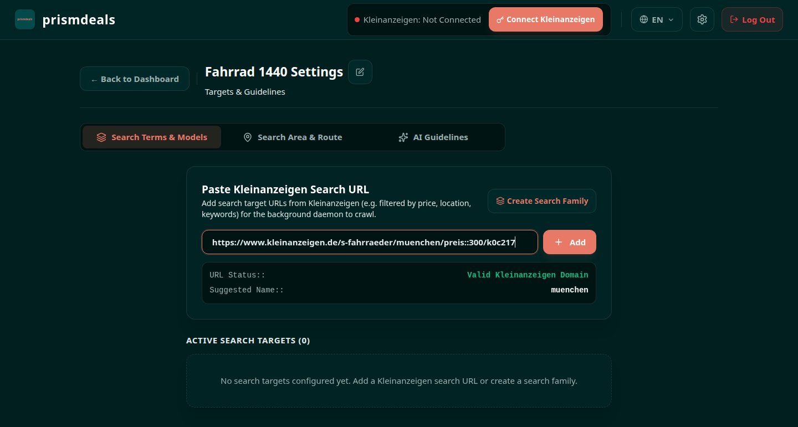

**Was dasteht:** wie 07, aber der Statuskasten zeigt jetzt „URL Status::" / „Valid Kleinanzeigen Domain" in Grün und eine zweite Zeile „Suggested Name::" / „muenchen". „Active Search Targets (0)" steht weiterhin darunter.

**Was anklickbar ist und was dann passiert:** „Add" ist jetzt aktiv. Drückt man ihn nicht, geschieht nach 600 ms dasselbe, was er tun würde. Der abgeleitete Name („muenchen") stammt aus dem Ortssegment der Adresse und ist nicht bearbeitbar, bevor das Ziel angelegt ist.

**Zählungen:**
- Rechner: 11 Knöpfe · 2 Kästen · 1 Feld · 63 Wörter Fließtext · Inhalt beginnt bei y=328 · Seitenhöhe 771 px
- Telefon: 8 Knöpfe · 2 Kästen · 1 Feld · 60 Wörter Fließtext · Inhalt beginnt bei y=370 · Seitenhöhe 1024 px

---

## 09 — Einstellungen, Reiter 1 „Search Terms & Models"

**Wie man hierher kommt:** Übersicht → Zahnrad auf der Karte „Matratze". (Der erste von drei Reitern ist immer vorausgewählt.)

**Telefon:** 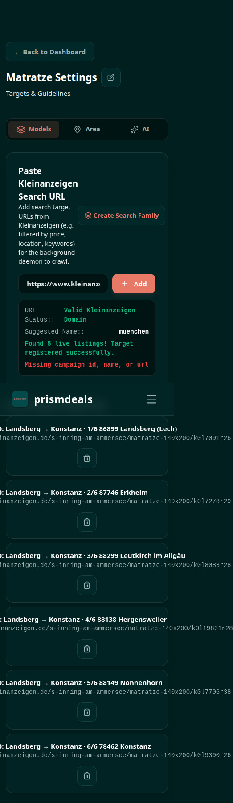
**Rechner:** 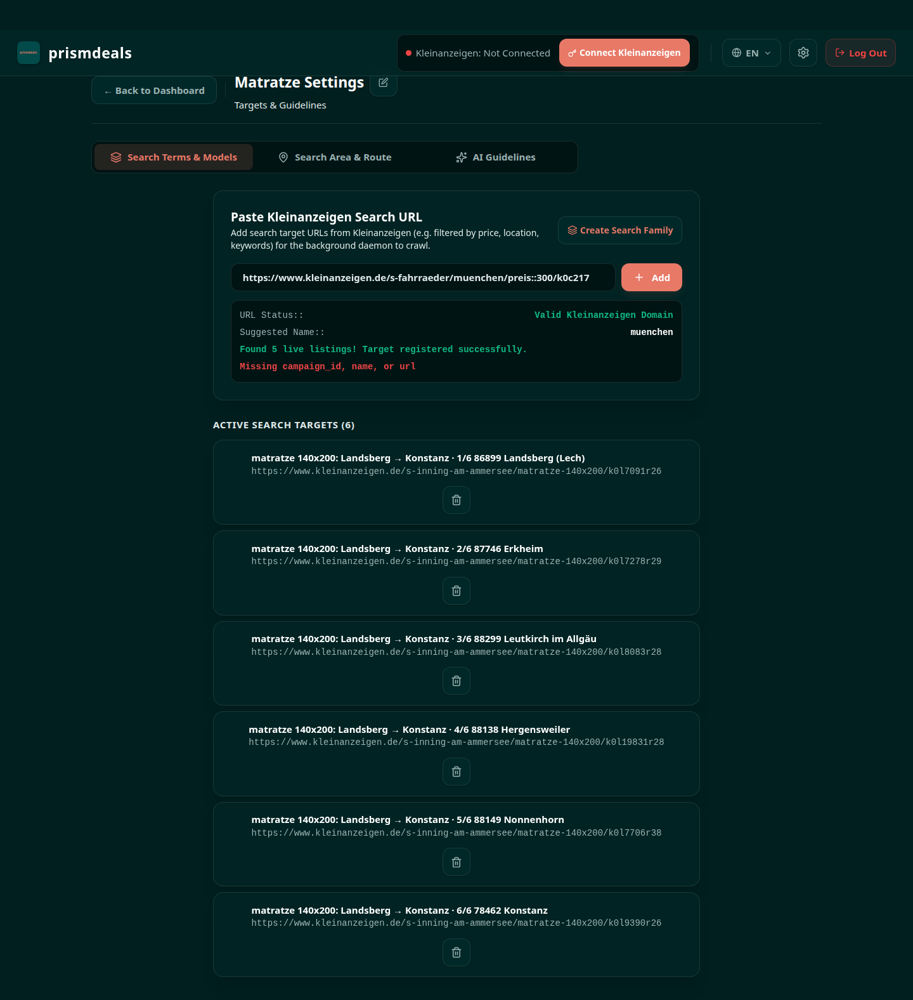

**Was dasteht:** „Matratze Settings", „← Back to Dashboard", „Targets & Guidelines", die Reiterleiste, dann derselbe Block wie in 06 („Paste Kleinanzeigen Search URL", Beschreibungstext, Feld, „Add"). Darunter „Active Search Targets (6)" und sechs Karten, jede mit dem vollen Zielnamen („matratze 140x200: Landsberg → Konstanz · 1/6 86899 Landsberg (Lech)") und darunter der vollständigen URL in Schreibmaschinenschrift, rechts ein Papierkorb.

**Was anklickbar ist und was dann passiert:** die drei Reiter; „Create Search Family"; „Add"; sechs Papierkorb-Knöpfe, die je ein Suchziel löschen; der Stift hinter dem Namen benennt die Suche um.

**Zählungen:**
- Rechner: 17 Knöpfe · 7 Kästen · 1 Feld · 122 Wörter Fließtext · Inhalt beginnt bei y=300 · Seitenhöhe 1576 px
- Telefon: 14 Knöpfe · 7 Kästen · 1 Feld · 119 Wörter Fließtext · Inhalt beginnt bei y=342 · Seitenhöhe 1803 px, Seite **523 px breit** (133 px breiter als das Fenster)

Die Liste der sechs Suchziele beginnt bei y=658 und reicht bis zum Seitenende — 918 der 1576 px Seitenhöhe. Die oberen 300 px sind Kopfleiste, Titel und Reiterleiste.

---

## 10 — Einstellungen, Reiter 2 „Search Area & Route"

**Wie man hierher kommt:** Bildschirm 09 → zweiten Reiter anklicken.

**Telefon:** 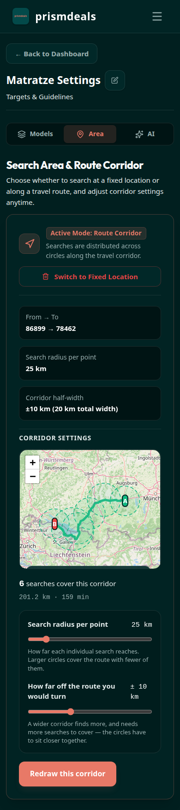
**Rechner:** 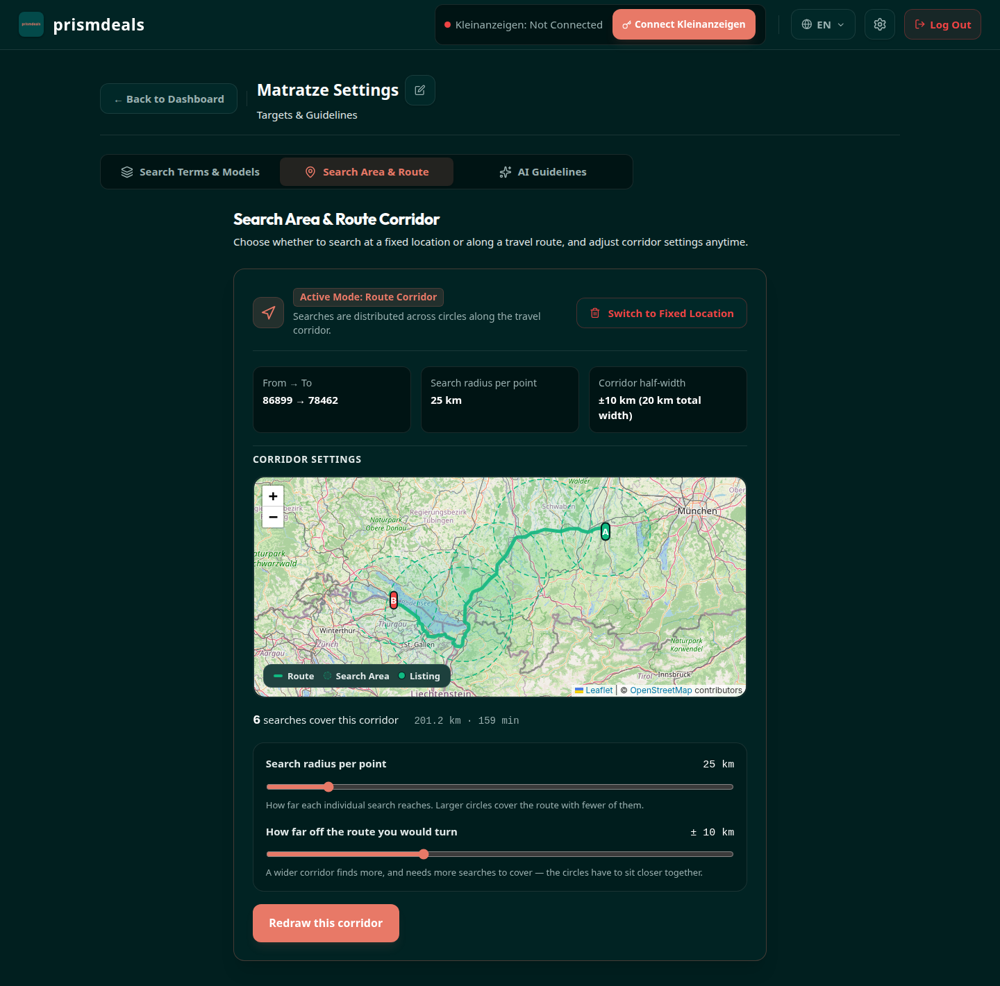

**Was dasteht:** „Search Area & Route Corridor", „Choose whether to search at a fixed location or along a travel route, and adjust corridor settings anytime.", „Active Mode: Route Corridor", der Knopf „Switch to Fixed Location", „Searches are distributed across circles along the travel corridor." Dann drei Wertepaare nebeneinander: „From → To" / „86899 → 78462", „Search radius per point" / „25 km", „Corridor half-width" / „±10 km (20 km total width)". Darunter „Corridor settings", eine Leaflet-Karte mit den Markern A und B, der Legende „Route · Search Area · Listing" und „Leaflet | © OpenStreetMap contributors", daneben „6" / „searches cover this corridor" und „201.2 km · 159 min". Darunter zwei Regler: „Search radius per point" / „25 km" mit „How far each individual search reaches. Larger circles cover the route with fewer of them." und „How far off the route you would turn" / „± 10 km" mit „A wider corridor finds more, and needs more searches to cover — the circles have to sit closer together." Zum Schluss „Redraw this corridor".

**Was anklickbar ist und was dann passiert:** „Switch to Fixed Location" wechselt den Modus. Die beiden Zahlenfelder ändern den Vorschau-Korridor; „Redraw this corridor" schreibt ihn fest und legt die Suchziele neu an. Auf der Karte vier Links (Leaflet, OpenStreetMap, Zoom).

**Zählungen:**
- Rechner: 11 Knöpfe · 1 Kasten · 2 Felder · 144 Wörter Fließtext · Inhalt beginnt bei y=300 · Seitenhöhe 1421 px
- Telefon: 8 Knöpfe · 1 Kasten · 2 Felder · 141 Wörter Fließtext · Inhalt beginnt bei y=342 · Seitenhöhe 1755 px

Der Satz „A wider corridor finds more, and needs more searches to cover — the circles have to sit closer together." steht auf diesem Bildschirm einmal, in der Korridor-Schublade (16) ein zweites und ein drittes Mal.

---

## 11 — Einstellungen, Reiter 3 „AI Guidelines" (= Schritt 1 des Assistenten)

**Wie man hierher kommt:** Bildschirm 09 → dritten Reiter anklicken. Es gibt keinen anderen Einstieg in den KI-Assistenten; der dritte Reiter *ist* Schritt 1.

**Telefon:** 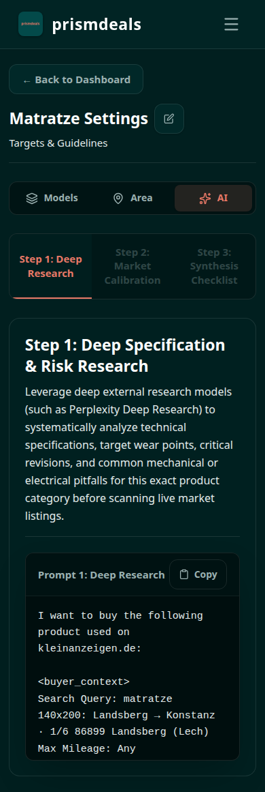
**Rechner:** 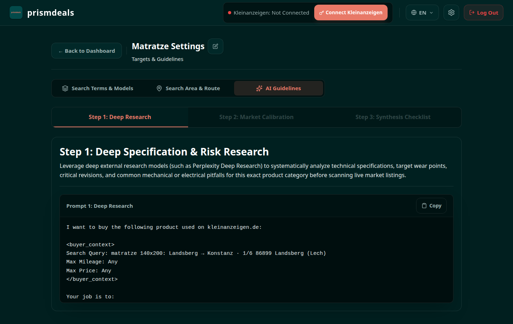

**Was dasteht:** unter den Einstellungs-Reitern eine zweite Reiterleiste: „Step 1: Deep Research" · „Step 2: Market Calibration" · „Step 3: Synthesis Checklist". Dann „Step 1: Deep Specification & Risk Research" und „Leverage deep external research models (such as Perplexity Deep Research) to systematically analyze technical specifications, target wear points, critical revisions, and common mechanical or electrical pitfalls for this …". Darunter ein dunkler Kasten „Prompt 1: Deep Research" mit „Copy" und dem vollständigen Prompt-Text, der mit „I want to buy the following product used on kleinanzeigen.de: <buyer_context> Search Query: matratze 140x200: Landsberg → Konstanz · 1/6 86899 Landsberg (Lech) Max Mileage: Any Max Price: Any </buyer_context> …" beginnt.

**Was anklickbar ist und was dann passiert:** „Step 2" und „Step 3" sind **ausgegraut**. Der einzige wirksame Knopf ist „Copy": er kopiert den Prompt und blendet dadurch den Weiterknopf zu Schritt 2 ein. Ohne Kopieren führt kein Weg weiter.

**Zählungen:**
- Rechner: 13 Knöpfe (davon 2 ausgegraut) · **0 Kästen** · 0 Felder · 135 Wörter Fließtext · Inhalt beginnt bei y=408 · Seitenhöhe 909 px
- Telefon: 10 Knöpfe · 0 Kästen · 0 Felder · 132 Wörter Fließtext · Inhalt beginnt bei y=490 · Seitenhöhe 1161 px

Zwei Reiterleisten übereinander; der Inhalt beginnt auf dem Telefon erst bei 490 px.

---

## 12 — Suche mit vielen Treffern: die Liste

**Wie man hierher kommt:** Übersicht → Karte „Matratze" anklicken.

**Telefon:** 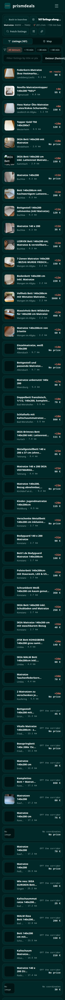 *(oben beschnitten, siehe Zählungen)*
**Rechner:** 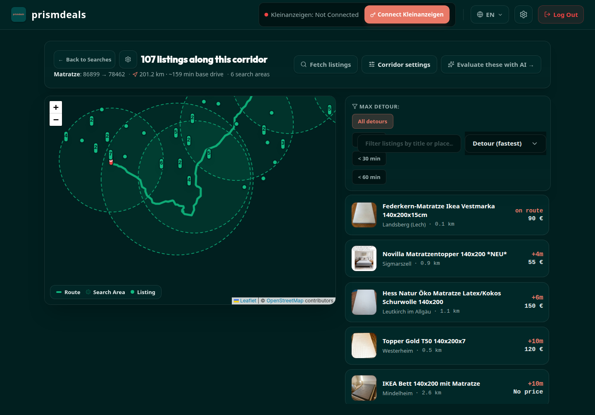

**Was dasteht:** „107 listings along this corridor" als Überschrift, links daneben „← Back to Searches" und ein Zahnrad. Darunter „Matratze: 86899 → 78462 · 201.2 km · ~159 min base drive · 6 search areas". Rechts drei Knöpfe: „Fetch listings", „Corridor settings", „Evaluate these with AI →". Darunter links die Leaflet-Karte mit dem Korridor, den nummerierten Häufungen und der Legende „Route · Search Area · Listing"; rechts die Filterzeile „Max Detour:" mit „All detours", „< 15 min", „< 30 min", „< 60 min", ein Feld „Filter listings by title or place..." und die Auswahl „Detour (fastest)". Darunter die Anzeigen, je Zeile Vorschaubild, Titel, Ort, Entfernung, Umweg und Preis — die erste: „Federkern-Matratze Ikea Vestmarka 140x200x15cm", „Landsberg (Lech) · 0.1 km", „on route", „90 €".

**Was anklickbar ist und was dann passiert:** jede Anzeigenzeile ist ein `<a>` mit `target="_blank"` — sie öffnet die Anzeige bei Kleinanzeigen in einem neuen Tab **und** markiert sie gleichzeitig in der Karte. Die vier Umweg-Plaketten filtern. Das Suchfeld filtert nach Titel und Ort. „Detour (fastest)" öffnet die Sortierung. „Fetch listings" startet einen Abruf, „Corridor settings" öffnet die Schublade (16), „Evaluate these with AI →" springt in die Einstellungen dieser Suche.

**Zählungen:**
- Rechner: 14 Knöpfe · 111 Links · 2 Kästen · **107 Zeilen** · 1678 Wörter Fließtext · Inhalt (erste Anzeige) beginnt bei y=472 · Seitenhöhe 1006 px
- Telefon: 13 Knöpfe · 107 Links · 2 Kästen · 107 Zeilen · 1633 Wörter Fließtext · Inhalt beginnt bei y=395 · Seitenhöhe **11 471 px** (Bild auf 6000 px beschnitten)

Auf dem Rechner ist die Liste in einen eigenen Scrollbereich gefasst und die Seite bleibt 1006 px hoch; auf dem Telefon wächst dieselbe Liste auf 11 471 px — gut 15 Telefonbildschirme untereinander.

---

## 13 — Suche mit vielen Treffern: die Karte

**Wie man hierher kommt:** Trefferliste → Reiter „Map". **Diesen Bildschirm gibt es nur auf dem Telefon.**

**Telefon:** 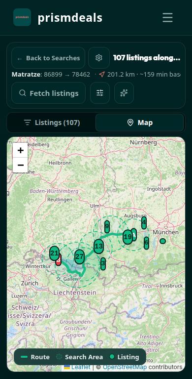
**Rechner:** *nicht erreichbar* — bei 1440 px ist die Umschaltung Liste/Karte ausgeblendet (`lg:hidden`); die Karte ist dort die linke Spalte von Bildschirm 12 und steht immer neben der Liste.

**Was dasteht:** dieselbe Kopfzeile wie 12 („107 listings along this corridor", „Matratze: 86899 → 78462 · 201.2 km · ~159 min base drive · 6 search areas"), dann die Umschaltung „Listings (107)" / „Map", darunter die formatfüllende Karte mit den Markern A und B, den Häufungszahlen (27, 21, 19, 13, 9, 6, 4, 3), den Zoomknöpfen „+" und „−" und „Leaflet | © OpenStreetMap contributors".

**Was anklickbar ist und was dann passiert:** „Listings (107)" schaltet zurück zur Liste. Marker wählen eine Anzeige aus. Die Kopfleiste ist auf dem Telefon auf „prismdeals" und den Hamburger reduziert; die drei Aktionsknöpfe sind hier nur noch Symbole ohne Beschriftung.

**Zählungen:** 8 Knöpfe · 1 Kasten · 0 Zeilen · 44 Wörter Fließtext · Inhalt (Karte) beginnt bei y=277 · Seitenhöhe 767 px. 44 Wörter ist der zweitniedrigste Wert der ganzen Strecke nach der Anmeldung.

---

## 14 — Trefferliste mit gesetztem Filter

**Wie man hierher kommt:** Trefferliste → Plakette „< 15 min" anklicken.

**Telefon:** 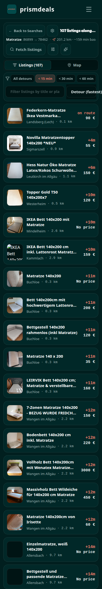
**Rechner:** 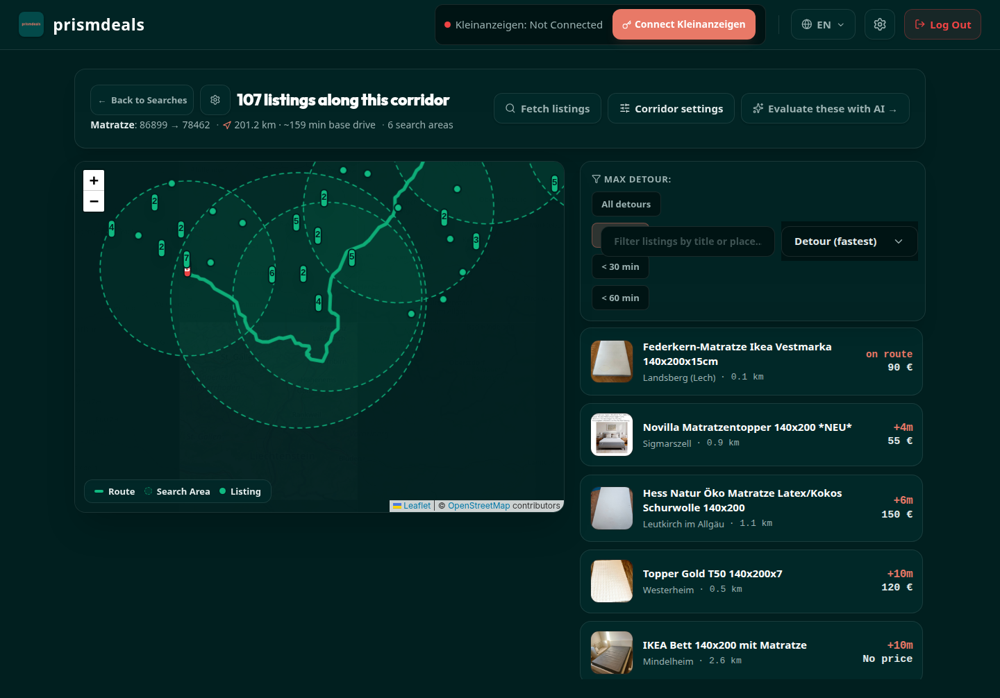

**Was dasteht:** wortgleich wie 12, mit zwei Unterschieden: die Plakette „< 15 min" ist hervorgehoben, und die Liste ist kürzer. Die Überschrift zählt weiter **„107 listings along this corridor"**, obwohl 18 Anzeigen zu sehen sind.

**Was anklickbar ist und was dann passiert:** die Plaketten schließen einander aus; „All detours" hebt den Filter auf. Es gibt keine Anzeige, wie viele Anzeigen der Filter gerade durchlässt.

**Zählungen:**
- Rechner: 14 Knöpfe · 2 Kästen · **18 Zeilen** · 341 Wörter Fließtext · Inhalt beginnt bei y=472 · Seitenhöhe 1006 px
- Telefon: 13 Knöpfe · 2 Kästen · 18 Zeilen · 296 Wörter Fließtext · Inhalt beginnt bei y=395 · Seitenhöhe 2243 px

Der Filter nimmt 89 der 107 Anzeigen weg und dabei 1337 Wörter Fließtext (1678 → 341).

---

## 15 — Sortierung geöffnet

**Wie man hierher kommt:** Trefferliste → auf „Detour (fastest)" klicken.

**Telefon:** 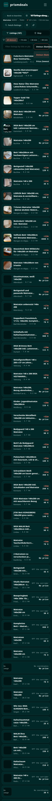 *(oben beschnitten)*
**Rechner:** 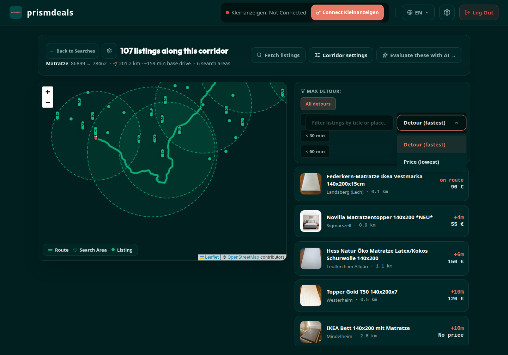

**Was dasteht:** wie 12, und darüber gelegt ein Klappfeld mit genau zwei Einträgen: „Detour (fastest)" (hervorgehoben) und „Price (lowest)".

**Was anklickbar ist und was dann passiert:** die beiden Einträge sortieren die Liste und schließen das Feld. Ein Klick daneben oder die Esc-Taste schließt es ebenfalls. Zwei Sortierungen, keine Richtungsumkehr — absteigend nach Preis ist nicht vorgesehen.

**Zählungen:**
- Rechner: 16 Knöpfe · 2 Kästen · 107 Zeilen · 1678 Wörter Fließtext · Inhalt beginnt bei y=472 · Seitenhöhe 1006 px
- Telefon: 15 Knöpfe · 2 Kästen · 107 Zeilen · 1633 Wörter Fließtext · Inhalt beginnt bei y=395 · Seitenhöhe 11 471 px

Das geöffnete Klappfeld fügt genau 2 Knöpfe hinzu; die Beschriftung „Detour (fastest)" steht dann zweimal auf dem Bildschirm.

---

## 16 — Korridor-Schublade

**Wie man hierher kommt:** Trefferliste → „Corridor settings".

**Telefon:** 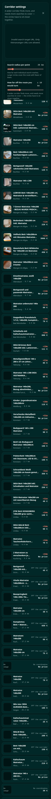 *(oben beschnitten)*
**Rechner:** 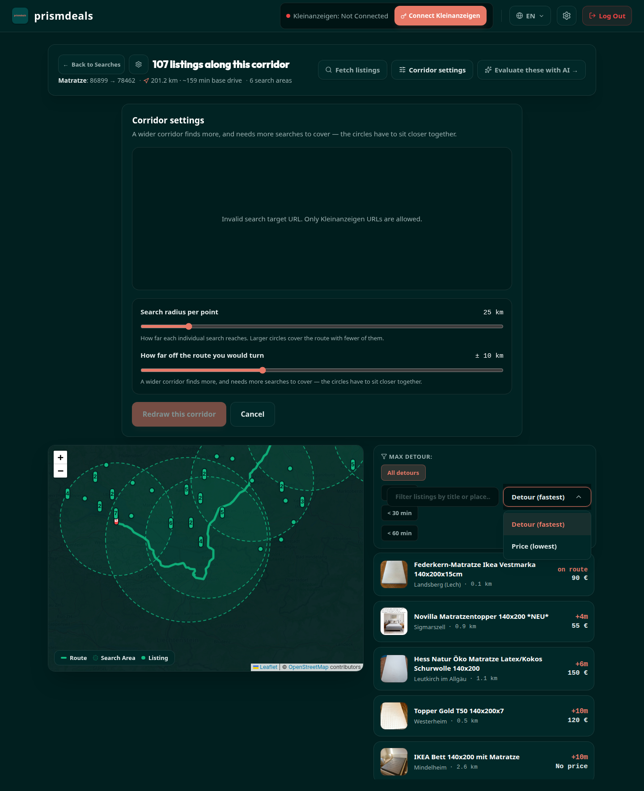

**Was dasteht:** „Corridor settings" als Überschrift, darunter „A wider corridor finds more, and needs more searches to cover — the circles have to sit closer together.", darunter eine rote Meldung „Invalid search target URL. Only Kleinanzeigen URLs are allowed.", dann die Karten-Vorschau, „Search radius per point" / „25 km" mit „How far each individual search reaches. Larger circles cover the route with fewer of them.", „How far off the route you would turn" / „± 10 km" mit demselben Satz über den breiteren Korridor **noch einmal**, und die Knöpfe „Redraw this corridor" (ausgegraut) und „Cancel". Die Trefferliste bleibt darunter sichtbar.

**Was anklickbar ist und was dann passiert:** „Cancel" schließt ohne Änderung. „Redraw this corridor" ist ausgegraut, solange die rote Meldung steht. Auf dem Telefon liegt die Schublade formatfüllend über allem (`fixed inset-0`) und hat oben rechts ein zusätzliches Schließkreuz; auf dem Rechner sitzt sie eingebettet zwischen Kopfkarte und Ergebnissen.

**Zählungen:**
- Rechner: 18 Knöpfe · 3 Kästen · 3 Felder · 107 Zeilen · 1759 Wörter Fließtext · Inhalt beginnt bei y=255 · Seitenhöhe 1769 px
- Telefon: 18 Knöpfe · 3 Kästen · 3 Felder · 107 Zeilen · 1714 Wörter Fließtext · Inhalt beginnt bei y=37 · Seitenhöhe 11 471 px (Bild beschnitten)

Der Satz über den breiteren Korridor steht auf diesem Bildschirm zweimal, 556 px auseinander.

---

## 17 — Der andere Ergebnisbildschirm (Suche ohne Route und ohne Modellfamilie)

**Wie man hierher kommt:** Übersicht → Karte „Laptops". Diese Suche hat weder Route noch Modellfamilie und bekommt deshalb eine völlig andere Ergebnisdarstellung als 12.

**Telefon:** 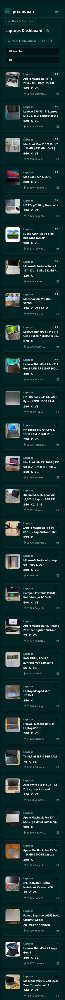 *(oben beschnitten)*
**Rechner:** 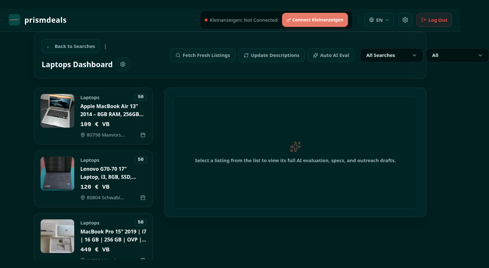

**Was dasteht:** „← Back to Searches | Laptops Dashboard" mit Zahnrad, rechts „Fetch Fresh Listings", „Update Descriptions", „Auto AI Eval" und zwei Auswahlfelder „All Searches" und „All". Darunter links eine Spalte voller Anzeigenkarten, jede mit Vorschaubild, Suchname („Laptops"), Bewertungszahl („50"), Titel, Preis und Ort; rechts der Detailbereich mit „Select a listing from the list to view its full AI evaluation, specs, and outreach drafts."

**Was anklickbar ist und was dann passiert:** jede Anzeigenkarte wählt sich in den Detailbereich. Die drei Aktionsknöpfe starten Abruf, Nachladen der Beschreibungen und die KI-Bewertung. Die beiden Auswahlfelder filtern nach Suchziel und Zustand.

**Zählungen:**
- Rechner: 11 Knöpfe · **1071 Kästen** · 0 Zeilen · **15 092 Wörter Fließtext** · Inhalt beginnt bei y=274 · Seitenhöhe 838 px, Seite **1529 px breit** (89 px breiter als das Fenster)
- Telefon: 8 Knöpfe · 1071 Kästen · 15 072 Wörter Fließtext · Inhalt beginnt bei y=415 · Seitenhöhe **203 220 px** (Bild auf 6000 px beschnitten)

Alle 1070 Anzeigen werden auf einmal dargestellt, ohne Blättern. Auf dem Rechner steckt das in einem eigenen Scrollbereich; auf dem Telefon wird die Seite 203 220 px hoch — 268 Bildschirmhöhen.

---

## 18 — Eine einzelne Anzeige im Detail

**Wie man hierher kommt:** Bildschirm 17 → erste Anzeigenkarte anklicken.

**Telefon:** 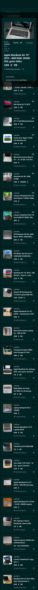 *(oben beschnitten)*
**Rechner:** 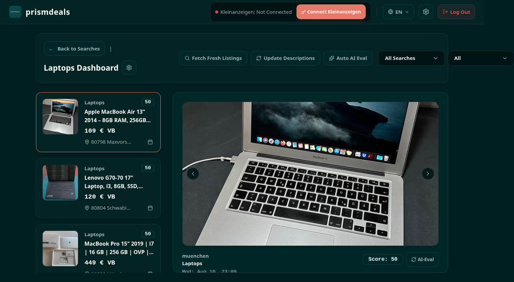

**Was dasteht** (im Detailbereich, von oben): großes Bild mit Pfeilen links und rechts, „muenchen", „Laptops", „Mod: Aug 10, 23:09", „Score: 50", „AI-Eval", der Titel „Apple MacBook Air 13" 2014 – 8GB RAM, 256GB SSD, guter Akku", „Description" mit dem vollen Anzeigentext, „AI Match Summary" / „Evaluated 0 expert criteria, satisfied 0/0. Niceness Score: 50.", dann „Soft Trust & Risk Dimensions" mit sechs Wertungen je „3/5" oder „2/5" — „Trustworthiness", „Transparency", „Condition Confidence", „Documentation Quality", „Hidden Risk Suspicion", „Market Above Average Signal" — jede mit einer Begründung auf Deutsch, obwohl die Oberfläche auf Englisch steht.

**Was anklickbar ist und was dann passiert:** „AI-Eval" bewertet diese eine Anzeige neu. Die Bildpfeile blättern durch die Fotos. Auf dem Telefon liegt das Detail als formatfüllender Dialog über der Liste, mit einem Schließkreuz oben rechts; auf dem Rechner ist es die rechte, mitlaufende Spalte und hat kein eigenes Schließkreuz.

**Zählungen:**
- Rechner: 14 Knöpfe · 1071 Kästen · **15 339 Wörter Fließtext** · Inhalt (Detailbereich) beginnt bei y=274 · Seitenhöhe 838 px, Seite 1529 px breit
- Telefon: 12 Knöpfe · 1071 Kästen · 15 335 Wörter Fließtext · Inhalt (Dialog) beginnt bei y=182 · Seitenhöhe 203 220 px

Die geöffnete Anzeige fügt 247 Wörter hinzu; die übrigen 15 092 sind die Liste dahinter, die weiter vollständig im Dokument steht.

---

## 19 — Suche ohne Treffer

**Wie man hierher kommt:** Übersicht → Karte „Drucker" anklicken.

**Telefon:** 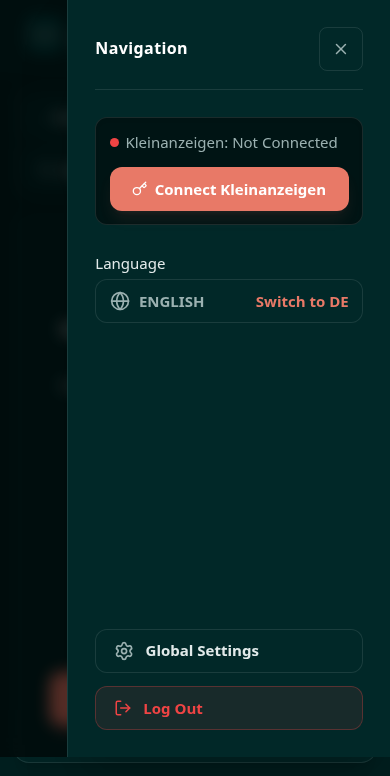
**Rechner:** 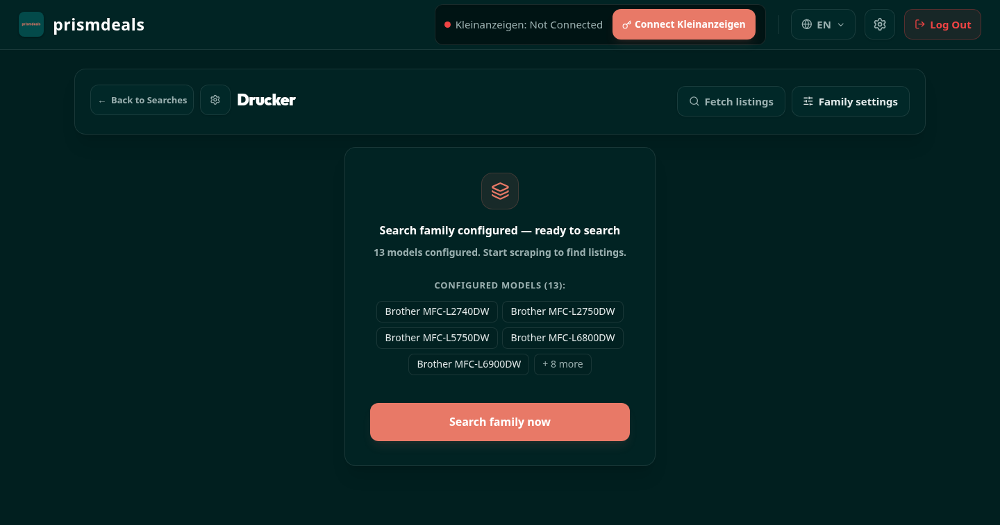

**Was dasteht:** „Drucker" als Überschrift, „← Back to Searches", ein Zahnrad, „Fetch listings", „Family settings". Darunter mittig ein Kasten mit Symbol: „Search family configured — ready to search", „13 models configured. Start scraping to find listings.", „Configured models (13):", dann fünf Plaketten „Brother MFC-L2740DW", „Brother MFC-L2750DW", „Brother MFC-L5750DW", „Brother MFC-L6800DW", „Brother MFC-L6900DW" und „+ 8 more", zum Schluss der Knopf „Search family now".

**Was anklickbar ist und was dann passiert:** „Search family now" und „Fetch listings" lösen beide denselben Abruf aus. „Family settings" führt zu Bildschirm 20. Es gibt keine Karte und keine Filterzeile — dieser Zustand zeigt weder das eine noch das andere.

**Zählungen:**
- Rechner: 9 Knöpfe · 2 Kästen · 0 Zeilen · 36 Wörter Fließtext · Inhalt beginnt bei y=320 · Seitenhöhe 757 px
- Telefon: 11 Knöpfe · 2 Kästen · 38 Wörter Fließtext · Inhalt beginnt bei y=317 · Seitenhöhe 776 px

Der einzige Bildschirm der Strecke, auf dem das Telefon **mehr** Knöpfe zeigt als der Rechner (11 gegen 9): der Hamburger kommt hinzu, und die Aktionsknöpfe werden zu Symbolen, ohne zu verschwinden.

---

## 20 — Modellfamilie bearbeiten

**Wie man hierher kommt:** Bildschirm 19 → „Family settings". Man landet nicht in einem Dialog über den Ergebnissen, sondern auf dem Einstellungsbildschirm, Reiter 1.

**Telefon:** 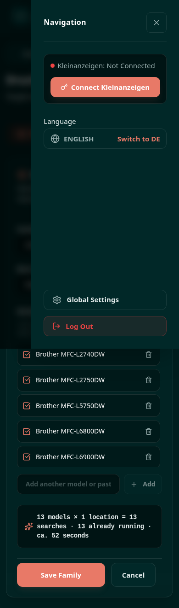
**Rechner:** 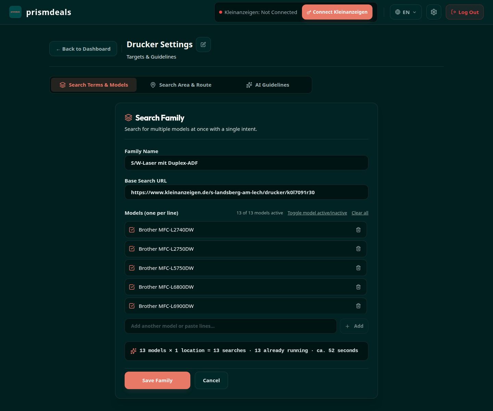

**Was dasteht:** „Drucker Settings", „← Back to Dashboard", „Targets & Guidelines", die drei Reiter, dann „Search Family", „Search for multiple models at once with a single intent.", „Family Name" (Feld, Inhalt „S/W-Laser mit Duplex-ADF"), „Base Search URL" (Feld mit der Kleinanzeigen-Adresse), „Models (one per line)" mit „13 of 13 models active" und „Clear all". Darunter die dreizehn Modelle als je eine Zeile mit eigenem Entfernen-Kreuz, ein Feld „Add another model or paste lines..." mit „Add", die Zeile „13 models × 1 location = 13 searches · 13 already running · ca. 52 seconds" und die Knöpfe „Save Family" und „Cancel".

**Was anklickbar ist und was dann passiert:** jedes Modell ist selbst ein Knopf (an/aus). Daneben liegt je ein Kreuz, das es löscht. „Clear all" schaltet alle ab. „Save Family" schreibt fest, „Cancel" verwirft und geht zurück.

**Zählungen:**
- Rechner: **40 Knöpfe** · 1 Kasten · 3 Felder · 51 Wörter Fließtext · Inhalt beginnt bei y=328 · Seitenhöhe 1200 px
- Telefon: **42 Knöpfe** · 1 Kasten · 3 Felder · 53 Wörter Fließtext · Inhalt beginnt bei y=365 · Seitenhöhe 1320 px

Die meisten Knöpfe der ganzen Strecke: 13 Modelle × 2 (Umschalten + Entfernen) = 26 davon allein für die Liste, bei 51 Wörtern Fließtext.

---

## 21 — KI-Assistent, Schritt 2

**Wie man hierher kommt:** Bildschirm 11 → „Copy" beim Prompt drücken → dann „Step 2: Market Calibration". Vor dem Kopieren ist der Reiter ausgegraut.

**Telefon:** 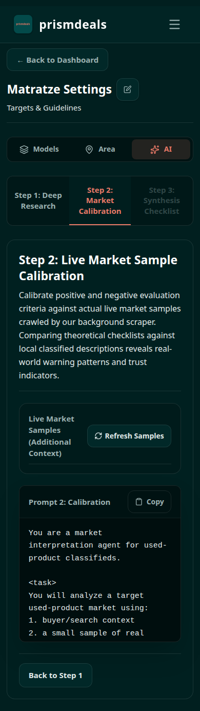
**Rechner:** 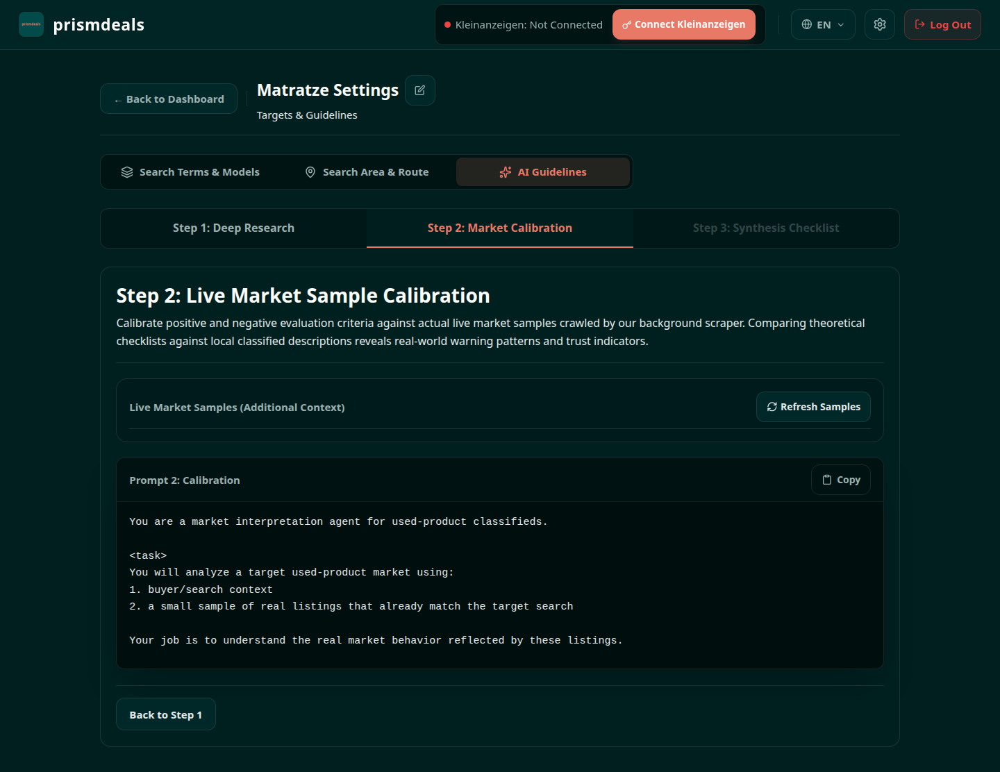

**Was dasteht:** „Step 2: Live Market Sample Calibration", „Calibrate positive and negative evaluation criteria against actual live market samples crawled by our background scraper. Comparing theoretical checklists against local classified descriptions reveals real-world warning …". Dann „Live Market Samples (Additional Context)" mit „Refresh Samples", darunter der Kasten „Prompt 2: Calibration" mit „Copy" und dem vollständigen Prompt („You are a market interpretation agent for used-product classifieds. <task> You will analyze a target used-product market using: 1. buyer/search context 2. a small sample of real listings that already match the target sea…"). Unten „Back to Step 1".

**Was anklickbar ist und was dann passiert:** „Copy" blendet das Textfeld ein, in das die Antwort eingefügt wird; erst wenn dort etwas steht, erscheint der Weiterknopf und wird „Step 3" anklickbar. „Refresh Samples" lädt Beispielanzeigen nach. „Back to Step 1" geht zurück.

**Zählungen:**
- Rechner: 15 Knöpfe (1 ausgegraut) · 0 Kästen · 0 Felder · **741 Wörter Fließtext** · Inhalt beginnt bei y=408 · Seitenhöhe 1112 px
- Telefon: 12 Knöpfe · 0 Kästen · 738 Wörter Fließtext · Inhalt beginnt bei y=490 · Seitenhöhe 1383 px

Der meiste Fließtext der ganzen Strecke außerhalb der Anzeigenlisten. Rund 600 der 741 Wörter sind der Prompt selbst.

---

## 22 — KI-Assistent, Schritt 3

**Wie man hierher kommt:** Schritt 2 → „Copy" → Marktnotiz in das Textfeld einfügen → „Step 3: Synthesis Checklist". Ohne Text im Feld bleibt der Reiter ausgegraut.

**Telefon:** 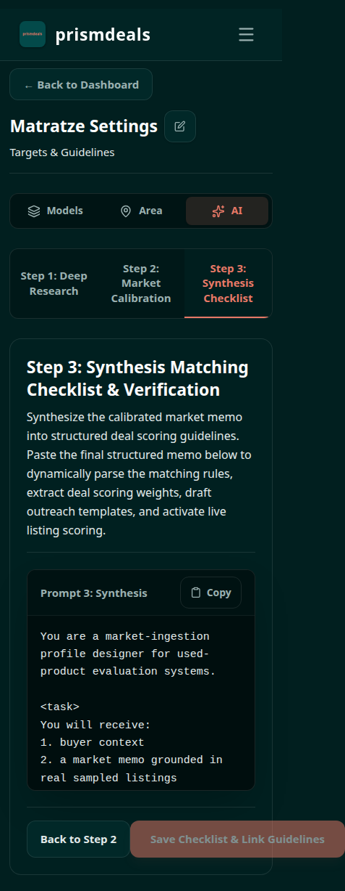
**Rechner:** 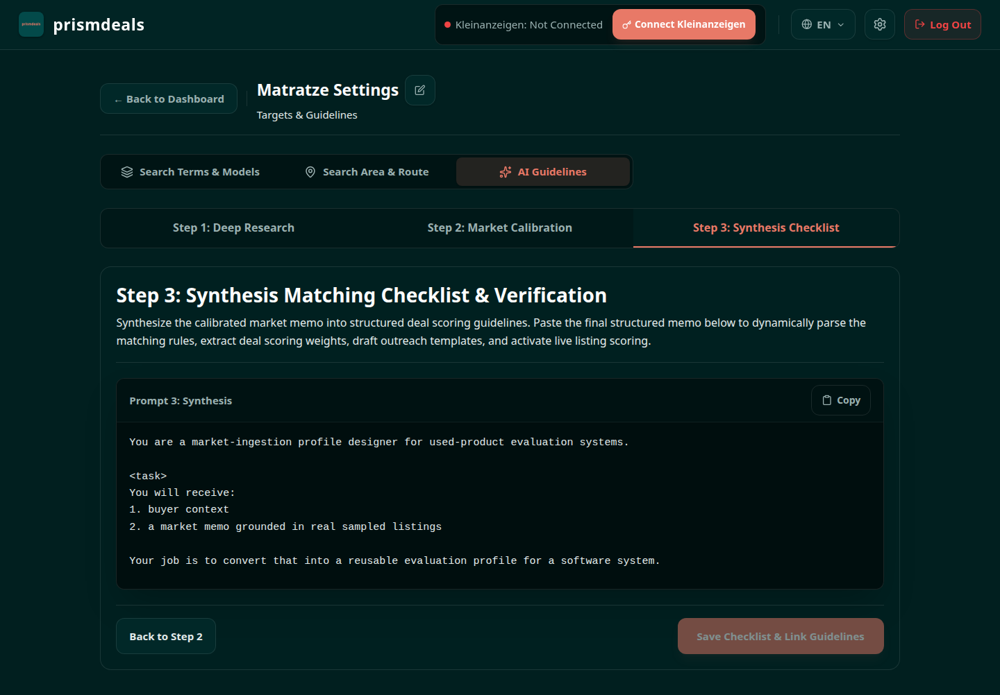

**Was dasteht:** „Step 3: Synthesis Matching Checklist & Verification", „Synthesize the calibrated market memo into structured deal scoring guidelines. Paste the final structured memo below to dynamically parse the matching rules, extract deal scoring weights, draft outreach templates, and ac…". Dann „Prompt 3: Synthesis" mit „Copy" und dem Prompt („You are a market-ingestion profile designer for used-product evaluation systems. <task> You will receive: 1. buyer context 2. a market memo grounded in real sampled listings Your job is to convert that into a reusable ev…"). Unten „Back to Step 2" und „Save Checklist & Link Guidelines".

**Was anklickbar ist und was dann passiert:** „Save Checklist & Link Guidelines" ist ausgegraut, bis die Antwort aus Schritt 3 eingefügt wurde. Alle drei Schritt-Reiter sind jetzt anklickbar. „Copy" kopiert wieder den Prompt.

**Zählungen:**
- Rechner: 15 Knöpfe (1 ausgegraut) · 0 Kästen · 721 Wörter Fließtext · Inhalt beginnt bei y=408 · Seitenhöhe 1002 px
- Telefon: 12 Knöpfe · 0 Kästen · 718 Wörter Fließtext · Inhalt beginnt bei y=490 · Seitenhöhe 1227 px, Seite **477 px breit** (87 px breiter als das Fenster)

Alle drei Schritte des Assistenten haben denselben Aufbau: Überschrift, Absatz, ein Prompt zum Kopieren, ein Feld für die Antwort.

---

## 23 — Globale Einstellungen

**Wie man hierher kommt:** Rechner: Zahnrad in der Kopfleiste. Telefon: Hamburger → „Global Settings".

**Telefon:** 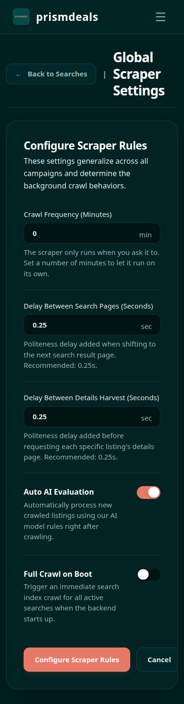
**Rechner:** 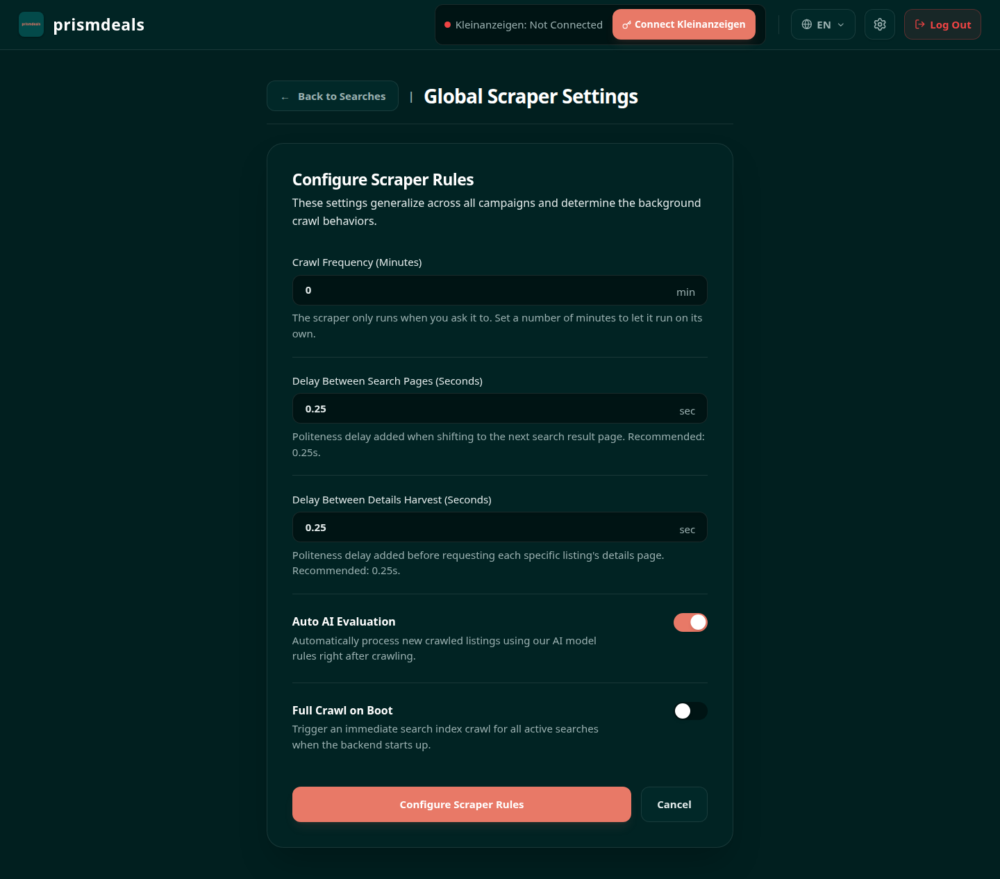

**Was dasteht:** „Global Scraper Settings | ← Back to Searches", dann „Configure Scraper Rules", „These settings generalize across all campaigns and determine the background crawl behaviors." Danach drei Zahlenfelder mit Einheit und Erklärung: „Crawl Frequency (Minutes)" / „min" / „The scraper only runs when you ask it to. Set a number of minutes to let it run on its own."; „Delay Between Search Pages (Seconds)" / „sec" / „Politeness delay added when shifting to the next search result page. Recommended: 0.25s."; „Delay Between Details Harvest (Seconds)" / „sec" / „Politeness delay added before requesting each specific listing's details page. Recommended: 0.25s." Dann zwei Schalter: „Auto AI Evaluation" / „Automatically process new crawled listings using our AI model rules right after crawling." und „Full Crawl on Boot" / „Trigger an immediate search index crawl for all active searches when the backend starts up." Zum Schluss „Configure Scraper Rules" und „Cancel".

**Was anklickbar ist und was dann passiert:** „Configure Scraper Rules" steht zweimal auf dem Bildschirm — einmal als Überschrift, einmal als abschickender Knopf unten. „Cancel" geht zurück auf den Bildschirm, von dem man kam.

**Zählungen:**
- Rechner: 9 Knöpfe · **0 Kästen** · 3 Felder · 120 Wörter Fließtext · Inhalt beginnt bei y=366 · Seitenhöhe 1266 px
- Telefon: 6 Knöpfe · 0 Kästen · 3 Felder · 117 Wörter Fließtext · Inhalt beginnt bei y=440 · Seitenhöhe 1483 px

Fünf Einstellungen, 120 Wörter Erklärung — im Mittel 24 Wörter je Einstellung.

---

## 24 — Mobiles Menü

**Wie man hierher kommt:** Übersicht → Hamburger in der Kopfleiste. **Nur auf dem Telefon.**

**Telefon:** 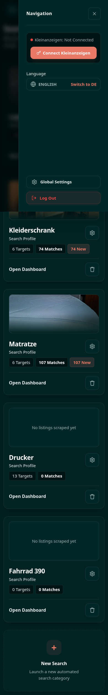
**Rechner:** *nicht erreichbar* — der Hamburger ist `md:hidden` und wird bei 1440 px überhaupt nicht dargestellt.

**Was dasteht** (in der Schublade von rechts): „Navigation" mit einem Schließkreuz, dann der Zustandsblock „Kleinanzeigen: Not Connected" mit „Connect Kleinanzeigen", dann „Language" mit der Zeile „ENGLISH" / „Switch to DE", und unten „Global Settings" und „Log Out". Hinter der abgedunkelten Fläche bleibt die Übersicht sichtbar und lesbar.

**Was anklickbar ist und was dann passiert:** die Sprachzeile schaltet unmittelbar um, ohne Zwischenauswahl. „Global Settings" führt zu 23, „Log Out" meldet ab. Ein Klick auf die abgedunkelte Fläche schließt die Schublade.

**Zählungen:** 16 Knöpfe · 6 Kästen · 84 Wörter Fließtext · Inhalt (Schublade) beginnt bei y=27 · Seitenhöhe 2486 px. Von den 16 Knöpfen liegen 5 in der Schublade, einer ist der Hamburger selbst; die übrigen 10 sind das Zahnrad und der Papierkorb der fünf Karten dahinter, die weiter im Dokument stehen.

---

## 25 — Sprachauswahl geöffnet

**Wie man hierher kommt:** Übersicht → „EN" in der Kopfleiste. **Nur auf dem Rechner.**

**Telefon:** *nicht erreichbar* — bei 390 px steckt die Sprache als volle Zeile in der mobilen Schublade (Bildschirm 24) und schaltet direkt um; es gibt kein Klappfeld zu öffnen.
**Rechner:** 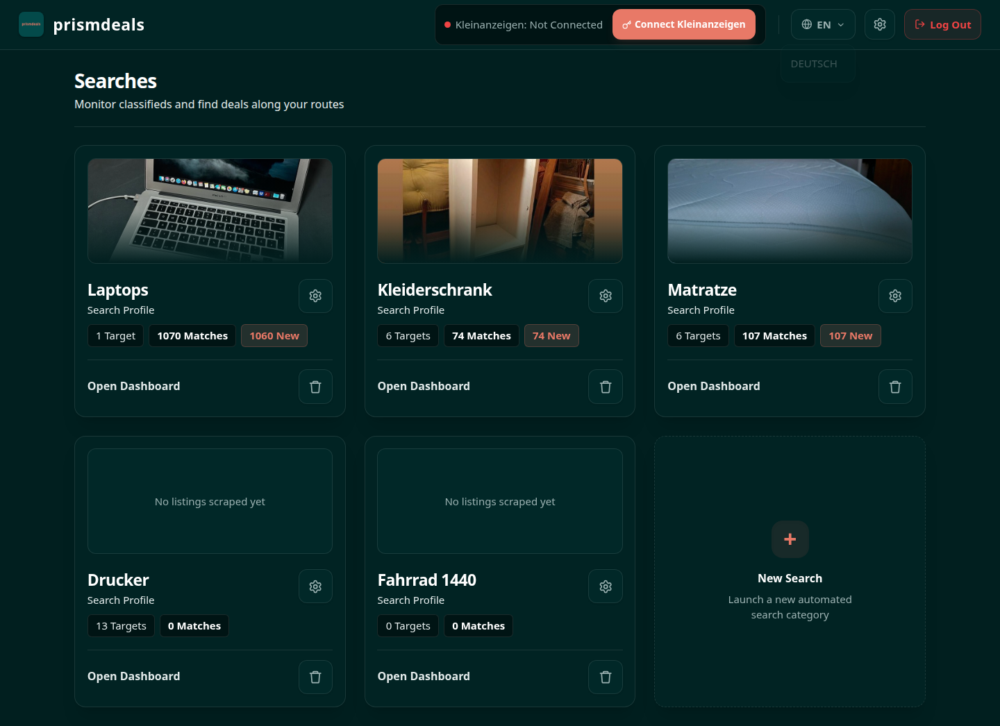

**Was dasteht:** unter dem Knopf „EN" ein schmales Klappfeld mit genau einem Eintrag: „DEUTSCH". Dahinter unverändert die Übersicht.

**Was anklickbar ist und was dann passiert:** der eine Eintrag schaltet auf Deutsch und schließt das Feld. Es gibt keinen Eintrag für die gerade aktive Sprache — das Feld zeigt immer nur die jeweils andere.

**Zählungen:** 15 Knöpfe · 6 Kästen · 82 Wörter Fließtext · Inhalt (Klappfeld) beginnt bei y=64 · Seitenhöhe 1046 px. Das geöffnete Feld fügt der Übersicht (03) genau 3 Knöpfe, 1 Kasten und 14 Wörter hinzu.

---

## 26 — Leerzustand: Filter ohne Treffer

**Wie man hierher kommt:** Trefferliste → in das Feld „Filter listings by title or place..." etwas eintippen, das auf keine Anzeige passt.

**Telefon:** 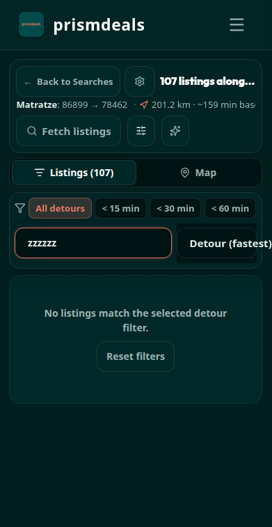
**Rechner:** 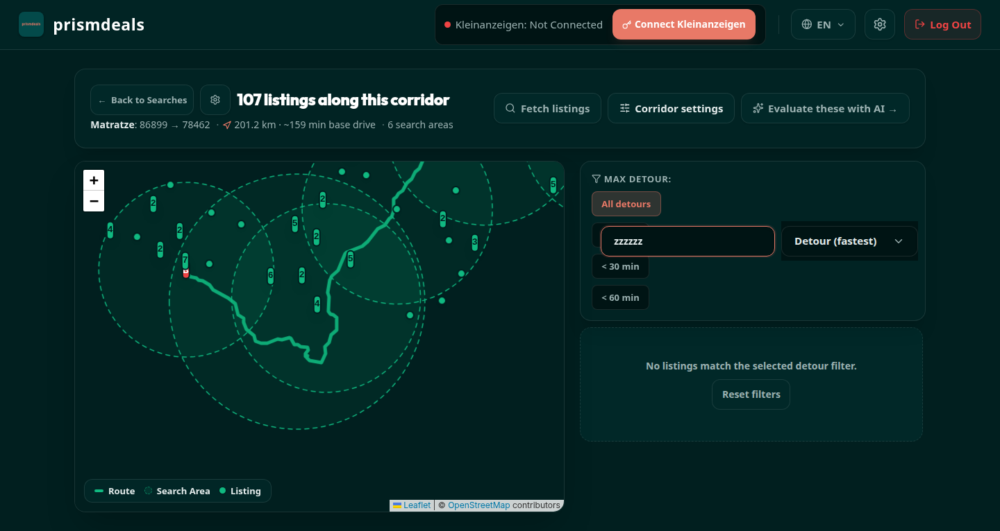

**Was dasteht:** Kopfzeile und Filterzeile unverändert wie in 12, Überschrift weiterhin „107 listings along this corridor". An der Stelle der Liste ein gestrichelt umrandeter Kasten: „No listings match the selected detour filter." und darunter der Knopf „Reset filters". Auf dem Rechner bleibt die Karte daneben stehen und zeigt weiterhin alle 107 Anzeigen.

**Was anklickbar ist und was dann passiert:** „Reset filters" setzt Umweg-Filter **und** Suchfeld zurück. Der Text nennt nur den Umweg-Filter, obwohl hier das Suchfeld die Ursache ist.

**Zählungen:**
- Rechner: 15 Knöpfe · 2 Kästen · **0 Zeilen** · 75 Wörter Fließtext · Inhalt beginnt bei y=472 · Seitenhöhe 766 px
- Telefon: 14 Knöpfe · 2 Kästen · 0 Zeilen · 30 Wörter Fließtext · Inhalt beginnt bei y=395 · Seitenhöhe 757 px

---

## Nicht erreichte Zustände

| Zustand | Warum nicht |
|---|---|
| **Suche löschen, Bestätigung** | Die Bestätigung ist ein `window.confirm` des Browsers, kein Element der Seite. Ein Bildschirmfoto der Seite enthält sie nicht, und mit offenem Dialog lässt sich die Seite nicht mehr vermessen. Derselbe Grund gilt für alle Fehlermeldungen der Anwendung, die über `alert()` laufen — davon gibt es 17 im Frontend. |
| **Bildschirm 13 (Karte) auf dem Rechner** | Existiert dort nicht: die Umschaltung Liste/Karte ist `lg:hidden`, die Karte ist bei 1440 px fester Bestandteil von Bildschirm 12. |
| **Bildschirm 24 (mobiles Menü) auf dem Rechner** | Der Hamburger ist `md:hidden` und wird bei 1440 px nicht dargestellt. |
| **Bildschirm 25 (Sprachklappfeld) auf dem Telefon** | Bei 390 px ist die Sprache eine Zeile in der mobilen Schublade und schaltet direkt um; es gibt kein Klappfeld. |
| **„Suche läuft", Fortschrittskarte** | Erreichbar nur, indem ein echter Abruf gegen kleinanzeigen.de gestartet wird. Der Auftrag ist Bestandsaufnahme; ein Abruf verändert die Datenbestände, die fotografiert werden sollen, während fotografiert wird. Nicht ausgelöst. |
| **„Zero in radius"-Diagnose (`ZeroInRadiusView`)** | Dieser Leerzustand erscheint nur, wenn eine Modellfamilie bereits **gesucht** hat und trotzdem nichts fand (`has_crawled` gesetzt, 0 Treffer). In der kopierten Datenbank ist „Drucker" noch nie gelaufen, deshalb zeigt sie den Zustand aus 19. Herstellbar nur durch einen echten Abruf — siehe oben. |
| **Fehlerzustand der Ergebnisse** („Retry") | Verlangt, dass die Schnittstelle fehlschlägt. Ohne Eingriff in den Produktcode oder Abschalten des Servers mitten im Lauf nicht herstellbar. |
| **Angemeldeter Kleinanzeigen-Zustand** | Die Kopfleiste zeigt auf der ganzen Strecke „Kleinanzeigen: Not Connected". Der verbundene Zustand verlangt echte Zugangsdaten für kleinanzeigen.de. |
| **Reiter 2 „Search Area & Route" im Modus „Fixed Location"** | Erreichbar über „Switch to Fixed Location", was die vorhandene Route der Suche verwirft. Nicht ausgelöst. |

---

## Beobachtungen ohne Wertung

Reine Feststellungen, keine Vorschläge.

1. **Das Eintippen einer gültigen Adresse ist bereits die Handlung.** 600 ms nachdem das URL-Feld als Kleinanzeigen-Adresse erkannt wird, legt die Anwendung von selbst ein Richtlinien-Set an, legt das Suchziel an, leert das Feld und startet einen Abruf gegen kleinanzeigen.de. Der Knopf „Add" daneben tut dasselbe und wird für das erste Ziel nie gebraucht. Beim Aufnehmen dieser Strecke wurden dadurch fünf Fahrrad-Anzeigen in die Kopie der Datenbank geladen, ohne dass ein Knopf gedrückt wurde.

2. **Derselbe Satz erscheint zweimal auf einem Bildschirm.** In der Korridor-Schublade (16) steht „A wider corridor finds more, and needs more searches to cover — the circles have to sit closer together." zweimal, 556 px auseinander. Derselbe Satz steht ein drittes Mal auf Reiter 2 der Einstellungen (10).

3. **„Configure Scraper Rules" ist auf Bildschirm 23 zugleich Überschrift und Knopf** — einmal bei y=243 als Titel, einmal bei y=1133 als abschickender Knopf.

4. **„URL Status::" trägt zwei Doppelpunkte** (Bildschirme 07, 08, 09). Ebenso „Suggested Name::".

5. **Knopf X führt zum selben Ziel wie Knopf Y:** auf Bildschirm 19 lösen „Fetch listings" oben und „Search family now" im Kasten denselben Abruf aus. Auf Bildschirm 04 führen „← Back" und „Cancel" beide zur Übersicht. Auf Bildschirm 12 führen das Zahnrad und „Evaluate these with AI →" beide in die Einstellungen derselben Suche.

6. **„Family settings" öffnet keinen Dialog, sondern wechselt den Bildschirm.** Der Knopf setzt im selben Handler eine Dialog-Markierung *und* stößt die Navigation an; die Navigation gewinnt, der Dialog wird nie sichtbar.

7. **Die Trefferzahl in der Überschrift folgt dem Filter nicht.** Bei gesetztem Filter „< 15 min" (14) stehen 18 Anzeigen in der Liste, die Überschrift sagt weiter „107 listings along this corridor". Im Leerzustand (26) stehen null Anzeigen da, die Überschrift sagt weiter 107.

8. **Der Leerzustand nennt den falschen Filter.** „No listings match the selected detour filter." erscheint auch dann, wenn nicht der Umweg-Filter, sondern das Suchfeld die Liste geleert hat.

9. **Zwei verschiedene Ergebnisbildschirme.** Suchen mit Route oder Modellfamilie bekommen Bildschirm 12 (Karte + Zeilen, 107 Zeilen, 2 Kästen); Suchen ohne beides bekommen Bildschirm 17 (Listenspalte + Detailbereich, 1071 Kästen). Gemeinsam sind ihnen „← Back to Searches" und das Zahnrad; die Aktionsknöpfe heißen verschieden. Der erste Knopf ruft auf beiden Bildschirmen dieselbe Funktion auf, heißt aber hier „Fetch listings" und dort „Fetch Fresh Listings".

10. **Bildschirm 17 stellt alle 1070 Anzeigen auf einmal dar.** Auf dem Telefon wird das Dokument dadurch 203 220 px hoch und enthält 15 072 Wörter Fließtext. Es gibt kein Blättern und keine Nachlade-Grenze.

11. **Vier Bildschirme sind breiter als das Fenster, in dem sie stehen.** Anmeldung bei 390 px: 500 px breit. Einstellungen Reiter 1 bei 390 px: 523 px. KI-Schritt 3 bei 390 px: 477 px. Bildschirm 17/18 bei 1440 px: 1529 px.

12. **Leeres und ausgefülltes Formular sind messgleich.** Zwischen 04 und 05 ändert sich keine der gemessenen Größen — gleiche Knopfzahl, gleiche Wortzahl, gleiche Höhe, gleiche y-Position. „Save" sieht in beiden Zuständen gleich aus, tut aber nur in einem etwas.

13. **Der KI-Assistent ist hinter „Copy" verriegelt.** Schritt 2 ist ausgegraut, bis der Prompt aus Schritt 1 in die Zwischenablage kopiert wurde; Schritt 3 ist ausgegraut, bis im Textfeld von Schritt 2 etwas steht. Das Kopieren ist die einzige Bedingung — was kopiert wurde oder ob es benutzt wurde, wird nicht geprüft.

14. **Die Begründungen der KI-Bewertung stehen auf Deutsch, während die Oberfläche auf Englisch steht** (Bildschirm 18: „Konkrete Angaben (607 Ladezyklen, zurückgesetzt, Nichtraucher) wirken realistisch; …" unter der englischen Überschrift „Soft Trust & Risk Dimensions").

15. **Auf Bildschirm 09 stehen eine Erfolgs- und eine Fehlermeldung gleichzeitig:** „Found 5 live listings! Target registered successfully." bei y=541 und „Missing campaign_id, name, or url" bei y=568. Der Inhalt des URL-Feldes bleibt beim Wechsel von einer Suche zur anderen stehen und wird auf dem neuen Bildschirm erneut verarbeitet.

16. **Jede Karte der Übersicht trägt denselben Untertitel** „Search Profile", unabhängig davon, ob die Suche eine Route, eine Modellfamilie oder keines von beidem hat.

17. **Der Inhalt beginnt selten im oberen Drittel.** Über alle Bildschirme: Median bei y=347 auf dem Rechner (24 Messungen) und y=382 auf dem Telefon (25 Messungen). Auf dem Telefon beginnt bei den beiden Assistenten-Schritten (21, 22) der Inhalt erst bei y=490 — mehr als die halbe Bildschirmhöhe.

18. **Auf der Anmeldeseite gibt es genau einen Knopf und drei Wörter Text.** Auf Bildschirm 20 gibt es 40 bzw. 42 Knöpfe und 51 Wörter Text — mehr Knöpfe als Wörter.

19. **Die Liste/Karte-Umschaltung zählt mit, die Überschrift auch — mit unterschiedlichem Ergebnis.** Auf dem Telefon steht im Reiter „Listings (107)" und in der Überschrift „107 listings along this corridor"; die Zahl 107 steht damit zweimal auf demselben Bildschirm.

20. **Zwei Sortierungen, keine Richtung.** Das Sortierfeld (15) bietet „Detour (fastest)" und „Price (lowest)". Eine Umkehr (teuerste zuerst, größter Umweg zuerst) ist nicht vorgesehen.

---

## Wie das aufgenommen wurde

`scripts/ui_shots.py` startet je Breite einen Wegwerf-Server gegen eine eigene
Kopie der Datenbank, legt einen Benutzer mit bekanntem Passwort an, meldet sich
an und klickt sich durch. Navigiert wird ausschließlich durch Klicken; die drei
im Skript dokumentierten Sackgassen (`driver.get` auf eine reine
Fragmentänderung, das Zurückschreiben von `location.hash` durch den Router, das
Zerstören des Seitennetzwerks durch ein Bildschirmfoto bei voller Seitenhöhe)
sind nicht wiederholt worden.

```bash
./venv/bin/python scripts/ui_shots.py                 # beide Breiten
./venv/bin/python scripts/ui_shots.py --width 390     # nur eine
```

Die Zahlen jeder Aufnahme stehen als JSON neben den Bildern
(`docs/ui-journey/measurements-390.json`, `measurements-1440.json`), mitsamt der
Liste aller sichtbaren Textblöcke mit ihrer y-Position — daraus sind die
Abschnitte „Was dasteht" wörtlich entnommen.

Zwei Dinge, die das Werkzeug beim Fotografieren von sich aus **nicht** tut:
es drückt keinen Knopf, dessen Beschriftung auf Abrufen, Hinzufügen oder
Löschen hindeutet (eine Sperrliste im Skript), und es schreibt nie in
`data/scraper.db` — gearbeitet wird immer auf einer Kopie.
